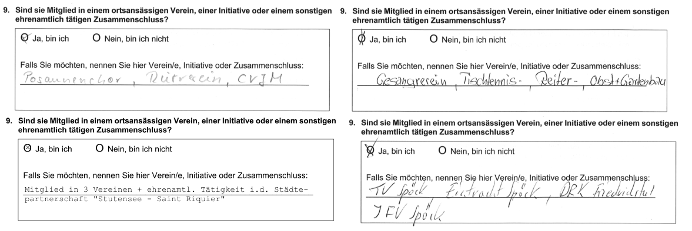
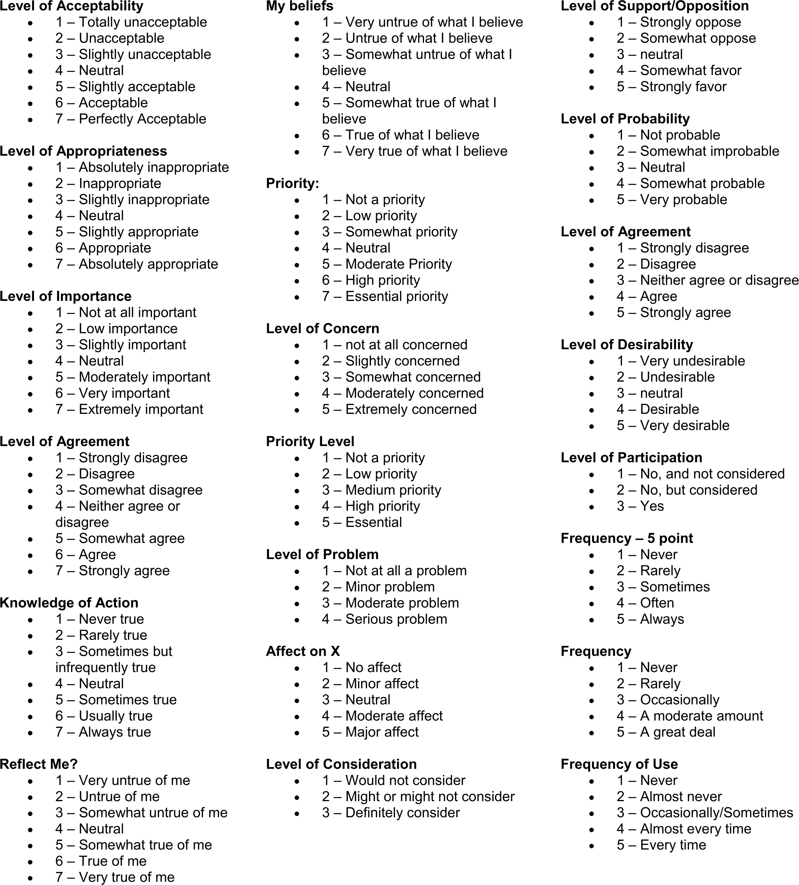
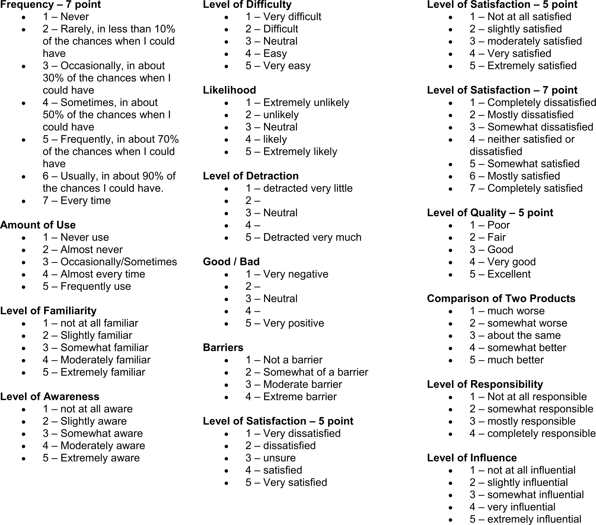

## Was wollen wir messen?

-   Zur Operationalisierung eines Konzepts gehört nicht nur die Itemformulierung und -auswahl sondern auch die Vorgabe der Reaktionen.
-   Es gibt diesbezüglich keine "festen" Regeln, **außer*: die Reaktionsmöglichkeiten müssen erschöpfend[^1] und überschneidungsfrei sein.
-   Alles kommt darauf an, was Sie messen wollen und welche Möglichkeiten Sie im Rahmen der Datenerhebung haben.

[^1]: Deshalb muss stets klar sein, ob Mehrfachantworten möglich sind.

## offene, halboffene, geschlossene Antwortvorgaben

-   offen: Sie wissen über das Thema nichts oder die möglichen Reaktionen sind nicht überschaubar.

-   halboffen: Sie sind sich unsicher, ob Sie nicht eine potentiell wichtige Kategorie übersehen haben.

-   geschlossen: Sie haben ein Reaktionsmuster definiert, das aus überschaubaren Varianten besteht.

## offene, halboffene, geschlossene Antwortvorgaben

{width="100%"}

## die verschämte Resterampe?

](images/wong-other-describe.png){width="70%"}

## Was wollen Sie **messen**?

](images/sommerurlaub.png)

## Trade-offs: Offene Reaktionsvorgaben {.midi}

:::::: columns
::: {.column width="40%"}
### Vorteile

-   Antworten sind unbeeinflusst

-   Jede/r Befragte antwortet innerhalb seines „Referenzsystems“

-   Besser geeignet, um theoretisch postulierte Unterschiedlichkeit zu messen

-   **Kann** motivierend auf die Befragten wirken
:::

::: {.column width="10%"}
:::

::: {.column width="40%"}
### Nachteile

-   Sprachliches Ausdrucksvermögen ist sehr unterschiedlich ausgeprägt

-   Analyseaufwand der Daten ist deutlich höher, fehleranfälliger und subjektiv
:::
::::::

## Trade-offs: Geschlossene Reaktionsvorgaben {.midi}

:::::: columns
::: {.column width="40%"}
### Vorteile

-   Kognitive Anforderungen an Befrage geringer

-   Deutlich höhere Vergleichbarkeit der Antworten

-   **Kann** zu Antworten ermuntern, auf die die Befragten von selbst nicht gekommen wären

-   Analyse der Daten mit statistischen Methoden/Software
:::

::: {.column width="10%"}
:::

::: {.column width="40%"}
### Nachteile

-   Vorgabe der Antworten sind auf theoretisch postulierte Unterschiedlichkeit beschränkt

-   **Kann** zu oberflächlichen und schnellem antworten führen

-   verhindert originelle/unerwartete Antworten
:::
::::::

## Antwortanker bei geschlossenen Vorgaben {.midi}

Befragte müssen ihre Reaktion ins Verhältnis zur Vorgabe bringen können. Es ist daher bedeutsam, welche inhaltliche Referenz Sie vorgeben [(Vagias 2014)](https://media.clemson.edu/cbshs/prtm/research/resources-for-research-page-2/Vagias-Likert-Type-Scale-Response-Anchors.pdf). 

::::: {.columns}
:::: {.column width="50%"}
{width=80%}
::::

:::: {.column width="50%"}

::::
:::::

## nominale, ordinale und metrische Antwortabstände

-   **nominal**: Die Befragten können oder sollen nur Fallunterscheidungen machen, die in keiner Rangfolge zueinander stehen.

-   **ordinal**: Die Befragten sollen etwas bewerten, ordnen oder in eine sonstige Rangfolge bringen oder sich selbst in Relation zu anderen in eine Rangfolge sortieren. Sie vermuten, dass die Befragten die Verhältnisse unterschiedlicher Reaktionen nicht gleichabständig äußern können.

-   **metrisch**: Die Befragten sind in der Lage, Unterschiede der Reaktion mindestens in gleichen Abständen angeben zu können.

## nominale, ordinale und metrische Antwortabstände

Wie zufrieden sind Sie mit Ihrem neuen Laptop?

-   nominal: $\boxtimes$ $\square$

-   ordinal: $\square$ 1 $\boxtimes$ 2 $\square$ 3 $\square$ 4 $\square$ 5 $\square$ 6 (Schulnoten)

-   metrisch: 0% ------------------------------------x----- 100%

## verbalisierte vs. endpunktbenannte Antwortvorgaben

 ](images/rating-vorgaben.png)

## verbalisierte vs. endpunktbenannte Vorgaben {.midi}

-   Bei verbalisierten Antwortvorgaben wird jede Kategorie einzeln bezeichnet.

    -   **Vorteil**: Keine Unsicherheit/Unschärfe, was die Kategorien bedeuten sollen.

    -   **Nachteil**: Mittelkategorie meist semantisch schwierig. Gleichabständigkeit semantisch oft nicht ausdrückbar. Je mehr Antwortvorgaben, desto schwieriger die Wortfindung.

-   Bei endpunktbenannten Skalen werden nur die beiden Extreme bezeichnet.

    1.  **Vorteil**: Leichte Verbalisierung. Antwortvorgaben können beliebig breit sein.

    2.  **Nachteil**: Unschärfe/Unsicherheit, was die einzelne Kategorie zu bedeuten hat.

## gerade oder ungerade Anzahl von Antwortkategorien {.midi}

-   **ungerade**: Die Skala hat einen Mittelpunkt. Diese Mitte muss allerdings technisch gesehen nicht der mittlere Punkt sein, d.h.: die mittlere Reaktionsstärke.

    -   Vorteil: Personen, mit mittlerer Ausprägung können sich einordnen.

    -   Nachteil: Die Mitte wird *manchmal* als Fluchtkategorie verwendet.

-   **gerade**: Die Vorgaben zwingen den Befragten zu einer Einordnung in eine obere oder untere Hälfte.

    -   Vorteil: Die "Flucht durch die Mitte" wird verhindert.[^1]

    -   Nachteil: Personen mit mittlerer Einstellung können sich nicht einordnen.

[^1]: Bitte ordnen Sie dieses Problem in seiner Relevanz korrekt ein: Es ist unmotivierten Befragten moderat vorhanden, bei allen anderen Befragten können Sie es als Randphänomen ansehen.

## die Anzahl von Kategorien

Die Breite von Antwortvorgaben bezieht sich auf die Anzahl der vom Fragenden vorgeschlagenen Antwortkategorien. Die Breite von Antwortvorgaben hängt von mehreren Faktoren ab:

-   Welche Reaktionsmuster wollen Sie erfassen?

-   Wie hoch ist die verlangte Abstraktionsfähigkeit, die zur Unterscheidung einzelner Kategorien nötig ist?

-   Wie viele Unterschiede der Merkmalsausprägungen sollen erfasst werden?

Empfehlung ($\neq$ Anweisung!): 5-9 Kategorien.

## Die Skalenrichtung

Die Skalenrichtung gibt vor, ob die Reihenfolge der "niedrigsten" zur "höchsten" Ausprägung von links nach rechts bzw. von Anfang zu Ende verläuft oder vice versa.

-   Im Fall optischer Präsentation: Optisch präsentierte Skalen suggerieren einen Verlauf. Verläufe werden meist als von links nach rechts ordnend interpretiert. Daher: Der kleinste Wert nach links, der höchste nach rechts.

-   Im Fall akustischer Präsentation: Bei verbalisierten Reihenfolgen kann es von Bedeutung sein, welcher Pol zuerst gewählt wird. Typischerweise kommt das Positive/Höchste zuerst.

## Uni- und bipolare Antwortvorgaben {.midi}

Skalen können entweder zwischen zwei Extremen oder zwischen einem "Nullpunkt" und einem Endpunkt pendeln. Ein Nullpunkt kann auch Indifferenz bedeuten. In vielen Fällen bedeutet er **nicht** das Gegenteil des Endpunkts.

 ](images\unipolar-bipolar.png)

