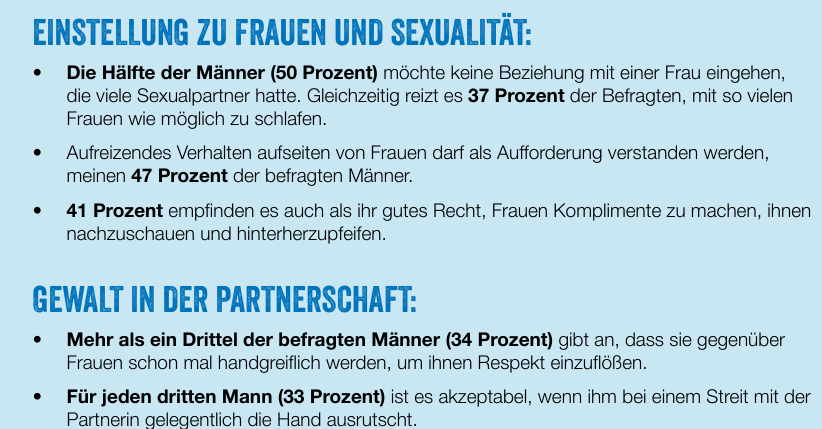

## Teilnahmeselektion 

1. Diskutieren Sie, welche Veränderungen von der Brutto- zur Nettostichprobe Sie über die folgenden Varianten erwarten. 
2. Welche Annahme über die Stärke der Zusammenhänge sind für Ihre Erwartungen besonders wichtig? 

### Variante 1
```{mermaid}
flowchart TB
E[Einsamkeit]
G[Geschlecht]
K[Kinder im Haushalt]
T[Teilnahme]

G -->|verstärkt| K
G --> |verstärkt| E
K --> |verringert| E

G --> |verstärkt| T
K --> |verringert| T

```


### Variante 2
```{mermaid}
flowchart TB
E[Einsamkeit]
G[Geschlecht]
K[Kinder im Haushalt]
T[Teilnahme]

G -->|verstärkt| K
G --> |verstärkt| E
K --> |verringert| E

G --> |verstärkt| T
K --> |verringert| T
E --> |verringert| T

```


### Variante 3
```{mermaid}
flowchart TB
E[Einsamkeit]
G[Geschlecht]
K[Kinder im Haushalt]
T[Teilnahme]
S[Stress]

G -->|verstärkt| K
G --> |verstärkt| E
K --> |verringert| E

G --> |verstärkt| T
K --> |verringert| T
E --> |verringert| T

K -->|verstärkt| S
S -->|verringert| T

```


## Spannungsfeld "Männlichkeit"

Im Sommer 2023 erschien die Studie  [Spannungsfeld Männlichkeit](https://www.plan.de/fileadmin/website/04._Aktuelles/Umfragen_und_Berichte/Spannungsfeld_Maennlichkeit/Plan-Umfrage_Maennlichkeit-A4-2023-NEU-online.pdf?sc=IDQ23200) von Plan International. Diese wurde in den Medien intensiv diskutiert. Ein Ergebnis war u.a. dass 33\% aller Männer unter 35 Jahren häusliche Gewalt akzeptabel finden: 



### Zum Stichprobendesign erfahren wir folgendes

 - Wir \[haben\] vom 9. bis zum 21. März 2023 bundesweit eine
    repräsentative Umfrage durchführen lassen. Mittels einer
    standardisierten schriftlichen Online-Befragung wurden 1.000 Männer
    sowie 1.000 Frauen von 18 bis 35 Jahren zu den folgenden zehn
    Aspekten von Männlichkeit befragt: Rollenverteilung in Beziehungen,
    Umgang mit Gefühlen, Verhalten in der Partnerschaft, Dominanz,
    Gewaltanwendung, Risikobereitschaft, Gesundheit, Umgang mit
    Problemen, Akzeptanz von abweichenden Männlichkeitsbildern sowie
    Wettbewerb.

 - Bei der Umfrage wurde bei den männlichen Befragten untersucht, wie
    Männlichkeit hierzulande im Alltag gelebt wird. Die weiblichen
    Teilnehmenden wurden wiederum nach ihren Vorstellungen von
    Männlichkeit befragt. Zudem sollten die Ergebnisse zeigen, ob und,
    wenn ja, wie die verschiedenen Ausprägungen von gelebter
    Männlichkeit den Alltag von Männern und Frauen beeinflussen.
    Abgefragt wurde außerdem, wie zufrieden Männer mit sich selbst sind,
    inwiefern sie Druck spüren, ihr Verhalten zu ändern, und wie groß
    die Bereitschaft unter den Männern ist, dem nachzugehen -- und der
    Wille bei den Frauen, sie dabei zu unterstützen.

 - Um die Repräsentativität der Stichprobe zu sichern, wurden auf Basis
    der amtlichen Statistiken Quoten-Vorgaben gemacht. Definiert wurden
    pro Geschlecht (männlich / weiblich) drei Altersvorgaben (18-24
    Jahre, 25-29 Jahre und 30-35 Jahre), die mit Schulbildung in zwei
    Abstufungen (ohne Abschluss bis mittlerer Abschluss / Hochschulreife
    und abgeschlossenes Studium) kombiniert wurden. Erfahrungsgemäß
    befinden sich in Online-Panels eher Personen mit etwas höherer
    Bildung, einer gewissen Computer-Affinität und einer natürlichen
    Neugierde und Mitteilungsbereitschaft. Hier wurde durch die
    Bildungsquote „ohne Schulabschluss / Hauptschulabschluss / mittlerer
    Schulabschluss" gegengesteuert. Unabhängig davon wurden Fallzahlen
    für die regionale Aussteuerung der Stichprobe vorgegeben. Dazu
    wurden vier Gebiete definiert (Nord, West, Süd, Ost) und die jeweils
    gewünschten Fallzahlen vorgegeben. Somit bildet die Stichprobe der
    Befragten die Gesamtbevölkerung im Alter von 18 bis 35 Jahren pro
    Geschlecht in den drei vorgegebenen Merkmalen mit einer hohen
    Wahrscheinlichkeit ab.

### Die Stichprobe basiert auf einem sogenannten Online-Access-Panel der Firma MoWeb. 

Diese nahm nach der Kritik an der Studie folgendermaßen
[Stellung](https://www.mowebresearch.com/de/news/article/r/id/Stellungnahme_zur_Befragung_Spannungsfeld_Maennlichkeit_von_Plan_International/):

- Unser Access-Panel basiert, wie in der Online-Forschung üblich, auf
    einer Nicht-Wahrscheinlichkeitsstichprobe (non-probability sample)
    statt einer Zufallsstichprobe. Die Repräsentativität wird durch eine
    gestapelte, quotierte Stichprobenziehung und eine Gewichtung der
    Daten nach Abschluss der Befragung gewährleistet.

 - Um eine gut stratifizierte Stichprobe zu gewährleisten, nutzt moweb
    verschiedene Rekrutierungsmethoden und interne
    Qualitätssicherungsverfahren, darunter auch multi-modale
    Rekrutierungsverfahren und Digital Fingerprinting. Unsere
    Rekrutierungskanäle umfassen unter anderem Newsletter-Werbung,
    Banner- und Pop-up-Werbung auf regulären Internetseiten, Affiliate
    Marketing, Social Media Advertising, Search Engine Acquisition,
    E-Mail-Listenversand sowie Offline-Telefonrekrutierung. Für schwer
    erreichbare Zielgruppen setzen wir gegebenenfalls auch
    konventionelle Werbung in Fachzeitschriften ein.

-   Wir möchten im Folgenden auf die beiden häufigsten Anmerkungen und
    Rückfragen eingehen:

    -  *Behauptung: Online-Panels können nicht repräsentativ sein, da die
    Stichprobe nicht zufällig ausgewählt wird.*

    -  Obwohl es richtig ist, dass sich Teilnehmer in Online-Panels aktiv
    für eine Teilnahme an Umfragen entscheiden, bedeutet dies nicht,
    dass eine Panel-Erhebung nicht repräsentativ sein kann.
    Repräsentativität hängt nicht zwangsläufig mit Zufälligkeit
    zusammen. Eine repräsentative Stichprobe bildet die Grundgesamtheit
    hinsichtlich bestimmter relevanter sozio-ökonomischer Variablen wie
    Alter, Geschlecht, Region, Bildung, Einkommen und weitere Merkmale
    genau ab. Da viele dieser Variablen in Online-Panels erfasst werden,
    können solche Quoten einfach und gezielt erfüllt werden.

    -  *Warum kann Online-Marktforschung potenziell repräsentativer sein
    als andere Methoden?*

    -  Durch Online-Methoden können wir Bevölkerungsgruppen erreichen, die
    mit traditionellen Marktforschungsmethoden nur schwer oder gar nicht
    erreichbar sind. Zum Beispiel können Personen mit ungewöhnlichen
    Arbeitszeiten oder solche ohne Festnetzanschluss leichter erreicht
    werden.

    - Ein weiterer wichtiger Aspekt ist das Fehlen eines Interviewer-Bias
    und die reduzierte Tendenz zur sozialen Erwünschtheit bei
    Online-Umfragen. Sensible Themen wie häusliche Gewalt können
    Menschen dazu veranlassen, zögerlich zu sein, ihre Erfahrungen einem
    Interviewer gegenüber offenzulegen. Durch die Anonymität von
    Online-Umfragen fühlen sich die Teilnehmer möglicherweise sicherer,
    ihre Meinungen und Erfahrungen zu teilen, was zu ehrlicheren
    Antworten führen kann.
    
### Ihre Aufgaben

1.  Was ist die theoretische Population dieser Studie?

2.  Was ist der Sampling Frame und wie selektiv ist dieser - und wonach
    ist er selektiv.

3.  Beschreiben Sie in eigenen Worten die Art der Stichprobenziehung.
    Ist diese ggf. selektiv und wonach?

4.  Welche Einflüsse könnten die Selektivitäten auf die Ergebnisse
    haben?

5.  Ist die genutzte Quotierung geeignet, die Selektivitäten zu
    reduzieren?

6.  Diskutieren Sie die Aussagen von MoWeb in Bezug auf
    Repräsentativität.

7.  Diskutieren Sie die Behauptungen der geringeren Selektivität von
    Online Befragungen.


