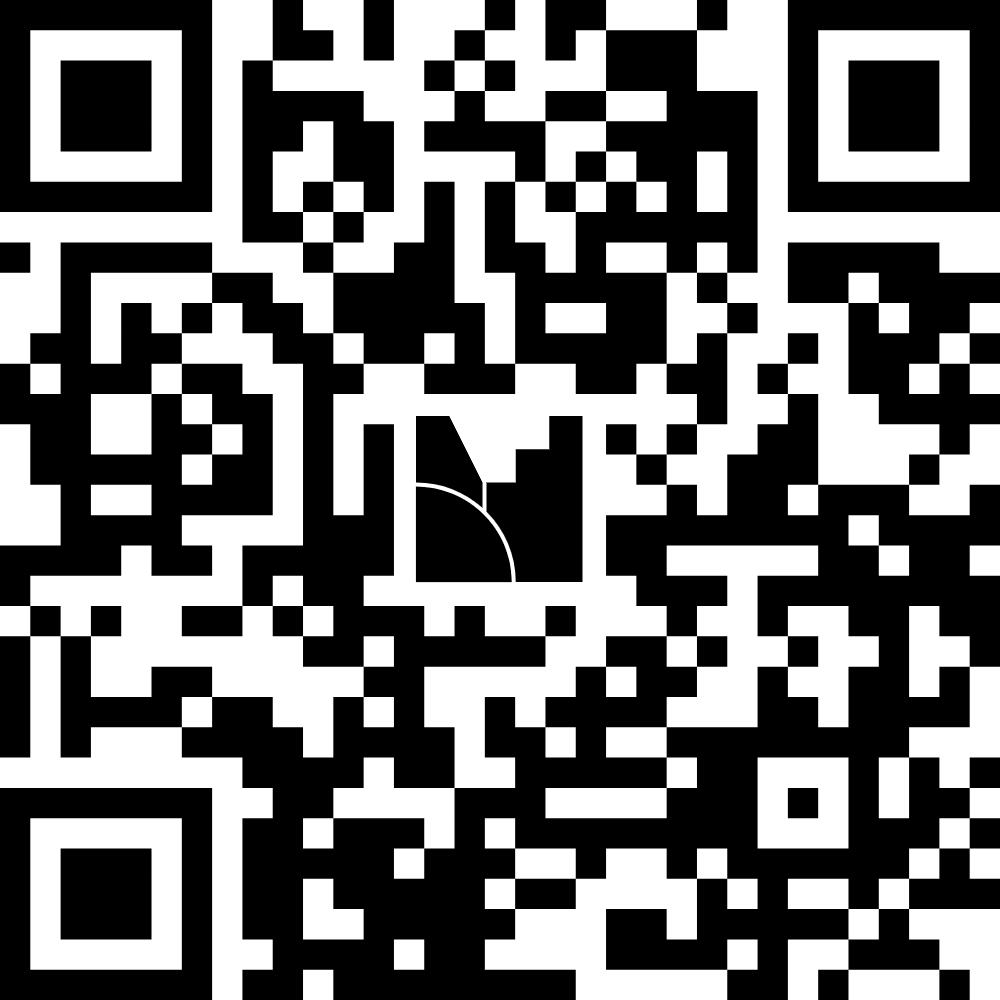

## Unsere Homebase

Alle Informationen und Unterlagen für alle Lehrveranstaltungen des Moduls (Vorlesungen & Übungen) für dieses und nächstes Semester werden gebündelt auf einer Website dargestellt:

::: {.callout-note appearance="simple"}
## Homebase

<https://unterscheiden-und-vergleichen.netlify.app>
:::

Bitte nutzen Sie diese Webpage als erste Anlaufstelle.

## Aufbau des Moduls

```{mermaid}
flowchart LR
%%| deviceScaleFactor: 2
%%| fig-width: 6.5
 subgraph Sommersemester["**Sommersemester**"]
        B["V: Datenanalyse"]
        B1["Übungen"]
        AB2["Arbeitsblätter"]
  end
   subgraph Wintersemester["**Wintersemester**"]
        A["V: Grundlagen"]
        A1["Übungen"]
        AB1["Arbeitsblätter"]
  end
 subgraph Modulprüfung["Modulprüfung"]
        K["Klausur"]
  end
    A --> AB1 & A1
    B --> AB2 & B1
    AB1 -- bestanden --> K
    AB2 -- bestanden --> K
```

## Soziologie Ergänzungsfach

<iframe data-external="1" width="1200" height="700" src="https://docs.google.com/spreadsheets/d/e/2PACX-1vRiCpi-YEhCI1Y15zMb9m2Uud0zoVupGBpA088mqEfIUE1dwthVUGo4Bx7eqWmQTCSmaSRD791PZ2r4/pubhtml?widget=true&amp;headers=false">

</iframe>

## Wissenschaftsquiz Log-In

{width=40%}

## Wissenschaftsquiz

::: {style="position: relative; padding-bottom: 56.25%; padding-top: 35px;
  height: 0; overflow: hidden;"}
<iframe data-external="1" sandbox="allow-scripts allow-same-origin allow-presentation" allowfullscreen="true" allowtransparency="true" frameborder="0" height="315" src="https://www.mentimeter.com/app/presentation/al774qnixb3k3upv4j52zmzyp9q4qy8d/embed" style="position: absolute; top: 0; left: 0; width: 100%; height: 100%;" width="420">

</iframe>
:::

## Zum Weiterlesen {.midi}

1. Cools, Sara (2025): Older sisters and younger siblings: How is school performance affected by sibling gender? *Economics of Education Review*  <https://www.sciencedirect.com/science/article/pii/S0272775725000895>

2. Hamjediers, Maik (2023): Gender-Atypical Learning Experiences of Men Reduce Occupational Sex Segregation: Evidence from the Suspension of the Civilian Service in Germany. *Gender & Society* <https://journals.sagepub.com/doi/10.1177/08912432231177650>

3. Kjærvik, Sophie L., and Brad J. Bushman (2024): A meta-analytic review of anger management activities that increase or decrease arousal: What fuels or douses rage?. *Clinical Psychology Review* <https://www.sciencedirect.com/science/article/pii/S0272735824000357>
