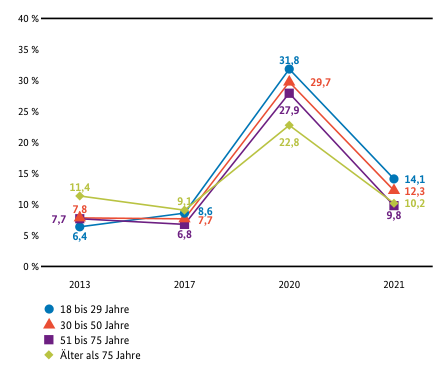
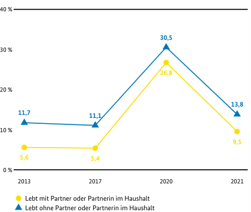

## Ein empirisches Problem: Einsamkeit und Gesellschaft {.midi}

::::: columns
::: {.column width="30%"}
 
:::

::: {.column width="70%"}
-   27% junger Frauen und 21% junger Männer gab in der 19. Shell-Jugendstudie an, sich oft einsam zu fühlen [(Albert et al. 2024)](https://www.shell.de/ueber-uns/initiativen/shell-jugendstudie-2024.html).
-   Insgesamt steigt der Anteil der einsamer Personen in der Bevölkerung; Abb. links; Quelle: [Einsamkeitsbarometer (2024)](https://www.bmbfsfj.bund.de/bmbfsfj/service/publikationen/einsamkeitsbarometer-2024-237576).
-   Es ist jedoch bis jetzt unklar, wie Einsamkeit adäquat erfasst werden kann [(Walsch et al., 2025)](https://www.nature.com/articles/s44220-024-00382-3).
:::
:::::

## Einsamkeit - Konzeptspezifikation {.midi}

Wir übernehmen die Definition von [Walsch et al. (2025, 175)](https://www.nature.com/articles/s44220-024-00382-3).

> Loneliness is typically defined as the subjective state associated with deficits in social connection, characterized by perceived discrepancies between one’s desired and objective social relationships.

Die Autoren grenzen dieses Konzept dann von *Isolation* wie folgt ab:

> Loneliness is distinct from isolation, which is the objective lack of social or emotional connections. Loneliness encompasses more than just physical isolation, reflecting an individual’s relational preferences, cognitions, and desires.

## Einsamkeit -- alles nicht so einfach... {.midi}

::::: columns
::: {.column width="30%"}
](images/village-networks.png)
:::

::: {.column width="70%"}
Wenn Einsamkeit ein unerfülltes Bedürfnis nach Verbindung ist, dann helfen uns die Netzwerkstrukturen, Einbettungen in Organsisationen, oder quantitative Erfassungen sozialer Kontakte nur sehr bedingt weiter.

In den Abbildungen links können Sie nicht erkennen, wer von den Personen (=Punkte) sich einsamer fühlt als andere. Wir können damit Isolation studieren, aber nicht Einsamkeit.
:::
:::::

## Einsamkeit als unerfülltes Bedürfnis

::::: columns
::: {.column width="40%"}

:::

::: {.column width="60%"}
Das Bedürfnis nach sozialen Verbindungen kann auf zwei Arten nicht erfüllt sein:

1.  Eine Person fühlt sich innerhalb ihrer sozialen Umgebung emotional nicht verbunden (emotionale Einsamkeit).
2.  Eine Person sieht ihr persönliches Mindestmaß sozialer Verbindungen nicht erfüllt (soziale Einsamkeit).
:::
:::::

## Keep it simple?

Warum fragen wir nicht einfach "Wie oft fühlen Sie sich einsam?"

::: {.callout-note appearance="simple"}
## Tipps aus der Praxis

Kann man machen ([Halvorson et al., 2024](10.1037/tps0000438))!

Aber:

-   Wir können dann verschiedene Fälle von Einsamkeit nicht mehr unterscheiden - wenn uns das wichtig ist ([Walsch et al., 2025](https://www.nature.com/articles/s44220-024-00382-3)).
-   Sehr wahrscheinlich verneinen viele Personen diese Frage, obwohl sie sich einsam fühlen. [van den Broek et al. (2024)](https://doi.org/10.1007/s10433-024-00826-w) zeigen experimentell, dass sich bei der "einfachen" Messung von Einsamkeit circa 6% der Befragten und bei der "komplexen" Messung 13% der Befragten als einsam einstuften.
:::

## Grundsätzliche Fragen zur Erfassung von Eigenschaften

1.  Aus wie vielen Elementen besteht die Eigenschaft, die erfasst werden soll (Dimensionalität)?
2.  Wie lassen sich die Ausprägungen der Eigenschaft und/oder seiner Elemente adäquat erfassen (Messung/Skalierung).

## Dimensionen {.midi}

-   Nehmen wir an, dass eine Eigenschaft nur aus einem Element aufgebaut ist, das sich auch nicht in kleinere Bestandteile zerlegen lässt, dann bezeichnen wir diese als **eindimensional** (Alter, Geschlecht, Arbeitsstunden).

-   Eigenschaften können jedoch auch auf einer Kombination von Elementen basieren, die für sich jeweils eigene Wirkungen oder Bedeutungen haben und sich ggf. auch unabhängig voneinander verändern oder sich gegenseitig kompensieren können. In diesem Fall liegt eine **mehrdimensionale** Eigenschaft vor (sozialer Status, Persönlichkeitsstruktur).

## Variante 1: Eindimensional - manifest

```{mermaid}
%%| fig-align: center
flowchart LR

E([Einsamkeit]) --> I1["`Wie oft fühlen 
Sie sich einsam?`"]

```

## Variante 2: Eindimensional - latent

```{mermaid}
%%| fig-align: center
flowchart LR

subgraph K[" "]
E([Einsamkeit])
end 

subgraph I["Indikatoren"]
I1; I2; I3; 
end 

E --> I1 & I2 & I3

```

## Variante 3: Zweidimensional 

```{mermaid}
%%| fig-align: center
flowchart LR


subgraph K["Dimensionen"]
E([Einsamkeit])
GE(["`Sozial einsam`"])
IE(["`Emotional einsam`"])
end 

subgraph I["Indikatoren"]
I1; I2; I3; I4;
end 

E --> GE & IE
GE --> I1 & I2
IE --> I3 & I4
```

## Variante 4: Dreidimensional A

```{mermaid}
%%| fig-align: center
flowchart LR


subgraph K["Dimensionen"]
E([Einsamkeit])
IS(["`Isoliertheit`"])
RV(["`Relationale Verbundenheit`"])
KV(["`Kollektive Verbundenheit`"])
end 

subgraph I["Indikatoren"]
I1; I2; I3; I4; I5; I6
end 


E --> IS & RV & KV
IS --> I1 & I2
RV --> I3 & I4
KV --> I5 & I6

```

## Variante 5: Dreidimensional B

```{mermaid}
%%| fig-align: center
flowchart LR


subgraph K[" "]
E([Einsamkeit])
GE(["`Sozial einsam`"])
IE(["`Emotional einsam`"])
AE(["`Affiliativ einsam`"])
end 

E --> GE & IE & AE
GE --> I1 & I2
IE --> I3 & I4
AE --> I5 & I6
```


## Dimensionen & Ausprägungen {.midi}

::: {style="float: left"}
{.plot-padding}
:::

Konstrukte bestehen immer aus Dimensionen, die wiederum Ausprägungen haben. 

Ausprägungen sind alle Varianten eines bestimmten Konzepts.[^1] 

Ausprägungen sind theoriegeleitet und nicht notwendigerweise erschöpfende Beschreibungen der Vielfalt eines Phänomens.

Die Ausprägungen können unterschiedlich strukturiert sein (Nullpunkt, gleiche Abstände, Ränge, Typen).

[^1]: In der Sprachphilosophie und Linguistik wird dies auch als type/token Unterscheidung genutzt. 

---

## Dimensionen & Ausprägungen {.midi}

Ausprägungen und verschiedene Dimensionen sind nicht das Gleiche! In der Tabelle werden vier verschiedene Ausprägungen von Gesamteinsamkeit erfasst, die auf zwei verschiedene Dimensionen von Einsamkeit mit jeweils zwei Ausprägungen beruhen.

+------------------+------+---------------+
|                  |      | Sozial einsam |
+==================+======+======+========+
|                  |      | ja   | nein   |
+------------------+------+------+--------+
| Emotional einsam | ja   |      |        |
|                  +------+------+--------+
|                  | nein |      |        |
+==================+======+======+========+

## Dimensionen & Ausprägungen

::: {style="float: left"}
{.plot-padding}
:::

Dimensionen einer Eigenschaft können in unterschiedlichem Zusammenhang zueinander und zur gesamten Eigenschaft stehen.

Die Kombination aus den Ausprägungen pro Dimension ergibt die Ausprägung der gesamten Eigenschaft für eine Untersuchungseinheit.


## Beispiel: Intelligenzmessung

](images\intelligence-meassure.jpg)

## Beispiel: berufliche Selbstregulation

](images/beruflicheselbstregul-dim.png)

## Unterschiedlichkeit von Eigenschaften und Ausprägungen {.midi}

Personen unterscheiden sich pro Dimension hinsichtlich einer Eigenschaft. Daher müssen wir für jede Dimension diese Unterschiedlichkeit hinsichtlich ihrer **relevanten Ausprägungen**[^2] erfassen.

Ausprägungen sind daher Wahrnehmungen unter zu Hilfe Nahme von Konzepten (das haben wir als "Beobachtung" definiert).  

[^2]: Ja, das ist eine Theoriefrage. Nicht jede Art des Bildungsabschlusses ist für jede Forschungsfrage relevant. Manchmal sind nur grobe Unterschiede relevant, manchmal müssen es sehr feine Unterschiede sein. Learn to love it!

------------------------------------------------------------------------

## Augenfarben 

30386-5/fulltext)](https://www.fsigeneticssup.com/cms/10.1016/j.fsigss.2019.10.057/asset/21029312-8360-46c0-9f4e-4040e21bdca3/main.assets/gr1_lrg.jpg){width=90%}

## Augenfarben

](https://upload.wikimedia.org/wikipedia/commons/a/a7/Eye_colors_map_of_Europe.png){width=50%}


## Ausprägungen

Wir können Ausprägungen spezifische Informationen zuschreiben. Die für uns relevanteste Information ist, wie die Abstände zwischen den Ausprägungen strukturiert sind.

)](images/skalenniveaus.png)

## Ausprägungen

Eine etwas detaillierete Unterscheidung der festgelegten Eigenschaften ermöglicht darüber hinaus folgende Differenzierung: 

::: custom-small
+--------------+-----------+-----------+-------+----------+-------------------------+
|              |           |   Festgelegte Eigenschaft                              |
+==============+===========+===========+=======+==========+=========================+===============================+
| Skalenniveau | Subtyp    | Identität | Ränge | Abstände | Nullpunkt               | Beispiel                      |
+--------------+-----------+-----------+-------+----------+-------------------------+-------------------------------+
| Nominal      |           | ja        | nein  | nein     | nein                    | Familienstand, Länder         |
+--------------+-----------+-----------+-------+----------+-------------------------+-------------------------------+
| Ordinal      |           | ja        | ja    | nein     | nein                    | Schulnoten, Machtpositionen   |
+--------------+-----------+-----------+-------+----------+-------------------------+-------------------------------+
| Metrisch     | Intervall | ja        | ja    | ja       | nein                    | Prestige, IQ-Scores           |
+--------------+-----------+-----------+-------+----------+-------------------------+-------------------------------+
|              | Ratio     | ja        | ja    | ja       | ja                      | Alter, Arbeitslosigkeitsdauer |
+==============+===========+===========+=======+==========+=========================+===============================+
:::