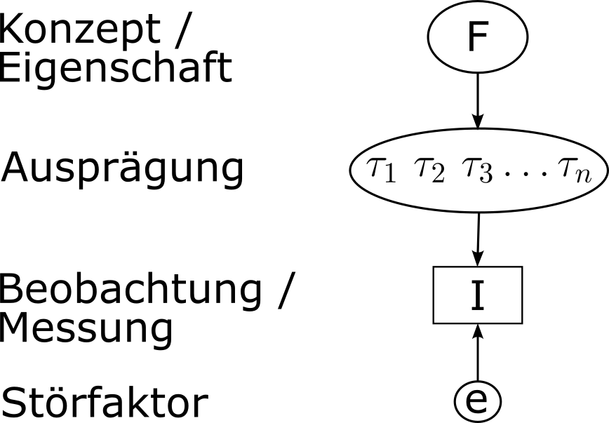
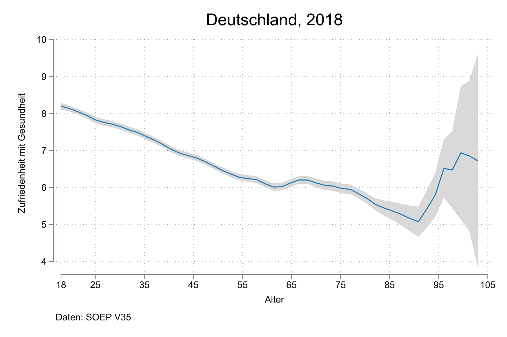
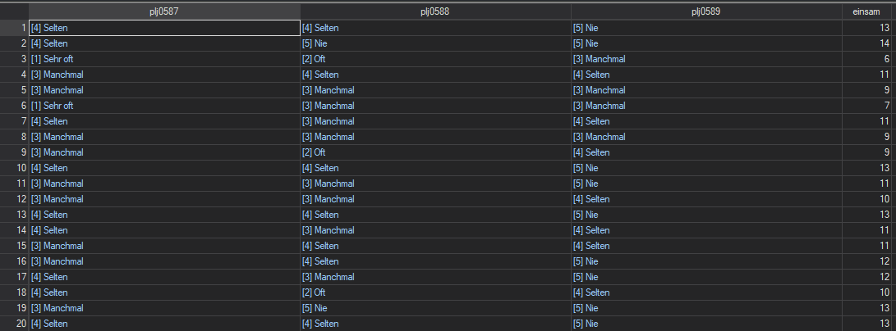
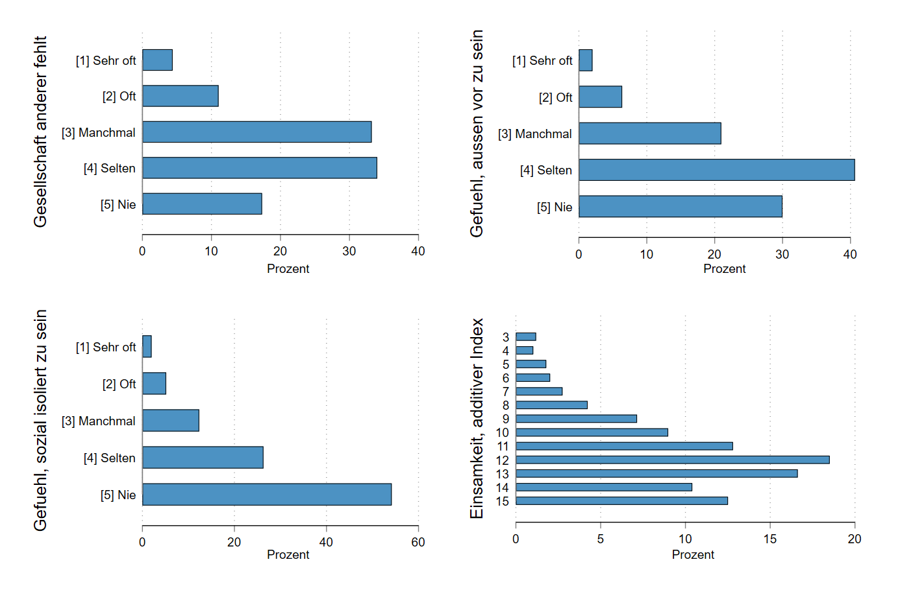

## Beobachten und nach Ausprägungen unterscheiden

{width="60%"}

## Messen = Ausprägungen einer Eigenschaft unterscheiden {.midi}

::::: columns
::: {.column width="30%"}
 [Bildquelle](https://www.splashlearn.com/math-vocabulary/measurements/measurement)
:::

::: {.column width="70%"}
Wir wollen Personen[^1] hinsichtlich ihrer Ausprägungen von Eigenschaften unterscheiden. Dazu brauchen wir ein Symbol für jede (relevante) Ausprägung, die wir einer Beobachtung dieser Ausprägung zuordnen. In den meisten Fällen ist dieses Symbol eine Zahl. Die Anordnung dieser Zahlen/Symbole ist eine Skala.
:::
:::::

## Unterschiede auf eine Skala bringen: Berufsprestige

::::: columns
::: {.column width="50%"}
](images/prestige-ausbildungsberufe.png)
:::

::: {.column width="50%"}
[Ebner & Rohrbach-Schmidt (2022)](https://www.degruyter.com/document/doi/10.1515/zfsoz-2021-0026/html) haben eine Skala für das soziale Ansehen von Berufen entwickelt.

Damit lassen sich Berufe nach ihrem Prestige unterscheiden und anhand einer Skala sortieren (links am Beispiel von Ausbildungsberufen).
:::
:::::

## Verhältnis von Eigenschaften, Ausprägungen, Beobachtungen und Fehlern {.midi}

::::: columns
::: {.column width="30%"}

:::

::: {.column width="70%"}
Die Eigenschaft, von der wir ein Konzept formulieren, wird üblicherweise mit *F* abgekürzen.[^2] Unterschiedliche Ausprägungen der Eigenschaft werden mit $\tau_1 \dots \tau_n$ (sprich: Tau) abgekürzt. Die Beobachtung einer **Ausprägung** wird mit *I* abgekürzt.[^3] Beobachtungen könen fehlerhaft sein. Die Quelle(n) einer fehlerhaften Beobachtung kürzen wir mit *e* ab (old school auch $\epsilon$, sprich: Epsilon.)
:::
:::::

[^2]: Kommt aus Großvaters Zeiten, in der alles ein *F*aktor war.

[^3]: Die Großväter (ja, es waren alles Männer) haben das *I*ndikator genannt.

---

## Verhältnis von Eigenschaften, Ausprägungen, Beobachtungen und Fehlern {.midi}

::::: columns
::: {.column width="30%"}

:::

::: {.column width="70%"}
Beachten Sie bitte auch die Richtung der Pfeile im Graph!

Die Eigenschaft (oder wie wir sie konzeptualisieren) bestimmt die Anzahl und Art der Ausprägungen.

Pro Untersuchungseinheit ist eine Ausprägung einer Eigenschaft vorhanden.

Diese Ausprägung lässt sich beobachten und mit einem Symbol belegen.

Diese Beobachtung wird aber von einer Störquelle beeinflusst.
:::
:::::

## Latente und manifeste Eigenschaften

Wir können Eigenschaften danach unterscheiden, ob wir bei der Beobachtung ihrer Ausprägungen Störquellen annehmen oder nicht: 

```{mermaid}
flowchart TB
    E["Eigenschaften"] -- Störquelle ausgeschlossen --> M["Manifest"]
    E -- Störquelle angenommen --> L["Latent"]
    M --- M1["Alter"] & M2["Torvorlagen"] & M3["Blutgruppe"]
    L --- L1["Einstellungen"] & L2["Armut"] & L3["Einsamkeit"]

```

Das ist eine *pragmatische* Unterscheidung, die wir bei jeder Eigenschaft so oder so treffen können (siehe: Fühlen Sie sich öfter einsam?)

## Alles fliest - vor allem pragmatische Unterschiede

```{mermaid}
flowchart TB

B([Biologisches <br> Alter])
A[Angegebenes <br> Alter]
E1((Erinnerungsfehler)) 
E2((Keine <br> Geburtsurkunde))
E3((Vordatierung))
E4((Rückdatierung))

E1@{ shape: text}
E2@{ shape: text}
E3@{ shape: text}
E4@{ shape: text}

B --> A ~~~ E1 & E2 & E3 & E4
E1 & E2 & E3 & E4 --> A
```


## Warum das alles? 

 - Unser Ziel ist es, soziale Prozesse besser zu verstehen.
 - Soziale Prozesse sind Verbindungen von Eigenschaften über Untersuchungseinheiten.
 - Dazu müssen wir verstehen, wie **Unterschiede** der Eigenschaft A mit **Unterschieden** der Eigenschaft B zusammenhängen.
 - Wenn wir in einem der erfassten Unterschiede auch einen großen Anteil von Störfaktoren/Messfehlern haben, ist unsere Untersuchung problematisch. 
 
## Alter und Gesundheit


## Alter und Gesundheit

{width=70%}

## Alter und mentale Gesundheit

 ](images/age_dispair.png){width=50%}


## Fehlerquellen unterscheiden
::::: {.columns}
:::: {.column width="50%"}
](images/path-impulsivity-externalizing.png)
::::

:::: {.column width="50%"}
- Mütter und Väter sind bessere Informationsquellen über das Verhalten des Kindes als Selbstangaben.
- Mütter und Väter können Impulsivität und Verhaltensprobleme ähnlich gut angeben, unterscheiden sich aber erheblich bei der Frustrationstoleranz.
::::
:::::

## Unterschiede erfassen: wozu nochmal?

::: {.centering}
```{mermaid}
%%| fig-align: center
flowchart TD
        A(["Sind wir an der systematischen <br> Verbindung von Eigenschaften <br> interessiert?"])
        DE([Deskription])
        T([Haben wir eine Theorie über <br> diese Verbindung, die <br> getestet werden soll?])
        EX([Exploration])
        HT([Hypothese])
        
        DE1["Wie groß ist die Gruppe <br> einsamer Personen <br> in Deutschland?"]
        DE1@{ shape: text}
        
        EX1["Gibt es einen Zusammenhang <br> zwischen Einsamkeit <br> und sportlicher <br> Aktivität?"]
        EX1@{ shape: text}       
        
        HT1["Je einsamer Personen sind, <br> desto höher ist ihr Suchtrisiko."]
        HT1@{ shape: text}       

        A -->|nein| DE --- DE1
        A -->|ja| T
        T -->|nein| EX --- EX1
        T -->|ja| HT --- HT1
        
```
:::

## Eigenschaften und Variablen

::::: {.columns}
:::: {.column width="50%"}
{width=80%}
::::

:::: {.column width="50%"}
Eine Variable ist das *Ergebnis* der Erfassung von Ausprägungen. 

Eine Variable ist **nicht** die Eigenschaft selbst, sondern unsere symbolisch protokollierte Beobachtungen von individuellen Ausprägungen, die durchaus große Anteile von Störfaktoren haben kann. 
::::
:::::

## Wie sieht das in der Praxis aus? {.midi}
{width=70%}

Wie oft haben Sie das Gefühl,

 - dass Ihnen die Gesellschaft anderer fehlt? [plj0587]
 - dass Sie sozial isoliert sind? [plj0588]
 - außen vor zu sein? [plj0589]

## Einsamkeit in Deutschland (2017)

{width=80%}
