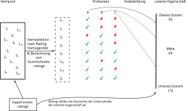

## Skalierung und Typisierung

Besteht das Konstrukt aus verschiedenen Subdimensionen, müssen die Ausprägungen jeder einzelnen Dimension in Kombination gesetzt werden.

-   Ist das Resultat dieser Kombination eine metrische Unterscheidung, wird dies auch als *Skala* oder *Index* bezeichnet.

-   Ist das Resultat eine ordinale oder nominale Unterscheidung, wird dies auch als *Typisierung* bezeichnet.

## Misanthrophie

::::: columns
::: {.column width="30%"}

:::

::: {.column width="70%"}
Bitte diesem [Link](https://f25ju5-andreas-haupt.shinyapps.io/misanthro) folgen oder 
:::
:::::

## Die Messung latenter Eigenschaften

-   Wir können Unterschiede in den Ausprägungen latenter Eigenschaften durch mehrere Beobachtungen erfassen.

-   Die zugrunde liegende, latente Eigenschaft führt zu unterschiedlichem Verhalten/Zuständen der Untersuchungseinheiten.

-   Die Kombination der unterschiedlichen Verhaltensweisen oder Zustände kann uns einen Rückschluss auf die latente Eigenschaft ermöglichen.

-   Wenn wir jeder beobachteten Verhaltensweise oder Zustand einen Zahlenwert zuweisen, können wir für die latente Eigenschaft eine/n Skala/Index erstellen.

## Die Messung latenter Eigenschaften

::::: columns
::: {.column width="50%"}
{width="90%"}
:::

::: {.column width="50%"}
Annahmen:

-   Die die Ausprägungen in systematischen Zusammenhang miteinander und zu der latenten Eigenschaft stehen.

-   Die Störfaktoren sind voneinander unabhängig und treten zufällig auf.
:::
:::::

## Ausprägungen und Indikatoren

{width="70%"}

## Auswahl von Indikatoren: Bandbreite

-   Die Indikatoren müssen die volle **Bandbreite** der (theoretisch postulierten) Unterschiede (= Dimensionen + Ausprägungen) erfassen können.[^1]

    -   Dazu wird in der Regel ein **Indikatorenpool** angelegt, der im Rahmen einer Befragung auch als **Itempool** bezeichnet wird.

    -   Aus diesem Pool müssen die geeignetsten Indikatoren oder Items **selektiert** werden.

[^1]: Das bedeutet nicht, dass wir alle möglichen Ausprägungen mit Indikatoren erfassen müssen, sondern nur, dass wir nicht systematisch einen Teil der zugrunde liegenden Unterschiede ignorieren.

## Auswahl von Indikatoren: Ein-Eindeutigkeit

-   Die resultierenden numerischen Unterschiede (pro Subdimension) müssen so sein erhoben werden, dass jeder Untersuchungseinheit ein spezifischer Wert zugeordnet werden kann.

    ```         
    - Dadurch können alle Untersuchungseinheiten nach ihrer Unterschiedlichkeit sortiert werden können (sofern ordinale oder metrische Ausprägungen vorliegen).

    - Ausprägungen von Subdimensionen müssen so kombinierbar sein, dass ebenfalls eine ein-eindeutige Zuordnung von Gesamtwert zur Gesamtausprägung möglich ist. 
    ```

## Thurstone-Skalierung

::::: columns
::: {.column width="20%"}
[Louis Leon Thurstone (1887-1955)](https://www.biografiasyvidas.com/biografia/t/fotos/thurstone.jpg)
:::

::: {.column width="80%"}
Eine Möglichkeit, latente Eigenschaften durch Befragungen oder psychologische Tests zu erfassen, wurde von Louis Leon Thurstone entwickelt.

Die Methode wird insbesondere für Intelligenztests und die Erfassung von Einstellungen angewandt.

Sie setzt voraus, dass die Ausprägungen der latenten Eigenschaften eine Hierarchie haben (also mindestens ordinal skaliert sind).
:::
:::::

## Thurstone-Skalierung

1.  Anlage eines großen Itempools, der das gesamte Spektrum aller Reaktionen/Einstellungen/Verhaltensweisen enthalten soll, das theoretisch erfasst werden soll.

2.  Die Items werden Expert:innen zum bewerten (engl.: *rating*) vorgelegt. Die Bewertungen orientieren sich an der Hierarchie der Ausprägungen der latenten Eigenschaft.

3.  Items, bei denen Uneinigkeit zwischen den Expert:innen besteht, werden ausgechlossen.

## Thurstone-Skalierung

4.  Jedes Item erhält den Durchschnittsbewertung aller Expert:innen. Dadurch lassen sich die Items in eine Ordnung bringen, die die "Position" des Items in der Hierarchie der latenten Eigenschaft darstellt.

5.  Die Items werden Probanten vorgelegt. Als Antwortkategorien sind nur binäre Kategorien zugelassen: ja (= 1)/nein (= 0); Aufgabe gelöst (= 1)/nicht gelöst (= 0); Reaktion gezeigt (= 1) / nicht gezeigt (= 0).

6.  Für jeden Probant wird die Summe aus allen ja/gelöst/Reaktion gezeigt (= 1) Itemscores gebildet. Mit diesem Wert lassen sich die Personen nach ihrer Ausprägung der latenten Eigenschaft unterscheiden.

## Thurstone Skalierung



## Thurstone-Skalierung

](https://journals.plos.org/plosone/article/figure/image?size=large&id=10.1371/journal.pone.0096431.g001){width="50%"}

## Thurstone-Skalierung {.midi}

:::{.callout}

## Skala für die Kontaktsituation in Wohnsiedlungen

1.  Ich komme mir in dieser Siedlung oft vor wie ein Fremder. (-2,00)

2.  Keinem Menschen in der Nachbarschaft würde es auffallen, wenn mir etwas zustieße. (-3,05)

3.  Hier in der Siedlung haben die Menschen keine Geheimnisse voreinander. (+3,30)

4.  Ich habe oft den Eindruck, dass sich die Menschen in meinem Wohnbezirk nur flüchtig kennen. (-0,53)

5.  Ich kenne kaum jemanden in meinem Wohnbezirk, mit dem ich über private Dinge reden könnte. (-0,33)

6.  In diesem Wohnbezirk ist es kaum möglich, sich auch nur für kurze Zeit von den anderen zurückzuziehen. (+1,79)

7.  Ich kenne hier in der Nachbarschaft fast jeden mit Namen. (+0,90)
:::

## Guttman-Skalierung

::::: columns
::: {.column width="30%"}
](https://static.wixstatic.com/media/c8a426_46aa46baed894860ba6a15675c613d04~mv2.jpg/v1/fill/w_120,h_120,al_c,q_80,usm_0.66_1.00_0.01,enc_avif,quality_auto/c8a426_46aa46baed894860ba6a15675c613d04~mv2.jpg){width="130%"}
:::

::: {.column width="70%"}
Ein weiteres Verfahren zur Erfassung latenter Eigenschaften wurde von Louis E. Guttman entwickelt.

Diese Art der Skalierung setzt voraus, dass die latente Eigenschaft Ausprägungen (in überschauberer Anzahl) hat, die streng hierarchisch geordnet sind.
:::
:::::

## Guttman-Skalierung

1.  Entwickle eine Liste von Items, die alle Ausprägungen des Merkmals erfassen. Die Items müssen sich streng nach der Hierarchie der Ausprägungen sortieren lassen (z.B.: von nicht hilfsbedürftig bis stark hilfsbedürftig) und dürfen sich nicht überschneiden.

2.  Lege die Liste Personen vor, die binär reagieren müssen: z.B.: ablehnen oder zustimmen / lösen oder nicht lösen.

3.  Die Anzahl aller positiven Reaktionen pro Person bildet eine Rangfolge, die die Ausprägung der latenten Eigenschaft wiedergibt.

## Guttman-Skalierung: Antisemitismus {.midi}

:::::: columns
::: {.column .callout width="50%"}
## Würden Sie es begrüßen, wenn

1.  Juden Deutschland besuchen.

2.  Juden sich in Deutschland niederlassen.

3.  Sie einen Juden als Arbeitskollegen haben.

4.  Sie einen Juden als Freund haben.

5.  Sie einen Juden heiraten würden.
:::

::: {.column width="5%"}
:::

::: {.column width="45%"}
Für eine Skala von Antisemitismus können wir eine Hierarchie sozialer Beziehungen nach "persönlicher Nähe" aufstellen.

Wir können dann Personen danach unterscheiden, wie nah sie jüdische Personen an sich heranlassen.
:::
::::::

## Grad der körperlichen Behinderung

::::: columns
::: {.column width="50%"}

:::

::: {.column width="50%"}
Gesundheitsfachkräfte wollen pflegebedürftige Personen nach dem Grad ihrer Beeinträchtigung unterscheiden.

Eine Möglichkeit ist, eine Guttman-Skala zu bilden, die verschiedene Tätigkeiten in der Hierarchie ihrer motorischen Komplexität bringt und zu erheben, ob Personen diese Motorik noch aufbringen können.
:::
:::::

## Unterschiede zwischen Guttman und Thurstone Skalierungen

-   Positive und negative Reaktionen können sich bei einer Thurstone-Skala gegenseitig aufheben, aber nicht bei einer Guttman-Skala.

-   Bei der Guttman-Skala gibt es (offiziell) keine Expert:innen, die für die Vorselektion sorgen.

-   Guttman-Skalen sind praktisch auf Eigenschaften mit überschaubaren Ausprägungen begrenzt.

## Likert-Skalierung {.midi}

::::: columns
::: {.column width="15%"}


[Rensis Likert (1903-1981)](https://de.wikipedia.org/wiki/Rensis_Likert)
:::

::: {.column width="85%"}
Die von Louis Thurstone oder Louis Guttman entwickelten Skalierungen nutzen die Unterschiedlichkeit der Items (über Scores oder ihre Position in einer Ausprägungshierachie) um Unterschiede der Ausprägungen zu erfassen. Das ist allerdings nicht immer praktikabel. Thurstone-Skalierungen können darüber hinaus sehr aufwändig und teuer sein.

Rensis Likert entwickelte eine Alternative, die besonders (aber nicht nur!) über die Antwortkategorien der Items die Unterschiedlichkeit von latenten Ausprägungen erfassen soll.

Diese Art der Skalierung setzt voraus, dass Personen in der Lage sind, sich durch ihre Reaktionen **konsitent** in Bezug auf eine Eigenschaft zu positionieren.
:::
:::::

## Likert-Skalierung

1.  Entwickle eine Liste von Items, die Variationen oder Aspekte des zugrunde liegenden Merkmals darstellen.

2.  Lege die Liste der Items Personen vor, die auf die Items mit unterschiedlichen Graden positiv, neutral oder negativ reagieren können. Die Ausprägungen der Reaktionen sind daher stets ordinal!

3.  Personen mit einer Ausprägung im unteren Bereich der Eigenschaft sollten daher sehr oft negativ auf Items reagieren und Personen mit einer hohen Ausprägung der Eigenschaft sollten sehr oft positiv reagieren.

4.  Ein Wert aus allen Reaktionen ist der Meßwert für jede Person.

## Likert-Skalierung

](images/likert-latent1.png){width=40%}

## Likert-Skalierung

](images/IRT-mentalhealth.jpg){width=50%}
