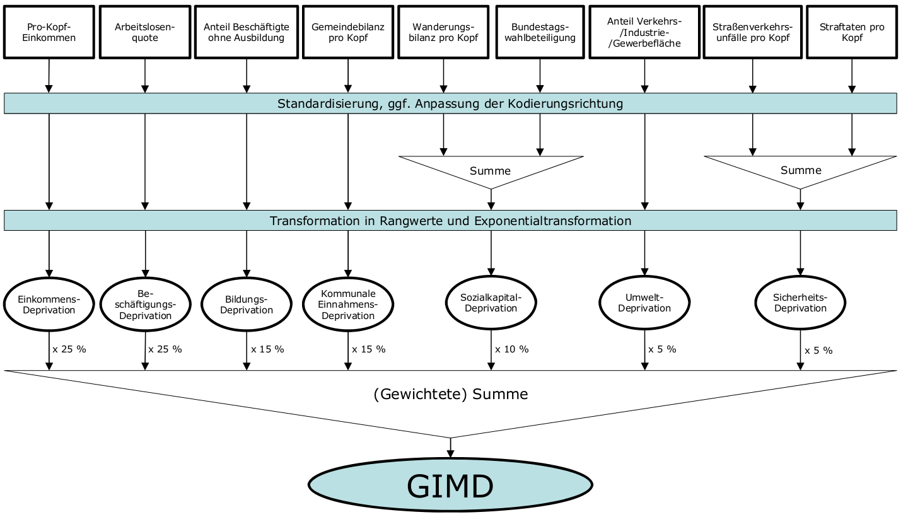
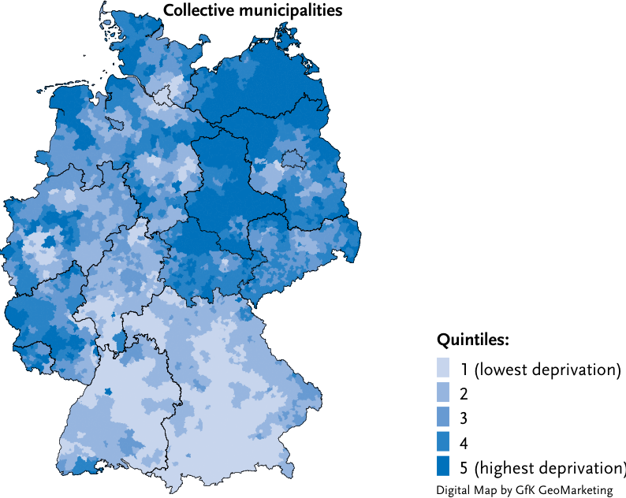

## Indexbildung

Werden die Ausprägungen (der verschiedenen Dimensionen) eines Merkmals metrisch gemessen, lässt sich mit ihnen ein Index konstruieren. Manche Indexbildungen beruhen auf der Annahme, dass sich alle Werte gleichwertig zu seinem Gesamtwert (=Index) aufsummieren. Das muss aber nicht der Fall sein. Wir können drei Formen der Indexbildung unterscheiden und müssen stets begründen, warum wir welche Form benutzen.

-   Additive Indizes: $I= X_1 + X_2 + X_3$

-   Gewichtete Indizes: $I= a \cdot X_1 + b \cdot X_2 + c \cdot X_3$

-   Multiplikative Indizes: $I = X_1 \cdot X_2 \cdot X_3$

Einen gewichteten Index benötigen wir, wenn verschiedene Items oder Dimensionen für das Endergebnis unterschiedlich bedeutsam sind. Einen multiplikativen Index benötigen wir, wenn alle Items sich auf notwendige Bedingungen einer Eigenschaft beziehen.

## Die perfekte Pasta-Form {.midi}

:::::: columns
::: {.column width="30%"}
 A) Sauceability: Wie gut verbindet sich die Nudel mit der Soße?
:::

::: {.column width="30%"}
 B) Forkability: Wie leicht lässt sich die Nudel auf die Gabel spießen/legen?
:::

::: {.column width="30%"}
 C) Toothsinkability: Wie gut fühlt es sich an, in die Nudel zu beißen?
:::
::::::

## Don't ask what the pasta can do for you...

 

Ihre Aufgabe:

1.  Entwickeln Sie über die Feiertage einen Nudel-Qualitäts-Index.
2.  Welche Ausprägungen haben die einzelnen Sub-Dimensionen der Nudel-Qualität?
3.  Wie kombinieren Sie die die einzelnen Ausprägungen zu einem Gesamt-Nudel-Qualitäts-Wert?
4.  Erheben Sie Qualitätswerte zu mindestens drei unterschiedlichen Nudelformen und protokollieren Sie Ihre Ergebnisse.

## Theoretische Differenzen zwischen additiven und multiplikativen Indizes

-   Die oben dargestellten additiven Indizes beruhen auf der Annahme, dass Ausprägungen in einer Dimension Nullwerte in einer anderen Dimension ausgleichen können.

-   Sie nehmen außerdem an, dass Kombinationen von sehr hohen oder sehr niedrigen Ausprägungen gleichabständig zu anderen Kombinationen sind.

-   Wir können aber jede Dimension als *notwendige Bedingung* ansehen, in denen Ausprägungen jenseits von null vorliegen müssen, damit wir in einem Gesamtindex oder einem Gesamttypus Ausprägungen weiter unterscheiden.

-   Kombination von hohen Werten können uns außerdem besonders bedeutsam sein.

## German Index of Multiple Deprivation

## German Index of Multiple Deprivation

## Bechdel Test

   

Der Bechdel-Test soll messen, ob ein Film *nicht* einseitig Männer orientiert ist.

Er ist es genau dann, wenn:

1.  mindestens zwei Frauen vorkommen, die

2.  miteinander reden und

3.  dieses Gespräch nicht einen Mann zum Gegenstand hat.

Alle drei Eigenschaften sind *notwendig*, damit der Test "positiv" ist.

## Bechdel 2025

|  |  |  |  |  |
|-----------------------|------------|------------|------------|------------|
|  | mind. zwei Frauen | reden miteinander | nicht nur übereinander | Gesamt |
| Predator: Badlands | 1 | 1 | 1 | 1 |
| Superman[^1] | 1 | 1 | 0 | 0 |
| The Fantastic Four: First Steps | 1 | 0 | 0 | 0 |
| Wish You Were Here | 1 | 1 | 1 | 1 |

[^1]: Zwei Frauen sprechen circa 30 Sekunden miteinander über Männer.

## Personalauswahl

- Eine Personalabteilung soll Kandidat:innen nach ihrem Potential für das Unternehmen sortieren. 

- Dazu erfassen sie die Fachkompetenz, die Erfahrung und die Teamfähigkeit der Kanditat:innen in drei Ausprägungen: 
  - 0 = nicht vorhanden, 
  - 1 = in Ordnung, 
  - 2 = exzellent.

Wir können drei Indizes erstellen: Index 1 ist additiv, Index 2 ist gewichtet-additiv (Gewichte in Klammern) und Index 3 ist multiplikativ.  
  
## Personalauswahl {.midi}
  

   Kandidat:in   Fachkompetenz (2)   Erfahrung (1.5)   Teamfähigkeit (1)   Index 1   Index 2   Index 3
  ------------- ------------------- ----------------- ------------------- --------- --------- ---------
        1                2                  1                  0              3        5.5        0
        2                1                  2                  0              3        5.0        0
        3                0                  1                  2              3        3.5        0
        4                1                  1                  1              3        4.5        1
        5                1                  2                  2              5        7.0        4
        6                2                  2                  2              6        9.0        8

- Index 1 unterscheidet die ersten vier Kanditat:innen gar nicht, weil sich die Schwächen gegenseitig kompensieren. Kandidat:in 5 & 6 unterscheiden sich in Bezug auf ihre Gesamtpassung nur gering.

- Index 2 bringt Kanditat:in 6, 5 und 1 auf die ersten drei Plätze.

- Index 3 sortiert die ersten drei Kandidat:innen aus und differenziert die letzten drei Kandidat:innen stark aus.

## Kombination von Ausprägungen nach Subdimensionen 

](https://journals.sagepub.com/cms/10.1177/0265407512471809/asset/225ba130-266c-49cb-9e51-d54cf5a6c660/assets/images/large/10.1177_0265407512471809-fig1.jpg){width=60%}

## Typenbildung

::::: {.columns}
:::: {.column width="50%"}

::::

:::: {.column width="50%"}

Manchmal sind nicht alle Ausprägungskombinationen von mindestens zwei Eigenschaften gleich wichtig (im Beispiel links sind es 81 Kombinationen). In diesem Fall werden die Ausprägungskombinationen auf wenige *typische* oder theoretisch relevante reduziert.

::::
:::::

## Typen $\neq$ Ausprägungen von Eigenschaften sondern *Kombinationen* 

{width=60%}

