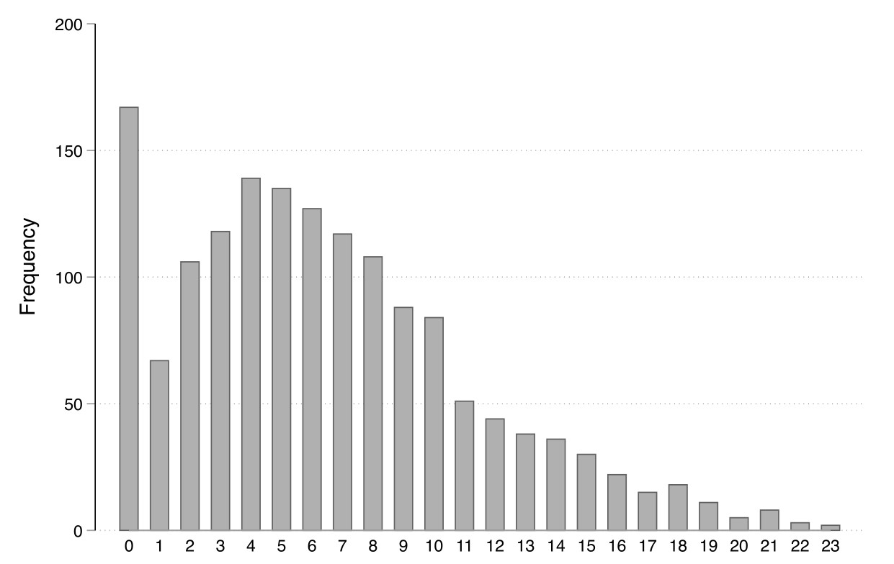
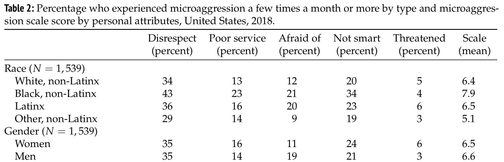
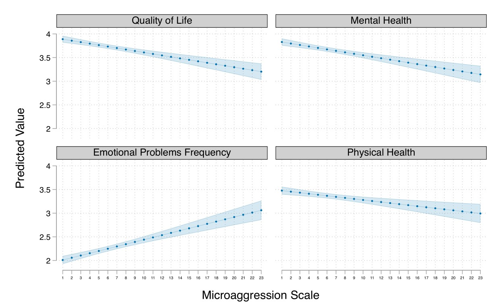

## Es könnt' vieles so einfach sein (isses aber nicht...) {.midi}

Eine perfekte Messung ordnet einer (wahren) Ausprägung einer Eigenschaft ein-eindeutig einen (Zahlen)Wert zu. Die gleiche Ausprägung der Eigenschaft von verschiedenen Personen bei einem Messzeitpunkt oder von der gleichen Person über verschiedene Messzeitpunkte würde bei einer perfekten Messung den identischen Zahlenwert erhalten.

In der Praxis ist es jederzeit möglich, dass

1.  eine Messung unterschiedliche Ergebnisse bei gleicher Ausprägung einer Eigenschaft liefert, weil die Messung durch starke, aber **zufällige** Störfaktoren beeinflusst wird (= Problem der Reliabilität).

2.  eine Messung nur in Teilen das misst, was sie messen soll oder **systematische** Einflüsse als Störfaktoren auftreten (= Problem der Validität).

# Reliabilität

## Überall Fehler {.midi}

::::: {.columns}

:::: {.column width="30%"}
{width=100%}
::::

:::: {.column width="70%"}
 Das Messergebnis $y_i$ (= Beobachteter Wert der Variable $Y$ einer Untersuchungseinheit $i$) wird mindestens von zwei Komponenten bestimmt:

1.  die (wahre) Ausprägung eines Merkmals $\tau$ (sprich: tau) sowie

2.  einen Störfaktor $\epsilon$ (sprich: epsilon), den wir zunächst als zufällig betrachten.

Wir gehen davon aus, dass sich beide Komponenten *additiv* verhalten und damit gilt: $y_i = \tau_i + \epsilon_i$
::::

:::::

## Reliabilität - systematische und unsystematische Variation {.midi}

Wenn wir Untersuchungseinheiten mehrfach testen oder verschiedene Untersuchungseinheiten mit gleichen Ausprägungen testen, müssen wir praktischerweise davon ausgehen, dass die Messergebnisse ($y_i$) über die verschiedenen Messungen *variieren*.

- Diese Variation - oder auch: Varianz - kürzen wir mit $Var()$ ab.

- Die Varianz der Messergebnisse einer Eigenschaft $Y$ ist daher $Var(y)$.

- Die Varianz der zugrunde liegenden Ausprägungen ist $Var(\tau)$. Diese Varianz ist die durch die Eigenschaft systematisch bedingte Unterschiedlichkeit unserer Messergebnisse.

- Die Varianz der Störfaktoren ist $Var(\epsilon)$. Wir gehen (zunächst) davon aus, dass diese Störfaktoren *zufällig* sind und die damit verbundene Varianz daher unsystematisch mit den Messergebnissen verbunden ist.

## Reliabilität = Verhältnis von systematischer und unsystematischer Variation

Wir können die Reliabilität einer Messung $Rel()$ definieren als den relativen Anteil der *systematischen* Varianz an der Varianz der Messergebnisse. Wenn die Ausprägungen einer Eigenschaft $\tau$ stark variieren, sollten auch unsere Messergebnisse stark variieren. Untersuchungseinheiten mit gleichen Ausprägungen sollten bei (wiederholten) Messungen nur eine kleine Varianz der Messergebnisse aufweisen.

$$Rel(y) = \frac{Var(\tau)}{Var(y)}.$$

Da die Reliabilität ein relativer Anteil ist, liegt ihr Wertebereich stets zwischen 0 und 1.

## Reliabilität = Verhältnis von systematischer und unsystematischer Variation

Da wir davon ausgehen, dass sich die Messergebnisse additiv aus $\tau$ und $\epsilon$ zusammensetzen, können wir die Gleichung umschreiben zu:

$$Rel(y) = \frac{Var(\tau)}{Var(\tau) + Var(\epsilon)} .$$

Ist der Störfaktor groß, ist die Reliabilität der Messung klein. Reliabilität ist daher in Maß für die *Zuverlässigkeit* von Messungen. Ist die Messung stark beeinflusst von zufälligen Schwankungen der Reaktion oder der Zustände der Untersuchungseinheiten, ist sie nicht reliabel.

## Covarianz von Items bei Mehrfachmessungen

::::: {.columns}
:::: {.column width="30%"}

::::

:::: {.column width="70%"}
Messen wir *eine* Ausprägung einer Untersuchungseinheit durch mehrere Items, ist dies eine Form der Messwiederholung. Jede Reaktion ist daher ein eigener Messwert $y_i$, der durch den zugrunde liegenden wahren Wert $\tau_i$ und Item-spezifische Störfaktoren gebildet wird.
 
Wenn die Reaktion auf die Items systematisch durch die zugrunde liegende Ausprägung hervorgerufen wird, müssen die Messergebnisse der einzelnen Items in systematischen Zusammenhang stehen. Dies bezeichnen wir ab sofort als *Covarianz* und kürzen sie mit $Cov()$ ab.
::::
:::::

## Covarianz von Items bei Mehrfachmessungen {.midi}

::::: {.columns}
:::: {.column width="30%"}
{width=100%}
::::

:::: {.column width="70%"}
Eine reliable Skalierung mit mehreren Items basiert daher auf einem sehr hohen Anteil von systematischer Covarianz zwischen den Reaktionen auf Items.

Wir gehen im links dargestellten Model davon aus, dass es keine Covarianz zwischen den Störfaktoren gibt.

Eine Skala ist wenig reliabel, wenn einzelne oder mehrere Items ein hohes Maß an unsystematischer Varianz in die Messung einführen. In diesem Fall würden wir vielen Untersuchungseinheiten mit gleicher Ausprägung eines Merkmals unterschiedliche Messergebnisse zuweisen.
::::
:::::

## Möglichkeiten Reliabilität zu testen

1.  Einfache Messwiederholung (Re-Test Korrelation)

    - Personen erhalten zu zwei (oder mehr) Messzeitpunkten das gleiche Messinstrument. Ist die Messung reliabel (und die Eigenschaft wenig variabel über die Zeit!), sollten zwischen den Messungen stark vergleichbare Ergebnisse erhalten werden.

2.  Parallel-Test

    - Leicht unterschiedliche Varianten eines Items werden parallel eingesetzt. Sind die Störfaktoren klein und unsystematisch, sollten stark vergleichbare Messergebnisse vorliegen.

## Möglichkeiten Reliabilität zu testen

1.  Split-Half Korrelation

    - Die Menge aller Items wird in zwei Hälften geteilt. Wenn die Skalierung reliabel ist, müssten die beiden Hälften untereinader und in Bezug auf die gesamte Skalierung ähnliche Ergebnisse liefern.

2.  interne Konsistenz

    - Wenn (!!) die Reaktion auf Items nur durch einen Faktor hervorgerufen werden und die Störfaktoren voneinander unabhängig und klein sind, ist die Varianz der Skalenwerte in hohem Maße durch die Varianz über alle Itemreaktionen zu erklären. Befragte reagieren daher wiederholt systematisch (=konsistent) auf die Items und nicht in hohem Maße unsystematisch.

##  Berechnung der internen Konsistenz (auch: tau-äquivalente Reliabilität oder Cronbachs Alpha) bei Mehrfachmessungen {.midi}

Interne Konsistenz lässt sich feststellen, wenn die Antworten auf die verschiedenen Items miteinander korrelieren. Die Maßzahl $\rho_{T}$ ist dafür ein Maß, das auch als Maß der internen Konsitenz bezeichnet wird.

$$ \rho_{T} = \frac{N\cdot \bar{r}}{1 + (N-1)\cdot \bar{r}} $$

$N$ ist dabei die `Anzahl der benutzten Items` und $\bar{r}$ ist die durschschnittliche Korrelation aller Items untereinander.    

Als Faustregel (!!!) gilt: Eine Skala ist ab 0.7 intern konsistent. 

## Interne Konsistenz der Erfassung von Mental Load {.midi}

::::: {.columns}
:::: {.column width="40%"}
During my daily activities **at home**:
  
  1.  I have a lot on my mind.

2.  I need to think about different things at the same time.

3.  I feel overwhelmed.

4.  I can concentrate on one thing at a time.

Responses: strongly agree, disagree, neither agree/nor disagree, agree, strongly agree
::::

:::: {.column width="10%"}

::::

:::: {.column width="40%"}
|    | I1 | I2 | I3 | I4 |
| ---- | --------|  -------- | -----| --- |
| I1 | 1 |  |  |  |
| I2 | 0.69 | 1 |  |  |
| I3 | 0.59 | 0.46 | 1 |  |
| I4 | 0.19 | 0.19 | 0.22 | 1 |
: Korrelationen der Items untereinander

::: {.r-fit-text}
$$\bar{r} = \dfrac{0.69 + 0.59 + 0.46 + 0.19 + 0.19 + 0.22}{6} = 0.39 $$
:::

$$\rho_{T} = \dfrac{4 \cdot 0.39}{1 + (4-1)\cdot 0.39} = 0.72 $$

::::
:::::

## Reliabilität von Einsamkeitsitems {.midi .scrollable}

Die einzelnen Items korrelieren konsistent mit dem latenten Faktor (vierte Spalte). 

| Item                                                                              	| M    	| SD  	| $r_{it}$ 	| $p_i$  	|
|-----------------------------------------------------------------------------------	|------	|-----	|-----	|-----	|
| 1\. Ich fühle mich in Übereinstimmung mit den Menschen um mich herum.             	| 1.76 	| .70 	| .45 	| .25 	|
| 2\. Ich habe nicht genügend Gesellschaft.                                         	| 2.06 	| .88 	| .48 	| .35 	|
| 3\. Es gibt niemanden, zu dem ich mich hinwenden kann.                            	| 1.46 	| .70 	| .50 	| .16 	|
| 4\. Ich fühle mich nicht allein.                                                  	| 0.61 	| .93 	| .39 	| .20 	|
| 5\. Ich fühle mich als Mitglied einer Freundesgruppe.                             	| 1.54 	| .79 	| .50 	| .18 	|
| 6\. Ich habe viel gemeinsam mit den Menschen um mich herum.                       	| 1.91 	| .79 	| .52 	| .30 	|
| 7\. Ich bin mit niemandem mehr eng zusammen.                                      	| 1.63 	| .91 	| .39 	| .21 	|
| 8\. Meine Interessen und Ideen werden von den Leuten um mich herum nicht geteilt. 	| 2.13 	| .85 	| .51 	| .38 	|
| 9\. Ich bin eine kontaktfreudige Person.                                          	| 1.67 	| .77 	| .42 	| .22 	|
| 10\. Es gibt Menschen, denen ich mich eng verbunden fühle.                        	| 1.31 	| .60 	| .50 	| .10 	|
| 11\. Ich fühle mich ausgeschlossen.                                               	| 1.62 	| .77 	| .53 	| .21 	|
| 12\. Meine sozialen Beziehungen sind oberflächlich.                               	| 2.00 	| .86 	| .42 	| .34 	|
| 13\. Niemand kennt mich wirklich.                                                 	| 1.96 	| .94 	| .55 	| .32 	|
| 14\. Ich fühle mich von anderen isoliert.                                         	| 1.58 	| .75 	| .68 	| .20 	|
| 15\. Ich kann Gesellschaft finden, wenn ich das wünsche.                          	| 1.54 	| .72 	| .44 	| .18 	|
| 16\. Es gibt Menschen, die mich wirklich verstehen.                               	| 1.55 	| .72 	| .53 	| .18 	|
| 17\. So zurückgezogen, wie ich bin, fühle ich mich unglücklich.                   	| 1.50 	| .77 	| .60 	| .17 	|
| 18\. Menschen sind zwar um mich herum, jedoch nicht bei mir.                      	| 2.05 	| .95 	| .57 	| .35 	|
| 19\. Es gibt Menschen, mit denen ich sprechen kann.                               	| 1.26 	| .56 	| .48 	| .09 	|
| 20\. Es gibt Menschen, zu denen ich mich hinwenden kann.                          	| 1.30 	| .58 	| .55 	| .10 	|
: {tbl-colwidths="[80,5,5,5,5]" .striped .hover}

Anmerkungen. M = Mittelwert, SD = Standardabweichung, $r_{it}$ = Trennschärfe, $p_i$ = Itemschwierigkeit.

# Validität

## Validität

Ein Merkmal wird valide gemessen, wenn das Messinstrument tatsächlich das Merkmal misst -- und nicht *systematisch* etwas anderes als man möchte.

Im Unterschied zur Reliabilität beziehen sich Probleme der Validität auf *systematische* Fehler bei der Messung. Theoretisch kann ein Messinstrument sehr reliabel aber nicht valide sein. Wir können zum Beispiel systematisch eine Subdimension bei der Messung nicht einbeziehen, die anderen Subdimensionen eines Merkmals aber sehr reliabel messen.

## Systematische Störungen von Messungen {.midi}

::::: {.columns}
:::: {.column width="40%"}
{width=100%}
::::

:::: {.column width="60%"}
**Problem 1: Ein Teil der Messung bezieht sich systematisch auf einen anderen Faktor.**

Im linken Modell soll $F_1$ mit vier Items gemessen werden. Reaktionen auf $I_4$ werden aber systematisch von einem anderen Faktor $F_2$ verursacht, der mit $F_1$ korreliert ist. Nur deshalb besteht auch eine Korrelation zwischen $I_4$ und $F_1$.

Bsp: Wir wollen Leistungsfähigkeit u.a. durch schulische Hausaufgaben messen und messen dadurch systematisch auch den Einfluss des elterlichen Umfelds.
::::
:::::

## Systematische Störungen von Messungen {.midi}

::::: {.columns}
:::: {.column width="40%"}
{width=100%}
::::

:::: {.column width="60%"}
**Problem 2: Die Störfaktoren sind nicht zufällig.**

Wir haben bisher angenommen, dass die Störfaktoren zufällig sind. Allerdings können diese auch systematisch sein. Im Modell werden die Störfaktoren von $I_2$ und $I_3$ von einem (nicht erfassten) Faktor $F_3$ beeinflusst. Da die beiden Störfaktoren systematisch von der gleichen Eigenschaft beeinflusst werden, sind diese auch nicht mehr voneinander unabhängig, sondern miteinander korreliert.

Bsp: Die Angabe von Schmerz durch Schmerzskalen ist u.a. davon abhängig, in welcher Geschlechter-Relation Befragte und Fragende zueinander stehen.

::::
:::::

## Arten von Validität

In der Literatur werden verschiedene Formen von Validität diskutiert, die im Kern verschiedene Facetten der **Gültigkeit** der wissenschaftlichen Untersuchung darstellen.

Historisch wurden viele verschiedene Formen von Validiät eingeführt. Mittlerweile werden für Messungen vor allem zwei Formen verwendet:

1.  Konstruktvalidität

2.  Kriteriumsvalidität

Darüber hinaus gibt es noch zwei weitere Formen von Validität, die sich auf die Gültigkeit der gesamten Untersuchung beziehen.

1.  interne Validität

2.  externe Validität

## Konstruktvalidität

Wurden alle Dimensionen des Merkmals gemessen oder weniger oder Dimensionen, die nicht zum Merkmal gehören?

- Diese Frage können Sie nur dann sinnvoll beantworten, wenn Sie vorher eine klare Konzeptspezifikation durchgeführt haben und es damit auch von anderen Konzepte, die potentiell in Zusammenhang mit Ihrem Konzept stehen könnten, abgegrenzt haben.

- Typischerweise diskutieren Forschende bei der Konstruktvalidität die Fragen, ob ein Konstrukt uni- oder mehrdimensional ist oder ob man eine Subdimension vergessen hat.

## Kriteriumsvalidität

Steht das gemessene Konstrukt empirisch in erwarteten Zusammenhängen zu anderen Konstrukten?

- Bei dieser Form von Validität geht es darum, ob ein Konstrukt

  - in Zusammenhang mit Konstrukten steht, mit denen es bekanntermaßen einen Zusammenhang bildet (Einsamkeit $\leftrightarrow$ Depression).

  - in Zusammenhang mit Konstrukten steht, die neu theoretisch erwartet werden (Einsamkeit $\rightarrow$ Ausbildungsabbruch).

  - *nicht* oder nur in begrenztem Maß in Zusammenhang mit Konzepten steht, die etwas anderes messen (Einsamkeit $\not\leftrightarrow$ Familienform).
      
##  interne Validität {.midi}    

Maximale interne Validität liegt vor, wenn der studierte Zusammenhang zwischen den Eigenschaften nicht durch weitere (unbeobachtete) Einflussgrößen zurückzuführen ist.

- Interne Validität bezieht sich auf die Isolation von Einflüssen. Dies kann durch die Art des Untersuchungsdesigns geschehen (siehe: Randomisierung) oder durch explizite Modellierung aller korrelierter Einflüsse (siehe: Drittvariablenkontrolle).

- Wenn Sie für die interne Validität Ihrer Untersuchung plädieren, müssen Sie Zweifel ausräumen, dass Eigenschaften "im Hintergrund" für (einen Teil) der Ergebnisse verantwortlich sind.

- Studien, die Diskriminierung im Arbeitsmarkt messen wollen, müssen klar machen, dass die Differenzen zwischen Gruppen nicht auch durch unterschiedliche Präferenzen oder unterschiedliches Verhalten verursacht wird.

## externe Validität {.midi}

Maximale externe Validität liegt dann vor, wenn die Ergebnisse der Untersuchung nicht nur für den Kontext der Untersuchung, sondern für die gesamte Population gelten.

- Externe Validitität bezieht sich auf die Generalisierbarkeit Ihrer Mess- und Untersuchungsergebnisse (siehe: Inferenzstatistik).

- Selektive Stichproben (z.B. Untersuchungen mit Studierenden) können Zusammenhänge zeigen, die in der gesamten Population anders sind.

- Ergebnisse von Untersuchungen innerhalb spezifischer Kontexte (Berufsbildungssysteme, Kulturen, Organisationsformen) können auch auf andere Kontexte teilweise übertragbar sein.

## Konstruktion einer Microaggression Skala {.midi}

[Douds & Hout (2020)](https://sociologicalscience.com/articles-v7-22-528) haben eine Skala für die Betroffenheit von Mikroaggression erstellt und getestet.  

::::: {.columns}
:::: {.column width="50%"}
**Definition**: 

Microaggressions are defined as the everyday verbal, nonverbal, and environmental slights, snubs, or insults, whether intentional or unintentional, that communicate hostile, derogatory, or negative messages to target persons based solely upon their marginalized group membership.
::::

:::: {.column width="50%"}
**Theoretisch postulierte Unterschiedlichkeit** 

Die zugrunde liegende Charakteristik hat Ausprägungen, die 
- metrisch sind (= Frequenz der Mikroaggressionen)
- einen natürlichen Nullpunkt haben (nie einer Mikroaggression ausgesetzt)
- zwischen *nie Mikroaggressionen ausgesetzt* und *dauerhaft Mikroaggressionen ausgesetzt* uni-polar pendeln.
::::
:::::

## Konstruktion einer Microaggression Skala {.midi}

::: {.r-fit-text .center}

|                                                         	| Almost every day (5) 	| At least once a week (4) 	| A few times a month (3) 	| A few times a year (2) 	| Less than once a year (1) 	| Never (0) 	|
|---------------------------------------------------------	|----------------------	|--------------------------	|-------------------------	|------------------------	|---------------------------	|-----------	|
| 1) You are treated with less respect than other people? 	|                      	|                          	|                         	|                        	|                           	|           	|
| 2) You are treated unfairly at restaurants or stores?   	|                      	|                          	|                         	|                        	|                           	|           	|
| 3) People act as if they think you are not smart?       	|                      	|                          	|                         	|                        	|                           	|           	|
| 4) People act as if they are afraid of you?             	|                      	|                          	|                         	|                        	|                           	|           	|
| 5) You are threatened or harassed?                      	|                      	|                          	|                         	|                        	|                           	|           	|
: {.hover .stripped tbl-colwidths="[70,25,25,25,25,25,25]"}
:::

## Konstruktion einer Microaggression Skala {.midi}

Theoretisch wären nach Aufsummierung Ausprägungen zwischen 0 und 25 möglich. Empirisch ergibt sich: 

::: {.r-fit-text}
{width=70%}
::: 

## Microaggressions in the USA -  Reliabilität

| Variables        	| (1)   	| (2)   	| (3)   	| (4)   	| (5)   	|
|------------------	|-------	|-------	|-------	|-------	|-------	|
| (1) Disrepect    	| 1.000 	|       	|       	|       	|       	|
| (2) Poor Service 	| 0.481 	| 1.000 	|       	|       	|       	|
| (3) Not Smart    	| 0.526 	| 0.446 	| 1.000 	|       	|       	|
| (4) Afraid of me 	| 0.350 	| 0.324 	| 0.384 	| 1.000 	|       	|
| (5) Threaten     	| 0.390 	| 0.340 	| 0.356 	| 0.294 	| 1.000 	|
: Korrelationen der Items untereinander {.bottom .hover .stripped tbl-colwidths="[70,25,25,25,25,25]"}

::: {.r-fit-text}
$$\bar{r} = \dfrac{0.4812 + 0.5259 + 0.3503 + 0.3905  + 0.4457 + 0.3242 +  0.3403 + 0.3837 +  0.3561 + 0.2937}{10} = 0.3892$$

$$\rho_{\tau} = \dfrac{5 \cdot 0.3892}{1 + 4 \cdot 0.3892} = 0.761 $$
::: 

## Microaggressions in the USA -  Validität

Theoretisch sollten Schwarze und Latinos stärker Mikroaggressionen erfahren als Weiße Amerikaner:innen. 

{width=100%}

## Microaggressions in the USA -  Validität

Theoretisch sollten Microaggressions Stress hervorrufen, der sich negativ auf die physische und psychische Gesundheit auswirkt.  

{width=70%}

