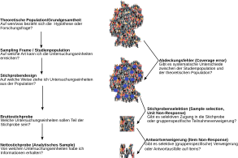
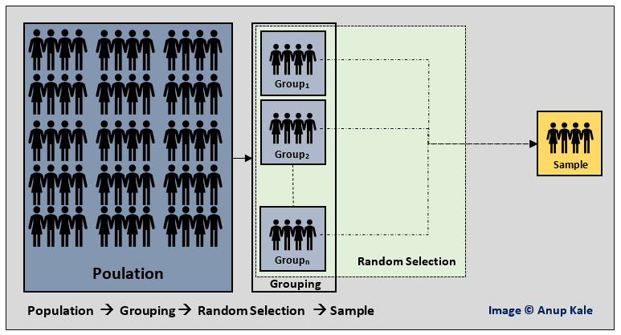
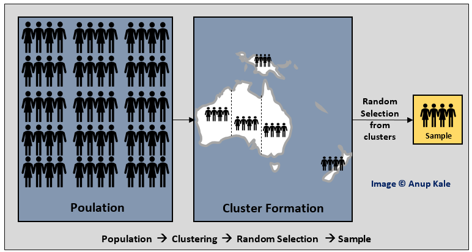
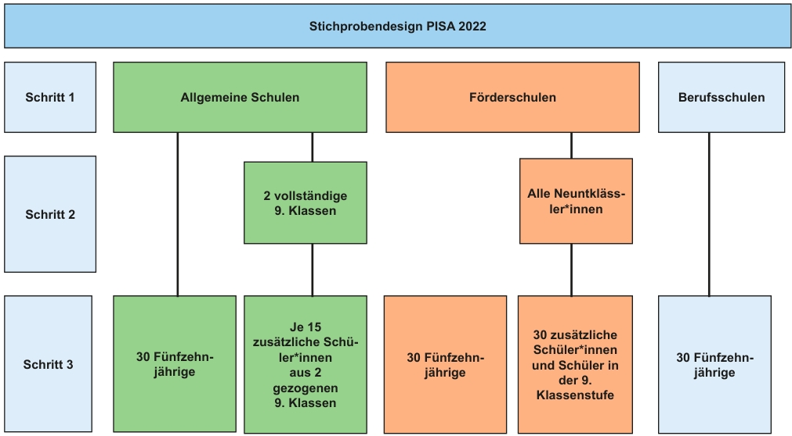
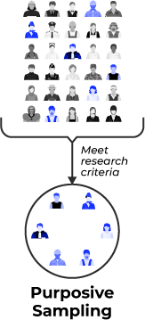
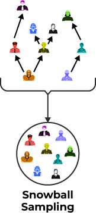

## Ausprägungen und ihre empirische Verteilung

::::: {.columns}
:::: {.column width="30%"}

::::

:::: {.column width="70%"}
- Die Ausprägungen ($\tau$) einer Eigenschaft ($F$) können in einer Population unterschiedlich verteilt sein.

- Die Ausprägungen können gruppenspezifisch verteilt sein.

- Die Ausprägungen können mit den denen einer anderen Eigenschaft systematisch in Zusammenhang stehen.

::::
:::::

## Was bedeutet es, wenn Ausprägungen "verteilt" sind? {.midi}

)](images/male-female-height.jpeg)

## Was bedeutet es, wenn Ausprägungen "verteilt" sind? {.midi}

](images/most-people-think-life-will-improve.png){width=50%}

## Verteilung von Zufriedenheit über Nationen

<iframe src="https://ourworldindata.org/grapher/happiness-cantril-ladder?tab=table&time=earliest..2024&country=DEU~FIN~DNK~ISL~SWE" loading="lazy" style="width: 100%; height: 600px; border: 0px none;" allow="web-share; clipboard-write"></iframe>

## Verteilungen über Gruppen: ADHS Symptome  {.midi .scrollable}

Die *Weiss Functional Impairment Rating Scale* besteht aus 70 Items, die auf sieben Dimensionen laden. Eine Sub-Dimension betrifft *Arbeit*:

| Item number | Item                                             |
| ----------- | ------------------------------------------------ |
| #1          | Problems performing required duties              |
| #2          | Problems with getting your work done efficiently |
| #3          | Problems with your supervisor                    |
| #4          | Problems keeping a job                           |
| #5          | Getting fired from work                          |
| #6          | Problems working in a team                       |
| #7          | Problems with your attendance                    |
| #8          | Problems with being late                         |
| #9          | Problems taking on new tasks                     |
| #10         | Problems working to your potential               |
| #11         | Poor performance evaluations                     |
: {.midi .hover .stripped}

## Verteilungen in speziellen Populationen: ADHS Symptome 

](images/adhd-work.png){width=80%}

## Verteilungen in speziellen Populationen: ADHS Symptome {.midi .scrollable}

| Number of _Work_ impairments | Patients with ADHD (_n_ = 134) | Community comparison group (_n_ = 268) |
| ---------------------------- | ------------------------------ | -------------------------------------- |
| 0                            | 19.4                           | 72.4                                   |
| 1                            | 31.3                           | 82.8                                   |
| 2                            | 44.8                           | 85.1                                   |
| 3                            | 59.7                           | 88.4                                   |
| 4                            | 70.1                           | 90.7                                   |
| 5                            | 79.1                           | 91.8                                   |
| 6                            | 84.3                           | 92.9                                   |
| 7                            | 90.3                           | 94.0                                   |
| 8                            | 93.3                           | 96.3                                   |
| 9                            | 96.3                           | 97.4                                   |
| 10                           | 99.3                           | 98.9                                   |
| 11                           | 100                            | 100                                    |
: {.midi .hover .stripped}

## Wichtige Begriffe

{width=80%}

## Theoretische Population/Grundgesamtheit

Alle Untersuchungseinheiten, über die Sie eine Aussage machen wollen, bilden Ihre theoretische Population oder Grundgesamtheit.[^1]

Die folgende Hypothese macht eine Aussage über alle Menschen in allen Kulturen über alle Zeitpunkte:

- Frauen präferieren größere Männer und Männer präferieren kleinere Frauen als Partner:innen.

Bisherige Forschung stützt diese These. Sie scheint global [(hier)](https://onlinelibrary.wiley.com/doi/full/10.1002/ajhb.22917) und über eine sehr lange Zeit der menschlichen Entwicklung zu gelten [(hier)](https://www.cambridge.org/core/journals/behavioral-and-brain-sciences/article/sex-differences-in-human-mate-preferences-evolutionary-hypotheses-tested-in-37-cultures/0E112ACEB2E7BC877805E3AC11ABC889).

[^1]: Der Begriff "Population" ist in den Sozial- und Lebenswissenschaften üblich. Der Begriff "Grundgesamtheit" kommt aus der Statistik. Beide Begriffe sind synonym.

## Theoretische Population/Grundgesamtheit

Was die theoretische Population sein soll, ist eine explizite Entscheidung von Forscher:innen.

Mögliche theoretische Populationen:

1.  Jugendliche im Alter von 14-18 in BW im Jahr 2023

2.  Bewohner:innen von Altersheimen in deutschsprachigen Ländern

3.  die allgemeinbildenden Schulen in Deutschland

4.  alle multi-nationalen Konzerne

Es ist möglich, eine Stichprobe auf eine Untergruppe zu fokussieren und somit die theoretische Population zu ändern. Sie könnten z.B. eine gesamtdeutsche Stichprobe nach Ost- und Westdeutschland unterteilen.

## Sampling Frame & Studienpopulation {.midi}

Bevor eine Stichprobe gezogen werden kann, muss sie einem Pool gezogen werden. Was dieser Pool ist, ist eine bedeutsame und begründungspflichtige Entscheidung! Dieser Pool wird als **Sampling Frame** (deutsch: Stichprobenrahmen) bezeichnet. In den Sozialwissenschaften ist dies meist eine Liste von Kontaktdaten:

::::: {.columns}
:::: {.column width="45%"}
1.  Telefonbuch

2.  Einwohnermelderegister

3.  Kontaktpools kommerzieller Anbieter

4.  Crowdarbeitsanbieter (u.a.: Mechanical turk, Clickworker)
::::

:::: {.column width="5%"}

::::

:::: {.column width="45%"}
5.  E-Mail-Adressen innerhalb von Organisationen (Universitäten, Firmen)

6.  Twitter-Daten

7.  Online-Foren
::::
:::::

Alle Untersuchungseinheiten innerhalb des Stichprobenrahmens bilden die *Studienpopulation*.

## Sampling Frame, Studienpopulation & Abdeckung {.midi}

In einer perfekten Studie sind die theoretische und die Studienpopulation identisch. Meist ist dies jedoch nicht der Fall und es kommt zu Abdeckungsfehlern (Coverage errors).

1.  Mit Hilfe des Mikrozensus wollen wir Aussagen über die gesamte deutsche Bevölkerung zu einem Zeitpunkt machen.

    $\rightarrow$ Den Sampling Frame des Mikrozensus bilden die Einwohnermelderegister. Personen ohne gemeldeten Wohnsitz sind dort aber nicht enthalten.

3.  Mit Twitter-Daten wollen wir studieren, wie sich Meinungsdynamiken in verschiedenen Ländern über die Population von Erwachsenen und Jugendlichen entwickeln.

    $\rightarrow$ Es ist sehr selektiv, wer Twitter nutzt(e); Personen können mehrere Accounts haben; Daten können von Bots generiert werden.

## Stichprobendesigns

Eine Stichprobe wird immer aus einem Sampling Frame gezogen. Sie können dabei grundsätzlich zwischen zufallsbasierten und nicht zufallsbasierten Stichprobenziehungen unterscheiden (probability based / non-probability based sampling). 

Beide Formen der Stichprobenziehung haben ihre Berechtigung. Es ist daher *nicht* so, dass nicht zufallsbasierte Stichproben per se unwissenschaftlich sind. 

Unwissenschaftlich (oder einfach unbedacht) ist die Verwendung der Stichprobe für Ziele, die sie nicht leisten kann.

## Zufall und Auswahl

- Mit zufallsbasierten Stichproben können Sie mit einer gewissen Sicherheit Aussagen über die theoretische Population treffen. Dies setzt aber einen verfügbaren und oft auch günstigen[^2] Sampling Frame voraus.

- Mit nicht zufallsbasierten Stichproben können Sie einen Zugang zu Untersuchungseinheiten schaffen, die Messungen testen und ggf. einen ersten Sampling Frame aufbauen. Sie können *meist* nicht mit hoher Sicherheit Aussagen über die theoretische Population treffen.

[^2]: Günstig sowohl im ökonomischen als auch im Sinne eines einfachen Zugriffs auf Daten.

## Repräsentativität

Wenn Sie mit ihrer Stichprobe Aussagen über die theoretische Population machen wollen, muss diese ein hohes Maß an Repräsentatitivität haben.

Eine Stichprobe ist völlig repräsentativ, wenn jede Person der Population die gleiche Wahrscheinlichkeit hatte, Teil der (analytischen) Stichprobe zu werden. Völlige Repräsentativität ist daher die **Abwesenheit von Selektivität**. 

Je selektiver die Stichprobe zusammengesetzt ist, desto geringer ist ihre Repräsentativität.

## Repräsentativität 

Aus dieser Definition folgt, dass

1.  eine Stichprobe auch dann repräsentativ ist, wenn sie nicht alle Ausprägungen einer Eigenschaft innerhalb der Population enthält;

2.  Stichprobengröße kein Maß für die Repräsentativität ist (wohl aber für die Fähigkeit, mit Sicherheit[^3] Aussagen über die theoretische Population zu machen);

3.  nur dann von (vollständiger) Repräsentativität der Stichprobe gesprochen werden kann, wenn die Stichprobenziehung auf einer Zufallsauswahl beruht und kein Abdeckungsfehler besteht.

[^3]: **Merken**: Die *Sicherheit* mit der wir von einer Stichprobe auf eine Population schließen können, ist eine Kombination aus Repräsentativität und Stichprobengröße. 

## Sicherheit des Schlusses von Stichprobe auf Population = Ignorierbarkeit von Unterschieden zwischen Stichprobe und Population {.midi}

Angenommen, die Ausprägung $\tau_1$ kommt in einer Population mit einer relativen Häufigkeit von 10% vor und $\tau_2$ mit 20%. Wir wissen, dass die Ausprägungen sich über die Gruppen A/B unterscheiden. Gruppe A: $\tau_1$ = 15% und $\tau_2$ = 15%, sodass die Differenz in den Ausprägungen -5% und +5% ist.

Wenn die Stichprobe repräsentativ (und hinreichend groß ist) ist, sollte sie in etwa die relativen Häufigkeiten für die Ausprägungen über alle Gruppen und die Differenzen der Ausprägungen zwischen den Gruppen erfassen.

Unterschiede zwischen den Verteilungen der Ausprägung in der Population und der Stichprobe sind bei einer repräsentativen Stichprobenziehung **rein zufällig** und daher ignorierbar. Selektive Stichproben führen zu systematischen Unterschieden zwischen den Verteilungen in der Population und der Stichprobe.

## Zufallsauswahlstrategien: Einfache Zufallsstichprobe {.midi}

::::: {.columns}
:::: {.column width="30%"}

::::

:::: {.column width="70%"}
Die Untersuchungseinheiten werden unabhängig voneinander und ohne Austausch aus einem Sampling Frame in die Stichprobe gezogen.

- Zufallsziehung von Haushalten aus dem Einwohnermelderegister

- Zufallsziehung von Emails aus einer Organisationseinheit

- Zufallsziehung von Patienten in eine Studie

Wichtig: Zufallsziehungen führen *notwendigerweise* zu zufälligen Schwankungen (z.B. 48% Männer & 52% Frauen). Diese dürfen *nicht* "ausgeglichen" werden.
::::
:::::

## Zufallsauswahlstrategien: Geschichtete Zufallsstichprobe {.midi}

:::::{.columns}
::::{.column width="30%"}
  
::::
::::{.column width="70%"}
 Bei einer geschichteten Auswahl wird die Population in einzelne Untergruppen (Schichten) aufgeteilt. Die Schichten können unterschiedlich groß sein. Aus jeder (weitgehend homogenen) Schicht werden unabhängige zufällige Stichproben gezogen.

- Zufallsziehung von Haushalten innerhalb von Bundesländern

- Zufallsziehung von Emails nach Untereinheiten

- Zufallsziehung von Patienten mit unterschiedlichen körperlichen Zuständen in eine Studie
::::
::::: 

## Anwendungsfall: ALLBUS 2023

Die **AL**lgemeine **B**evölkerungs**U**mfrage der **S**ozialwissenschaften wird alle vier Jahre erhoben. 

1. In der ersten Auswahlstufe wurden Gemeinden in Westdeutschland und in Ostdeutschland mit einer Wahrscheinlichkeit proportional zur Zahl ihrer erwachsenen Einwohner ausgewählt. 
2. In der zweiten Auswahlstufe wurden Personen aus den Einwohnermeldekarteien zufällig gezogen.

## Und was kann man damit machen?

](images/allbus-example1.png)

## Zufallsauswahlstrategien: Cluster-Stichprobe {.midi}

:::::{.columns}

::::{.column width="30%"}
  
::::

::::{.column width="70%"}
Die Population wird in verschiede Cluster eingeteilt, von denen ausgegangen wird, dass diese die Grundgesamtheit oder einer ihrer Schichten im Kleinen repräsentieren. Es werden einige Cluster zufällig ausgewählt und dann alle Einheiten innerhalb des Clusters befragt.

- Zufallsziehung von Haushalten als Cluster, dann Befragung von allen Haushaltsmitgliedern

- Zufallsziehung von Firmen als Cluster, dann Befragung aller Mitarbeiter:innen

Wichtig: Die Informationen innerhalb der Cluster sind voneinander mehr oder weniger abhängig, weil sich die Untersuchungseinheiten in die Cluster selektieren.

::::
::::: 

## Anwendungsfall: PISA 2022 Studie in Deutschland {.midi}

:::::{.columns}

::::{.column width="30%"}
  
::::

::::{.column width="70%"}
Die PISA-Studie ist ein Mix aus Cluster und geschichteter Zufallsauswahl.

Es werden Schichten nach Schultyp gebildet. Innerhalb der allgemeinbildenden Schulen wird nochmals nach Bundesländern geschichtet. Somit gibt es 18 Schultypschichten.

Innerhalb einer Schultypschicht werden Schulen gezogen. Innerhalb der gezogenen Schule werden 30 Fünfzehnjährige zufällig gezogen (Schulcluster) und zusätzlich zwei 9. Klassen als Cluster gezogen (Klassencluster). Daraus werden zufällig 15 Fünfzehnjährige gezogen.

::::
::::: 

## Und was macht man damit? 

](images/pisa2022-example1.png){width=80%}

## Nicht zufällige Stichprobenziehung: Quoten-Stichprobe {.midi}

:::::{.columns}

::::{.column width="30%"}
](images/sampling-quota.png)
::::

::::{.column width="70%"}
Aus der Population sind spezifische Verteilungen von Merkmalen (Quoten) bekannt. Der Stichprobenplan beinhaltet nun Kontingente von Unterstichproben, aus denen solange gezogen wird, bis die Quoten in der Stichprobe denen der Population entsprechen.

- Für eine Studie zum "Sozialen Zusammenhalt in Baden-Württemberg 2022" wurde eine Quotenstichprobe mit Quoten für Geschlecht, Alter, Einkommen, Bildungsstand und Haushaltsgröße gezogen.

- Marktforschungsstudien ziehen typischerweise Quotenstichproben nach Alter, Geschlecht und Bildung.
::::
::::: 

## Quoten-Stichprobe {.midi}

:::::{.columns}

::::{.column width="25%"}
](images/sampling-quota.png)
::::

::::{.column width="75%"}
- Vorteile:

  - Kosteneffizient

  - schneller

  - auch kleine Gruppen sind mit Sicherheit in der Stichprobe

- Nachteile:

  - Sampling ist abhängig von theoretischen Konzepten und ihren Ausprägungen (z.B.: Transgender/Transsexuelle bei Geschlechtskategorie, Bildungskategorien, Krankheitsgrade)

  - Wenn die Gruppen unterschiedliche unit- oder item-nonresponse haben, wird die Stichprobe durch die Quote selektiv
::::
::::: 

## Convience Stichprobe {.midi}

:::::{.columns}

::::{.column width="20%"}
  ](images/sampling-convenience.png)
::::

::::{.column width="80%"}
 Die Teilnehmer der Stichprobe sind leicht erreichbare Personen, die sich an einem bestimmten Ort aufhalten.

- Teilnehmer:innen der meisten Psychologiestudien stammen aus Einführungskursen in die Psychologie.

- Spieltheoretische Forschung basiert zu einem hohen Teil auf Stichproben von Ökonomie-Studierenden.

- Ein großer Teil der medizinische Forschung basiert auf den Zugang zu aktuellen Patienten der behandelnden Ärzte:innen.

Convenience Stichproben sind immer selektiv. Allerdings können innerhalb von Convenience Stichproben zufällig Gruppen gebildet werden (Placebo/Treatment; Versuchs-/Kontrollgruppe), was zu einer hohen internen Validität aber ggf. zu einer niedrigen externen Validität führen kann.
::::
::::: 

## Target-Auswahl 
:::::{.columns}

::::{.column width="20%"}
  
::::

::::{.column width="80%"}
Die Teilnehmer der Stichprobe werden gezielt nach ihren Eigenschaften ausgewählt.

- Expert:innen-Interviews zu einem bestimmten Thema (siehe Thurstone-Skala)

- Mitglieder sehr kleiner Gruppen (Regenbogenfamilien, seltene Krankheiten)

::::
::::: 

## The evil sister of Target-Auswahl

Eine Unterform dieser Stichprobenziehung ist *sampling on the dependent variable*. In diesem Fall selektieren Sie die Untersuchungseinheiten in die Stichprobe aufgrund der Eigenschaft, die Sie mit anderen Faktoren erklären wollen.[^4]

- Befragung von erfolgreichen Personen nach dem "Geheimnis" ihres Erfolgs

- Auswirkung von Erziehungsstilen bei Kindern in Theraphie

[^4]: Das ist sehr schlecht. Also: Wirklich schlecht. 

## Schneeball-Verfahren {.midi}

:::::{.columns}

::::{.column width="20%"}
  
::::

::::{.column width="80%"}
 Die Stichprobe beginnt mit einigen Personen, die den Studienkriterien entsprechen. Diese werden befragt und gebeten, andere Personen zu benennen, die den Studienkriterien entsprechen oder diese zu rekrutieren.

Manchmal haben wir kein Wissen über den Sampling Frame und der Zugang zu den jeweiligen Populationen ist schwierig (Vertrauensprobleme, Illegalität). In diesem Fall können wir über die sozialen Netzwerke einzelner Kontaktpersonen (sog. "seeds") versuchen, Vertrauen zu gewinnen und Informationen über die jeweilige Population zu sammeln.

- Befragung von ausländischen Haushaltshilfen

- Befragung innerhalb von (kleinen) Gruppen von Flüchtlingen
::::
::::: 

