## Brutto- und Nettostichprobe {.midi}

Mit einem Stichprobendesign wird festgelegt, wie Untersuchungseinheiten in die Stichprobe gelangen sollen. Diese Zielstichprobe wird auch als "Bruttostichprobe" bezeichnet. Allerdings kann während der Datenerhebungsphase passieren, dass Untersuchungseinheiten

-   gar nicht erreichbar sind (Komplettausfall)

-   die Teilnahme ganz verweigern (Unit nonresponse)

-   die Teilnahme an einzelnen Items verweigern (Item nonresponse)

Die Personen, die an der Untersuchung teilnehmen, bilden die Nettostichprobe (Bruttostichprobe - Teilnahmeverweigerung.) Alle Personen, von denen Daten erhalten wurde, mit denen Sie arbeiten können, bilden die analytische Stichprobe (Bruttostichprobe - Teilnahmeverweigerung - Antwortverweigerung)

## Ausschöpfungsquote (response rate) {.midi}

Der relative Anteil der Netto- zur Bruttostichprobe ist die *Ausschöpfungsquote* oder auch *response rate*.

Diese können Sie bestimmen, indem zum Beispiel

-   das Verhältnis verschickter zu ausgefüllter Fragebögen berechnet wird;

-   eine Liste mit Telefonnummern angelegt, diese abtelefoniert und der Anteil erreichter Personen notiert wird;

-   eine "Strichliste" geführt wird, wie viele Personen angesprochen wurden und wie viele geantwortet haben.

## Houston, we have a problem

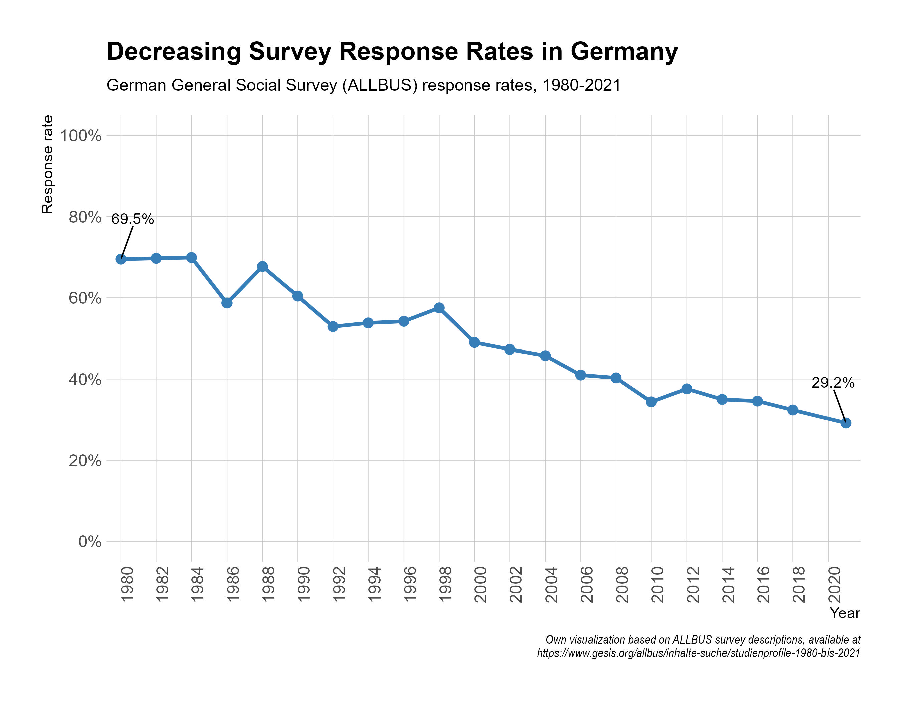{width="70%"}

## Ausschöpfung und Repräsentativität

-   Eine geringe Ausschöpfungsrate führt nicht zwingend zu einer geringen Repräsentativität.

-   Entscheidend ist, ob die Teilnahme - und damit die Ausschöpfung - selektiv ist (selective unit nonresponse).

-   Wenn die Teilnahme nach Merkmalen selektiv ist, die wir beobachtet haben, können wir die Selektion korrigieren (Gewichtungsverfahren).

-   Wenn die Teilnahme nach Merkmalen selektiv ist, die wir nicht beobachtet haben, sind unsere Ergebnisse sehr wahrscheinlich unter- oder überschätzt.

## Teilnahmeselektion bei der Bundestagswahl 2025

{width="70%"}

## Anwendungsfall: Der gender loneliness gap


## Zugang zum Problem: Simulation von Daten {.midi}

::::: columns
::: {.column width="40%"}
```{mermaid}
flowchart TB

G[Geschlecht] --> E[Einsamkeit]
B[Bildung] --> E
G --> B

```
:::

::: {.column width="60%"}
-   Im Folgenden werden wir studieren, wie die Erfassung des "gender loneliness gap" durch Teilnahmeselektion beeinflusst wird.

-   Für die Simulation nehmen wir folgendes an:

    -   Frauen sind im Durchschnitt etwas einsamer als Männer;
    -   Bildung reduziert Einsamkeit für Männer und steigert sie für Frauen
        -   hochgebildete Frauen bekommen einen Einsamkeitsmalus
        -   gering gebildete Männer bekommen einen Einsamkeitsmalus
:::
:::::

## Die "Bruttostichprobe"

Durch die Datensimulation können wir eine "Bruttostichprobe" simulieren, d.h. eine Stichprobe ohne jegliche Teilnahmeselektion.

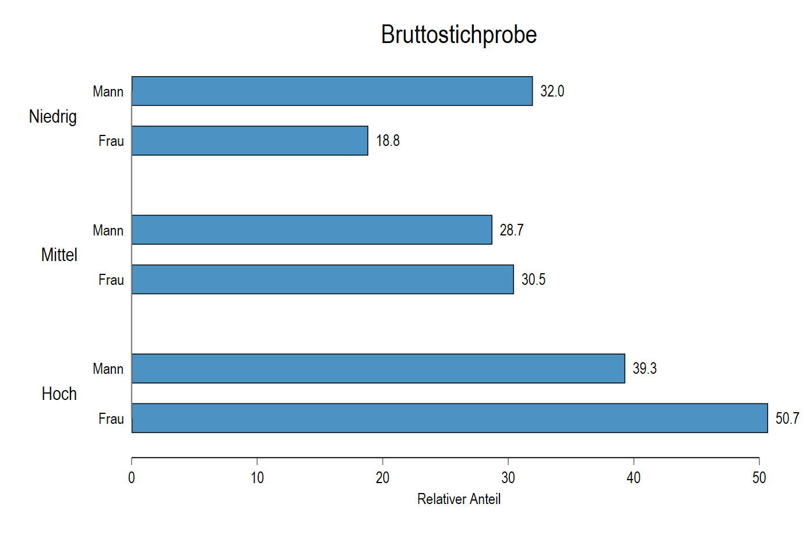{width="80%"}

## Verteilung von Einsamkeit

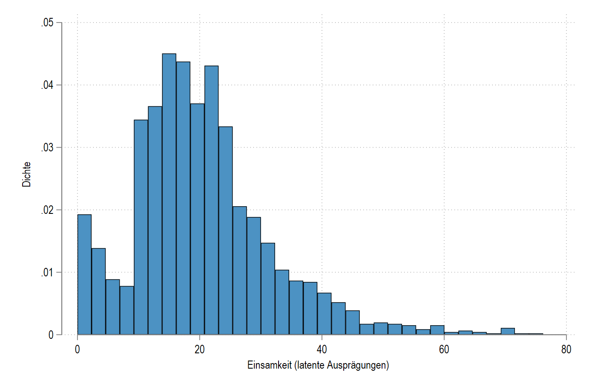{width="80%"}

## gender loneliness gap in der Simulation (aka "Die Wahrheit") {.midi}

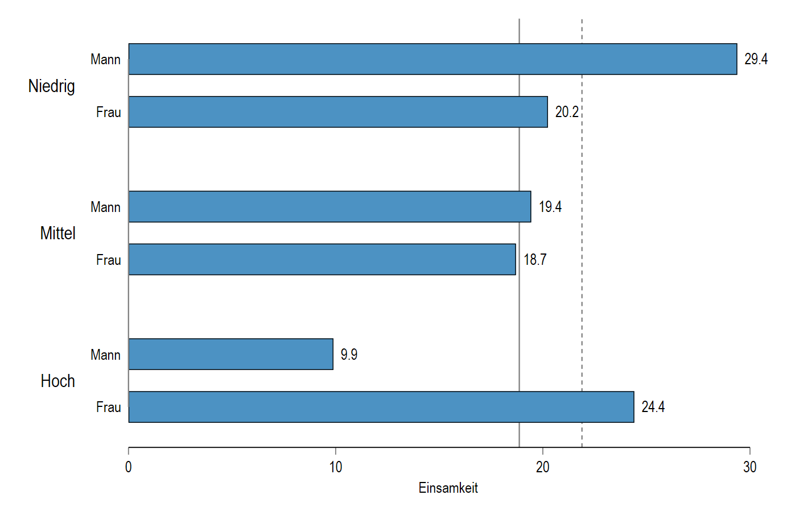{width="75%"}

## Geschlecht und die Verteilung von Einsamkeit

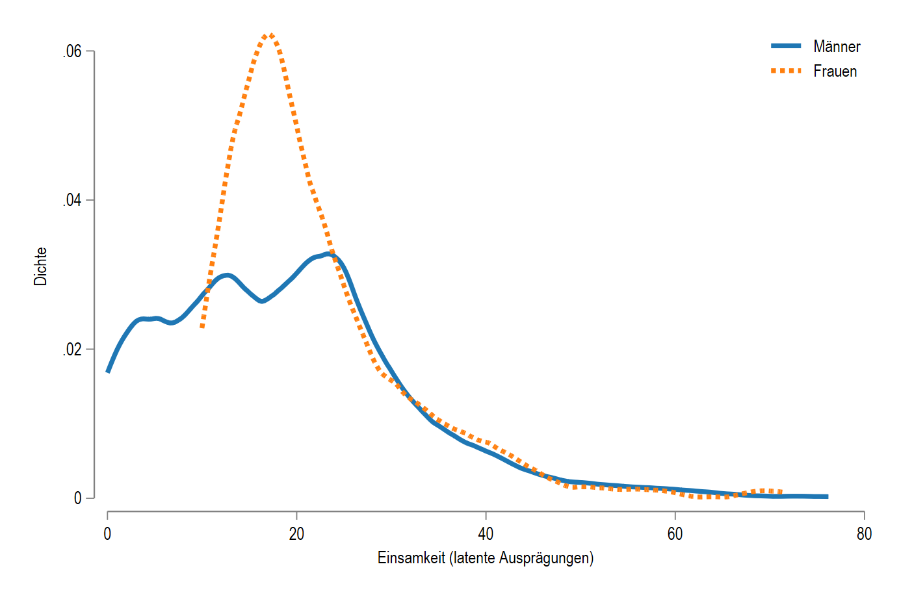{width="75%"}

## Teilnahmeselektion nach Geschlecht und Bildung {.midi}

::::: columns
::: {.column width="40%"}
```{mermaid}
flowchart TB

G[Geschlecht] --> E[Einsamkeit]
B[Bildung] --> E
G --> B
T[Teilnahme]
G --> T 
B --> T
```
:::

::: {.column width="60%"}
Wir nutzen ab sofort die Teilnahme an einer Stichprobe als eine Eigenschaft, deren Unterschiedlichkeit von anderen Eigenschaften abhängt.

Wir wissen, dass an Umfragen eher

-   Frauen teilnehmen;
-   Personen teilnehmen, je höher gebildet sie sind.

Das Problem verstärkt sich, weil Frauen seit einigen Jahren im Durchschnitt höhere Abschlüsse erwerben als Männer.
:::
:::::

## Teilnahmewahrscheinlichkeit(en)

Die Teilnahmewahrscheinlichkeit einer Person können wir als eine (latente) Ausprägung verstehen: Personen sind mehr oder weniger bereit, an einer Stichprobe teilzunehmen. Wir gehen davon aus, dass ab einer Wahrscheinlichkeit von über 50% die Personen teilnehmen.

::::: columns
::: {.column width="50%"}
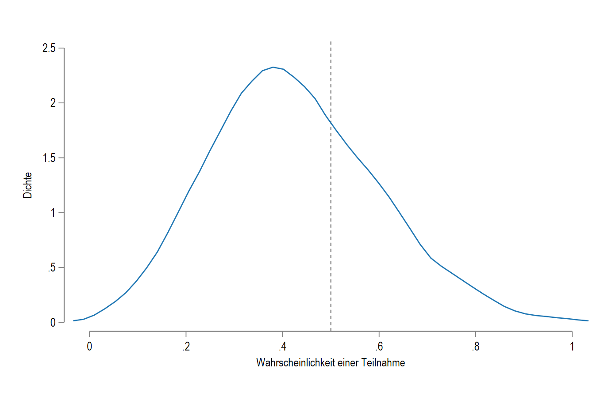
:::

::: {.column width="50%"}
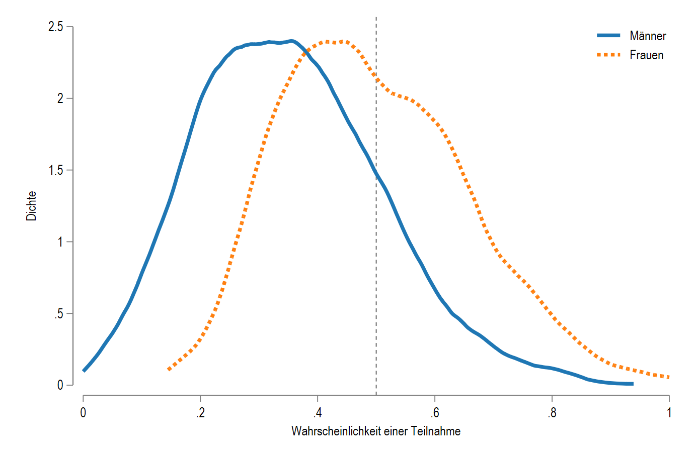
:::
:::::

## Die Stichprobe nach Teilnahmeselektion: Geschlecht {.midi}

::::: columns
::: {.column width="50%"}
|      |        |       |
|------|--------|-------|
|      | Brutto | Netto |
| Mann | 49.6   | 27.0  |
| Frau | 50.4   | 73.0  |
:::

::: {.column width="50%"}
-   Durch Teilnahmeselektion verstärkt sich die Zusammensetzung zu Gunsten der Frauen.
-   Das liegt vor allem am kombinierten Bildungs- und Geschlechtsmalus gering gebildeter Männer.
:::
:::::

## Die Stichprobe nach Teilnahmeselektion: Bildung {.midi}

::::: columns
::: {.column width="50%"}

:::

::: {.column width="50%"}
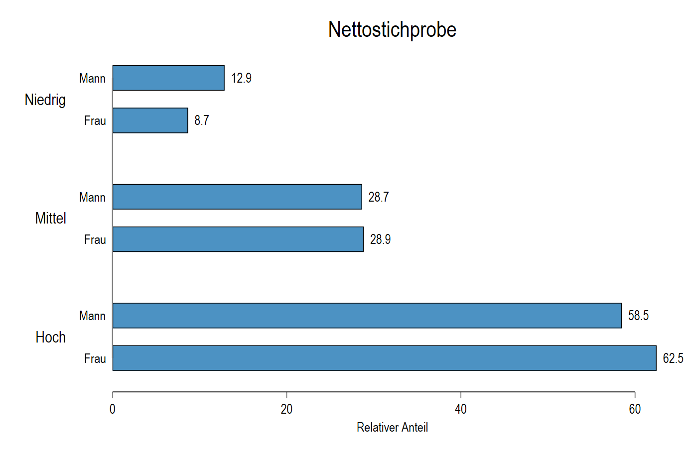
:::
:::::

## Auswirkungen auf Durschnittswerte {.midi}

::::: columns
::: {.column width="50%"}
Bruttostichprobe 
:::

::: {.column width="50%"}
Nettostichprobe 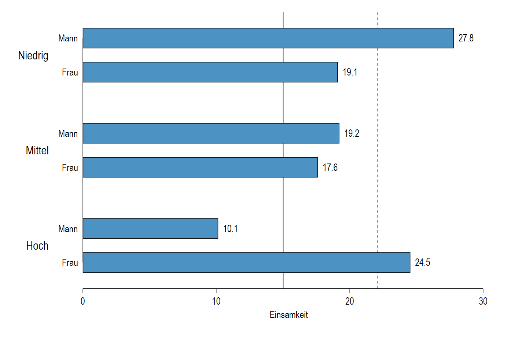
:::
:::::

Die Mittelwerte der einzelnen Gruppen unterscheiden sich nicht erheblich. Allerdings ist der gesamte "loneliness gap" deutlich größer, weil die Gruppengrößen sich stark verändert haben.

## Gewichtung als Lösung für selektive Stichprobenzusammensetzungen

**Wenn** wir wissen, wie sich die theoretische Population zusammensetzt und damit abschätzen können, wie die Differenzen zwischen beobachteter und theoretisch erwarteter Zusammensetzung ist, können wir die Differenzen hinzufügen, um die Selektivität der Nettostichprobe zu kompensieren.

Das ist allerdings nur dann eine Lösung, wenn sich die Zustimmungsraten **innerhalb** der Gruppen, mit denen wir gewichten, nur zufällig danach unterscheiden, ob sie Teil der Stichprobe sind oder nicht.

## Was bedeutet Gewichtung?

<iframe iframe width="1200" height="600" src="https://docs.google.com/spreadsheets/d/e/2PACX-1vSJQe0cCnhXcy4_BNgiI_qm0k4YTkjUlwIbQs-7y59cMurHJf1ZmtRtkiM-tZRopZBlm5exj7YVwfVu/pubhtml?gid=0&amp;single=true&amp;widget=true&amp;headers=false">

</iframe>

[Link](https://docs.google.com/spreadsheets/d/11PHa4iRb6AgwYbzEuWCpfbk9JYulFIraM17G495cErk/edit?usp=sharing) zum Sheet.

## The same old song: Es könnt' so vieles einfach sein...

Bisher haben wir angenommen, dass wir alle Eigenschaften, die für Teilnahmeselektion verantwortlich sind, beobachtet haben. Das ist aber sehr oft nicht der Fall. 

Teilnahmeselektion ist ein sehr komplexer sozialer Prozess, den Sie für jede Stichprobe durchdringen müssen. Wir können sehr oft aus pragmatischen, ökonomischen oder rechtlichen Gründen nicht alle Eigenschaften erheben, die bei der Teilnahmeselektion eine Rolle spielen. 

Für die Beurteilung der Aussagekräftigkeit von Ergebnissen ist das aber von ganz erheblicher Bedeutung! 

## Die Rolle antifeministischer Einstellungen {.midi}

::::: columns
::: {.column width="50%"}
```{mermaid}
flowchart TB

subgraph beobachtet
direction LR
G[Geschlecht] --> E[Einsamkeit]
B[Bildung] --> E
G --> B
T[Teilnahme]
G --> T 
B --> T
end 

subgraph unbeobachtet
A[Antifeminismus] 
T ~~~ A 
A --> T
end
```
:::

::: {.column width="50%"}
Je höher die Ausprägung einer antifeministischen Einstellung bei einer Person ist, desto geringer ist ihre Teilnahmebereitschaft.

Nicht verzeichnet im Graph (da sonst zu hässlich...):

-   Frauen haben deutlich geringere antifem. Einstellungen;
-   antifem. Einstellungen machen einsam;
-   je höher die Bildung, desto geringer sind die antifem. Einstellungen.
:::
:::::

## Exkurs: Die Messung antifeministischer Einstellungen {.midi .scrollable}

[Höcker et a. (2025)](https://www.frontiersin.org/journals/psychology/articles/10.3389/fpsyg.2025.1596397/full) entwickelten eine Kurzskala zur Erfassung antifeministischer Einstellungen mit folgenden Items: 

| Item |   |
|-------------|-----------------------------------|
| AF_PO | Frauen machen sich in der Politik häufig lächerlich. |
| AF_DE | Frauen, die mit ihren Forderungen zu weit gehen, müssen sich nicht wundern, wenn sie wieder in ihre Schranken gewiesen werden. |
| AF_SE | Frauen übertreiben ihre Schilderungen über sexualisierte Gewalt häufig, um Vorteile aus der Situation zu schlagen. |
| AF_HA | Durch den Feminismus werden die gesellschaftliche Harmonie und Ordnung gestört. |

Antworten sind auf einer 4er-Likert-Antwortskala von "lehne völlig ab" zu "stimme völlig zu" möglich. 

## Exkurs: Die Validität der Skala {.midi .scrollable}

| Scale                                       | Antifeminism | Gender role sexism |
| ------------------------------------------- | ------------ | ------------------ |
| Right-wing extremism                        | 0.51         | 0.39               |
| Right-wing dictatorship                     | 0.40         | 0.34               |
| Chauvinism                                  | 0.42         | 0.31               |
| Xenophobia                                  | 0.44         | 0.28               |
| Antisemitism                                | 0.44         | 0.38               |
| Social Darwinism                            | 0.44         | 0.38               |
| Belittling the crimes of National Socialism | 0.37         | 0.25               |
| Authoritarianism                            | 0.35         | 0.32               |
| Authoritarian aggression                    | 0.27         | 0.23               |
| Authoritarian submission                    | 0.27         | 0.26               |
| Authoritarian conventionalism               | 0.31         | 0.28               |
| Gender role sexism                          | 0.53         | –                  |

: Korrelation der Antifeminismus Ausprägungen mit verwandten Konzepten

## Die Verteilung von Antifeminismus in der Simulation

::::: {.columns}
:::: {.column width="50%"}
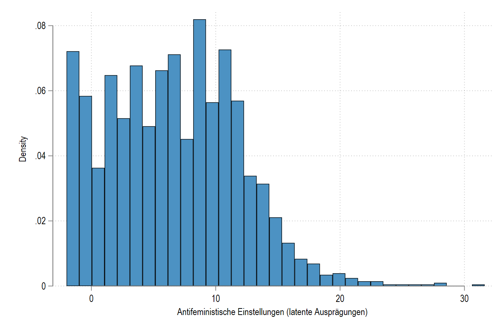
::::

:::: {.column width="50%"}
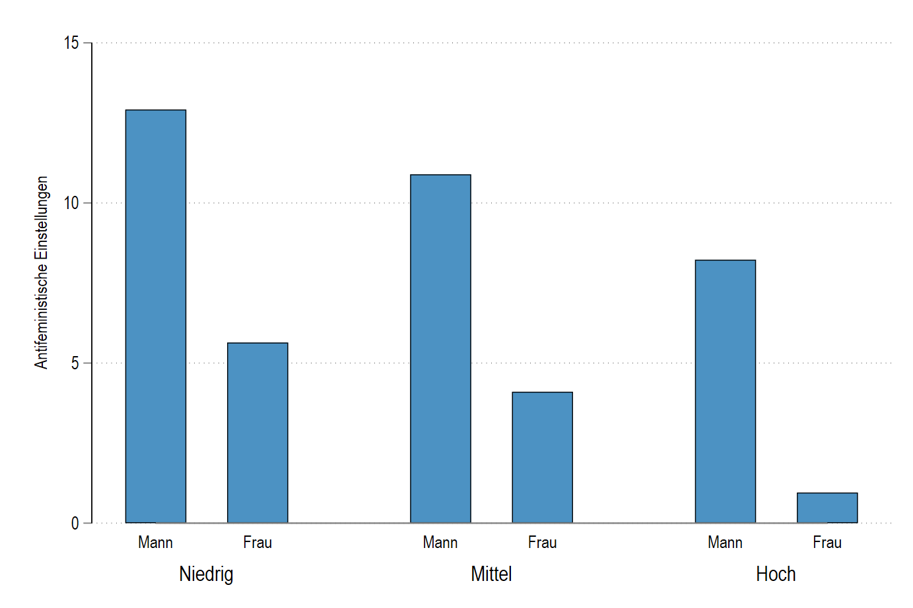
::::
:::::


## Einfluss auf die Stichprobenzusammensetzung 

::::: {.columns}
:::: {.column width="50%"}

::::

:::: {.column width="50%"}

::::
:::::

## Einfluss auf Einsamkeitswerte 

::::: {.columns}
:::: {.column width="50%"}
Nettostichprobe

::::

:::: {.column width="50%"}
 "+" Einfluss von Antifeminismus

::::
:::::

## Gewichtung hilft nur noch bedingt

- Im Gegensatz zur Teilnahmeselektion mit beobachteten Faktoren haben wir mit dem Antifeminismus einen unbeobachteten Faktor, der sog. *unbeobachtete Heterogenität* in die Gruppen bringt. 
    - D.h.: Innerhalb der Geschlechts/Bildungsgruppen müssten wir eigentlich nach dem Grad des Antifeminismus unterscheiden, können es aber nicht. 
    - Der Einfluss des Antifeminismus verändert nicht nur die relativen Gruppenanteile sondern auch die Einsamkeitswerte. 
    - Mit einer Gewichtung nach Geschlecht und Bildung können wir aber weder die Selektion nach Antifeminismus in die Stichprobe noch den Einfluss des Antifeminismus auf Einsamkeit ausgleichen. 