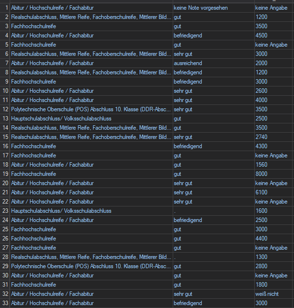
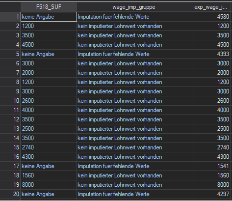
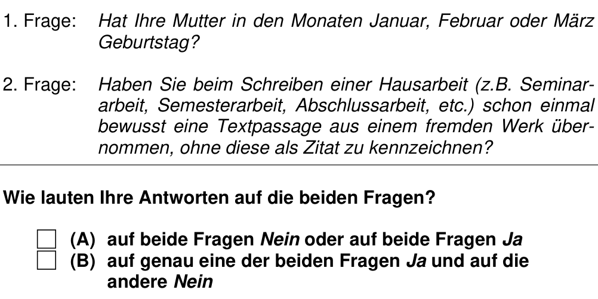
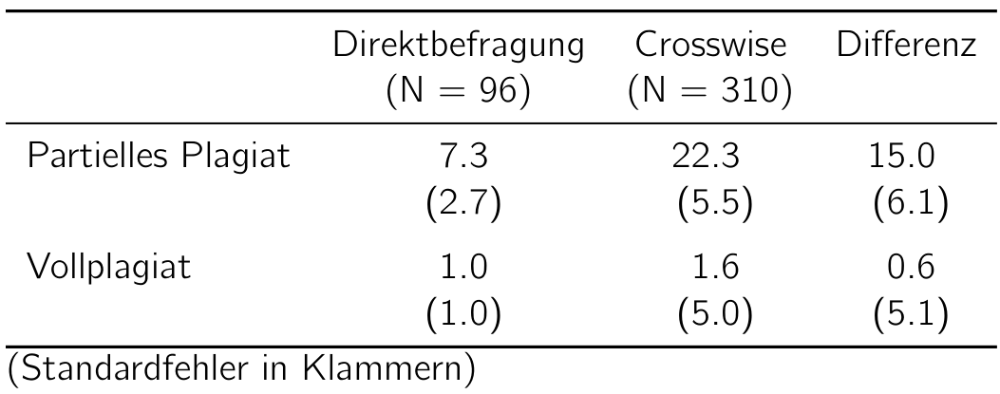
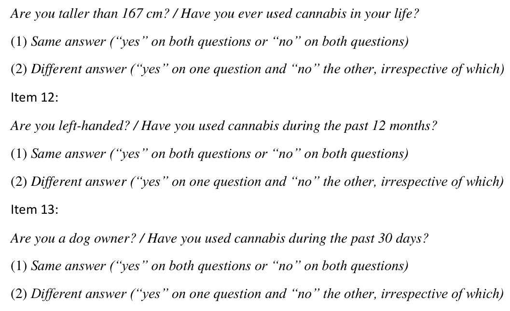

## Verweigerung

Personen können Teil der Nettostichprobe sein, aber auf bestimmte Items nicht reagieren. Mögliche Reaktionen:

-   komplette Verweigerung der Auskunft

-   "weiß nicht"

-   Medikamente werden unregelmäßig oder gar nicht eingenommen

-   die Teilnahme wird während der Erhebung abgebrochen

Jede diese Reaktionen bezeichen wir im Folgenden als *Item nonresponse*.

## Verweigerung

In einer Befragungssituation gibt es typische Kandidaten, von denen wir wissen, dass sie ein hohes Risiko haben, item nonresponse zu generieren:

-   Items über "heikle" Themen: Einkommen, Sexualität, Illegale Handlungen

-   Items über Informationen, die schwer zu prozessieren sind: nicht alltägliche Informationen über Befragte über lange Zeitspannen oder über Informationen über Dritte (Eltern, Verwandschaft, Freunde),

In Experimenten gibt es zum Teil unangenehme Treatments, die non-response hervorrufen. In Feldexperimenten oder sozialpolitischen Pilotprojekten gibt es Anreize oder Angebote, die ignoriert werden können.

## Wie sieht das in echt aus? {.midi}

:::::: columns
::: {.column width="45%"}
| Eigenschaft              | \% Missing |
|:-------------------------|-----------:|
| Höchster Abschluss       |        0.2 |
| Note des Abschlusses     |        5.6 |
| Einkommen (gesamt)       |       16.9 |
| Einkommen (weiß nicht)   |        3.2 |
| Einkommen (Verweigerung) |       13.7 |
| Beruf des Vaters         |       19.9 |

BIBB-BAuA Erwerbstätigenbefragung 2018
:::

::: {.column width="10%"}
:::

::: {.column width="45%"}
An einer repräsentativen Befragung der deutschen Erwerbsbevökerung nahmen 20.012 Personen teil. Sie wurden u.a. nach ihrem Abschluss, ihrer Abschlussnote, ihrem Einkommen und dem Beruf der Eltern befragt.

Der Item nonresponse schwankt zwischen 0 und 20%. Er kann zufällig auftreten oder sowohl durch beobachtete Eigenschaften (wie das Alter) als auch durch unbeobachtete Eigenschaften (Einstellungen zu Finanzinformationen) bedingt sein.
:::
::::::

## Ein Blick in den Datensatz

::::: columns
::: {.column width="60%"}

:::

::: {.column width="40%"}
Auszug aus der BIBB-BAuA Erwerbstätigenbefragung 2018.

-   Spalte 1: Höchster Schulabschluss

-   Spalte 2: Abschlussnote

-   Spalte 3: Einkommen
:::
:::::

## Führen Löcher im Käse zu schlechtem Käse?

Item nonresponse ist nicht immer ein Problem - wir müssen nicht alles erfasst haben, um gute Antworten durch die Daten zu erhalten!

Problematisch wird es, wenn die (unbeobachtete) Eigenschaft, die zur Verweigerung führt, eine Dreifachverbindung hat:

-    mit Y verbunden (= das Merkmal, dessen unterschiedliche Ausprägung erklärt werden soll)

-    mit X verbunden (= die Unterschiede, mit denen Y erklärt werden sollen)

-    mit Teilnahmeselektion verbunden

## Probleme durch Non-response (NR)

-   Wenn NR mit Teilnahmeselektion verbunden ist, ohne mit Y und X verbunden zu sein, verkleinert sich die Stichprobe.

-   Wenn NR mit der Teilnahmeselektion und X verbunden ist, ist die Verteilung von X durch Z selektiv aber nicht die Verteilung von Y über alle X.

-   Wenn NR sowohl mit der Teilnahmeselektion als auch mit Y und X verbunden ist, ist die Stichprobe sowohl in ihrer Zusammensetzung nach X als auch in der Zusammensetzung nach Y über alle X selektiv.

## Sneak-Preview: Verheimlichung des 🥦 {.midi}

|                   |Indirect survey (95% CI)    | Traditional survey (95% CI) |
| --------------------------------- | --------------------------- | ------------------------- |
| Gender                                                                                                      |
| Men                                                                                                        | 26.5% (23.2%; 29.7%)        | 12.0% (9.2%; 15.2%)      |
| Women                                                                                                      | 13.4% (11.0%; 15.9%)        | 9.1% (7.1%; 11.6%)       |

## Lösungsmöglichkeit: Imputation {.midi}

::::: columns
::: {.column width="50%"}

:::

::: {.column width="50%"}
Wenn wir gut wissen, welche Faktoren den item nonresponse bedingen, können wir schätzen, welche Werte in Y die Analyseeinheiten mit einem Set von Merkmalen X *typischerweise* haben. Wir können dann diesen typischen Wert mit einem gewissen Maß an Zufallsfluktation in den Datensatz einführen.

Dieses Verfahren wird *multiple Impuation* genannt [(Lektüre dazu hier)](https://link.springer.com/chapter/10.1007/978-3-531-92038-2_6). Wir werden dieses Verfahren im nächsten Semester im Rahmen der *multiplen Regression* genauer besprechen.
:::
:::::

## Ist das Hexerei? 

{width=70%}

## Lösungsmöglichkeit: Item Sum/Count Technique

Es gibt Items, die ein sehr hohes Risiko von Antwortverweigerung aufweisen *und* mit vielen unbeobachteten Merkmalen verknüpft sind. Dazu zählen u.a. illegale Praktiken (Schwarzarbeit, Datenfälschung, Drogen, Doping) oder ethische Normenverstöße, die nicht zwingend illegal sein müssen.

Oft wissen wir nicht, wie hoch die Rate dieser Verhaltensweisen in der Population überhaupt ist. Hierfür können wir die *Item Sum/Count Technique*[^1] benutzen (Trappmann et al. 2014).

[^1]: Item Sum = metrische Antwortskalen; Item Count = nominale Antwortskalen

## Lösungsmöglichkeit: Item Sum/Count Technique {.midi}

Sie basiert auf folgender Idee:

1.  Teile die Befragten zufällig in zwei Gruppen ein.

2.  Lege einer Gruppe eine kurze Liste mit Items vor, die nur harmlose Fragen enthält.

3.  Der anderen Gruppe wird eine lange Liste mit Items vorgelegt, die zusätzlich zu den harmlosen Fragen, auch eine "heikle" Frage enthält.

4.  Die Antwortskalen aller Items sind identisch.

5.  Die Befragten werden gebeten, lediglich die Summe der Antwortwerte zu benennen.

6.  Aus der Differenz der durchschnittlichen Summen (LL - KL) beider Gruppen kann ein typischer Antwortwert der heiklen Frage geschätzt werden.

## Ein Blick in die Praxis (Orchideen Mafia)

{width=70%}

## Item Sum/Count Technique - Varianten {.midi}

::::: columns
::: {.column width="50%"}

:::

::: {.column width="50%"}
Diese Technik ist nicht auf eine Liste beschränkt (Standard Variante links im Bild). Sie können auch mehrere Listen nutzen ("Double list") oder die Variation eines Merkmals nutzen, von dem wir wissen, dass es (annährend) zufällig in der Population verteilt ist (letzte Nummer der Telefonnummer ist gerade/ungerade).

Wir können diese Technik auch dazu nutzen, um zu studieren, wie stark selektiv die bisherigen Erhebungen waren, die das Item direkt abgefragt haben ("direct questioning")
:::
:::::

## Item Sum/Count Technique

Wichtig für die Anwendung

-   Alle Items auf allen Listen müssen die gleiche Antwortskala haben.

-   Die kurze Liste sollte Items enthalten, die thematisch zum "heiklen" Item passt.

-   Die kurze Liste sollte Items enthalten, die zu wenig Antwortverweigerung führt.

-   Die Summierung der Antworten sollte einfach sein und muss gut erklärt werden.

## Item Sum Technique {.midi .scrollable}

In einer Studie von [Wolter et al. (2022)](https://journals.sagepub.com/doi/pdf/10.1177/23780231221094749) wurde untersucht, ob es im Bezug auf den Covid-19 Impfstatus soziale Erwünschtheitseffekte gibt.

| Group          | Items                                                                                                                                                                                                                                                                    | _n_   |
| -------------- | ------------------------------------------------------------------------------------------------------------------------------------------------------------------------------------------------------------------------------------------------------------------------ | ----- |
| DQ             | “I have received at least one dose of vaccination against COVID-19.” (yes/no)                                                                                                                                                                                            | 526   |
| ICT short list | “I was treated by a physician last week.” “I have never been diagnosed with cancer.” “Private health insurance should be abolished.” “Alternative medicine like homeopathy is helpful.”                                                                         | 1,085 |
| ICT long list  | “I was treated by a physician last week.” “I have never been diagnosed with cancer.” “Private health insurance should be abolished.” “Alternative medicine like homeopathy is helpful.” “I have received at least one dose of vaccination against COVID-19.” | 1,030 |

: {.medium}

## Die Wahrheit -- Teil 1

| Question Type        | Estimated Vaccination Coverage | Standard Error | _n_   |
| -------------------- | ------------------------------ | -------------- | ----- |
| Direct questioning   | 84.8%                          | 1.6            | 526   |
| Item count technique | 75.0%                          | 4.3            | 2,115 |

## Die Wahrheit -- Teil 2 {.midi .scrollable}

|                  |DQ               | ICT            | Difference      | _p_ (Difference) | _n_  |
| ---------------- | -------------- | --------------- | ---------------- | ---- |
| Western Germany  | 86.3% (1.6) | 78.4% (4.6)  | 7.9              | .106 | 2,256 |
| Eastern Germany  | 75.3% (5.0) | 55.0% (11.8) | 20.4             | .112 | 385   |
| Male             | 88.9% (2.0) | 81.6% (6.2)  | 7.3              | .258 | 1,341 |
| Female           | 81.0% (2.4) | 67.9% (6.1)  | 13.1             | .044 | 1,300 |
| Lower education  | 83.6% (1.9) | 79.8% (5.1)  | 3.8              | .479 | 1,954 |
| Higher education | 88.5% (2.8) | 61.7% (8.3)  | 26.8             | .002 | 687   |

## Noch eine Lösung: Crossswise Modell

1.  Man stellt eine heikle und eine nicht-heikle Frage zusammen.
2.  Befrage sollen angeben, ob die Antwort
    -   auf **beide** Fragen ”ja“ oder ”nein“ ist (Fall A)
    -   auf nur eine Frage "ja" ist (Fall B).

In beiden Fällen bleibt unklar, ob die Antwort auf die heikle Frage pro Befragten ”ja“ oder ”nein“ ist.

Der ”Ja“-Anteil der nicht-heiklen Frage muss ungleich 0.5 und bekannt sein.

Die Antworten auf beide Fragen müssen unabhängig (= unkorreliert) sein.

## The magic sauce

::::: {.columns}
:::: {.column width="50%"}

::::

:::: {.column width="50%"}
Mit ein wenig Mathe-Voodoo [(Yu et al. 2008)](https://link.springer.com/article/10.1007/s00184-007-0131-x), können wir die Wahrscheinlichkeit, auf die heikle Frage mit "Ja" zu antworten von allen anderen Pfaden isolieren. Das ist deshalb möglich, weil wir $P(\text{Fall A})$ beobachtet haben und $P(\text{Ja | Nicht-heikel})$ **kennen müssen**.

::::
:::::

$$ P(\text{Ja | Heikel}) = \dfrac{P(\text{Fall A}) + P(\text{Ja | Nicht-heikel}) -1}{2P(\text{Ja | Nicht-heikel}) -1} $$

## Studentische Plagiate

## Studentische Plagiate

## Verheimlichung des 🥦

:::::{.columns}

::::{.column width="30%"}
  [Andersson et al. (2023)](https://onlinelibrary.wiley.com/doi/full/10.1111/add.16219) studierten, ob Personen unterschiedliche Angaben zum Cannabis-Konsum machten, je nachdem, ob sie direkt oder indirekt befragt wurden. 
::::

::::{.column width="70%"}

::::
::::: 

## Verheimlichung des 🥦 {.midi .scrollable}

|                   |Indirect survey (95% CI)    | Traditional survey (95% CI) |
| --------------------------------- | --------------------------- | ------------------------- |
| Gender                                                                                                      |
| Men                                                                                                        | 26.5% (23.2%; 29.7%)        | 12.0% (9.2%; 15.2%)      |
| Women                                                                                                      | 13.4% (11.0%; 15.9%)        | 9.1% (7.1%; 11.6%)       |
| Birth year                                                                                                 |
| 1992–95                                                                                                    | 17.5% (14.2%; 20.7%)        | 8.7% (6.2%; 11.9%)       |
| 1996–99                                                                                                    | 21.3% (17.7%; 24.9%)        | 12.2% (9.0%; 16.1%)      |
| 2000–03                                                                                                    | 18.8% (15.2%; 22.4%)        | 10.4% (7.6%; 13.8%)      |
| Education                                                                                                  |
| Compulsory (9 years)                                                                                       | 25.3% (18.7%; 31.9%)        | 10.2% (6.0%; 15.8%)      |
| High school (11–12 years)                                                                                  | 19.3% (16.6%; 22.1%)        | 10.2% (7.9%; 12.9%)      |
| University (> 12 years)                                                                                    | 16.5% (13.1%; 19.8%)        | 9.6% (6.8%; 13.2%)       |
| Other                                                                                                      | 24.1% (14.0%; 34.2%)        | 17.2% (8.6%; 29.4%)      |
| Occupational status                                                                                        |
| Employed                                                                                                   | 16.2% (13.5%; 19.0%)        | 9.0% (6.7%; 11.7%)       |
| Studying or internship                                                                                     | 20.4% (17.3%; 23.5%)        | 10.8% (8.3%; 13.8%)      |
| Unemployed                                                                                                 | 32.0% (22.8%; 41.2%)        | 11.3% (4.3%; 23.0%)      |
| Cohabitation                                                                                               |
| Yes                                                                                                        | 17.4% (15.1%; 19.6%)        | 9.1% (7.3%; 11.1%)       |
| No                                                                                                         | 25.2% (20.8%; 29.5%)        | 15.0% (10.8%; 20.0%)     |
| Country of birth                                                                                           |
| Sweden                                                                                                     | 18.4% (16.2%; 20.5%)        | 10.6% (8.8%; 12.6%)      |
| Other Nordic                                                                                               | −1.6% (−16.3%; 13.1%)       | 9.1% (0.2%; 41.3%)       |
| Other European                                                                                             | 26.8% (16.4%; 37.1%)        | 13.9% (4.7%; 29.5%)      |
| Non-European                                                                                               | 23.8% (17.3%; 30.4%)        | 7.6% (3.3%; 14.5%)       |
| Health status—general                                                                                      |
| Good                                                                                                       | 17.8% (15.7%; 19.9%)        | 10.2% (8.3%; 12.2%)      |
| Average                                                                                                    | 25.4% (19.5%; 31.3%)        | 10.3% (6.0%; 16.2%)      |
| Bad                                                                                                        | 36.1% (21.9%; 50.3%)        | 16.7% (6.4%; 32.8%)      |
| Health status—mental                                                                                       |
| Good                                                                                                       | 16.8% (14.4%; 19.1%)        | 8.8% (6.9%; 10.9%)       |
| Average                                                                                                    | 21.3% (16.9%; 25.6%)        | 13.6% (9.6%; 18.4%)      |
| Bad                                                                                                        | 32.1% (24.9%; 39.4%)        | 14.0% (8.5%; 21.2%)      |
| Health status—physical                                                                                     |
| Good                                                                                                       | 18.6% (16.3%; 20.8%)        | 10.5% (8.6%; 12.7%)      |
| Average                                                                                                    | 21.0% (16.3%; 25.6%)        | 10.1% (6.5%; 14.9%)      |
| Bad                                                                                                        | 23.9% (13.2%; 34.5%)        | 8.6% (2.9%; 19.0%)       |

