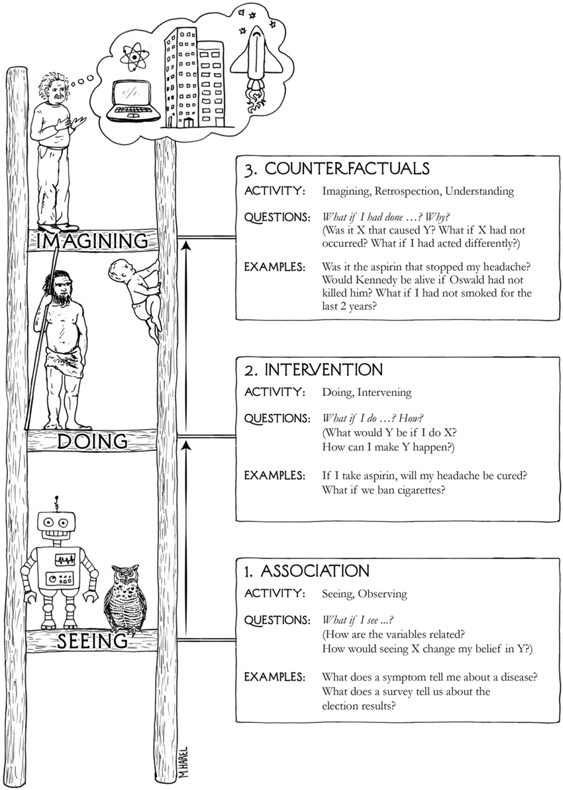
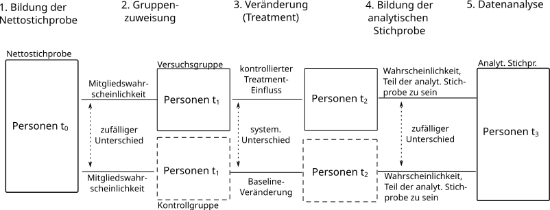
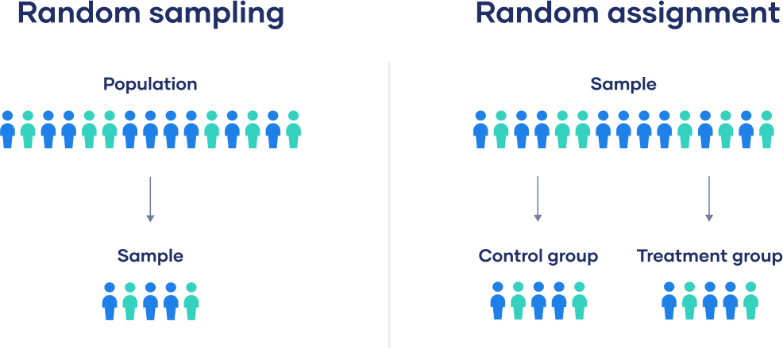

## Die richtigen Werkzeuge für jeden Anlass

Als Sozialwissenschaftler:in können Sie sehr unterschiedliche Forschungsfragen stellen, die unterschiedliche Untersuchungsdesigns zur Folge haben (müssen):

1.  Erkennen Lehrer:innen Depressionen bei Mädchen mit höherer Wahrscheinlichkeit als bei Jungen?

2.  Gibt es einen Zusammenhang zwischen dem Beruf und der Lebenszufriedenheit?

3.  Führt die Einnahme eines Medikaments im Gegensatz zu einem Placebo zu einer Besserung?

4.  Führt ein türkischer Name zu einer geringeren Wahrscheinlichkeit für ein Bewerbungsgespräch eingeladen zu werden?

5.  Führt ein Umzug in eine Nachbarschaft mit höherem Akademikeranteil zu besseren Noten für Jugendliche?

6.  Steigt der relative Anteil von sexuell nicht aufgeklärten aber sexuell aktiven Jugendlichen zwischen 13-15 Jahren?


## Was wollen wir da eigentlich wissen? 

Frage 1: Wie erfassen Lehrer:innen Symptome? 

```{mermaid}
flowchart TB

subgraph Mädchen 
direction LR
SM1([Symptom A]) 
SM2([Symptom B])
SM3([Symptom C])

DM[Depression] 

DM --> SM1 & SM2 & SM3

end 

subgraph Jungen
direction LR
SJ1([Symptom B]) 
SJ2([Symptom D])

DJ[Depression] 

DJ --> SJ1 & SJ2
end 

L[Lehrer:innen] --> SM1 & SM3 & SJ2

```

## Was wollen wir da eigentlich wissen? 

Frage 2: Gibt es (irgend)einen Zusammenhang zwischen Beruf & Lebenszufriedenheit? 

```{mermaid}
flowchart LR

B[Beruf] --> L[Lebenszufriedenheit]
X[?] <--> B & L

```


## Was wollen wir da eigentlich wissen? 

Frage 3a: Ist ein Medikament wirksam? Frage 3b: Wirkt ein türkischer Name anders als ein deutscher?

```{mermaid}
flowchart TB

subgraph Medikament 
Z1[Zustand $t_1$] 
Z2[Zustand $t_2$]
MJ[Medikament genommen]
MN[Medikament nicht genommen]

Z1 --> MJ --> Z2
Z1 --> MN --> Z2
end

subgraph Diskriminierung 

P[Musterperson]
DN[Deutscher Name]
TN[Türkischer Name]
E[Einladung zur Besichtigung]

P --> DN & TN
DN & TN --> E

end 

```

## Was wollen wir da eigentlich wissen? 

Frage 4a: Führt eine Veränderung in X (Umzug) zu einer Veränderung von Y (Noten)?

```{mermaid}
flowchart LR
    X1["X t_1"] --> Y1["Y t_1"]
    X2["X t_2"] --> Y2["Y t_2"]
    Y1 ~~~ X2
    X1 -.- X2
    Y1 -.- Y2

```

## Was wollen wir da eigentlich wissen? 

Frage 4a: Wie verändert sich in der Population die Verteilung der Ausprägung von Eigenschaften?

```{mermaid}
flowchart LR
    X1["X t_1"] 
    Y1["Y t_1"]
    X2["X t_2"]
    Y2["Y t_2"]
  
    X1 -.- X2
    Y1 -.- Y2

```

## Was wollen wir da eigentlich wissen? 

Frage 4b: Führt eine Veränderung in X (Umzug) zu einer Veränderung von Y (Noten)?

```{mermaid}
flowchart LR
    X1["X t_1"] --> Y1["Y t_1"]
    X2["X t_2"] --> Y2["Y t_2"]
    Y1 ~~~ X2
    X1 -.- X2
    Y1 -.- Y2

```


## Untersuchungsdesigns

Bezüglich unterschiedlicher (quantitativer) Untersuchungsdesigns können drei zentrale Fragen unterschieden werden:

1.  Gibt es eine randomisierte und kontrollierte Aussetzung eines Faktors auf Untersuchungseinheiten?

    1.  experimentelle vs. nicht-experimentelle Designs

2.  Wird nur einmal oder wiederholt erhoben?

    1.  Querschnitt- vs. Längsschnitt-Design

3.  Findet die Messwiederholung aufgrund einer identischen oder aufgrund mehrerer Stichproben statt?

    1.  Panel vs. Trend-Design

Es ist möglich, alle Varianten zu kombinieren!


## Untersuchungsdesigns & Datenstrukturen

::::: {.columns}
:::: {.column width="50%"}

::::

:::: {.column width="50%"}

::::
:::::

## Die wesentlichen Unterschiede

- Experimente weißen Werte des Treatment-Status über Spalten zufällig zu. Nicht-experimentelle Designs erfassen diese Werte über Beobachtungen.

- Querschnittsuntersuchungen konzentrieren sich auf Unterschiede zwischen Untersuchungseinheiten zu einem Zeitpunkt.

- Paneluntersuchungen studieren Veränderungen von Merkmalen über die Zeit. Dazu müssen diese für die gleichen Untersuchungseinheiten über die Zeit beobachtet werden.

## Das ganz dicke Brett: Ursache & Wirkung

::::: {.columns}
:::: {.column width="50%"}

::::

:::: {.column width="50%"}
Nach Judea Pearl können wir drei Ebenen der Kausalanalyse unterscheiden: 

1. Welche Zusammenhänge kann ich studieren? 
2. Wenn ich etwas *verändere*, was passiert dann? 
3. Da ich weiß, dass X eine Wirkung auf Y hat, kann ich mir vorstellen, was passieren *würde*, wenn X nicht vorliegt. 
::::
:::::

## Ursachen, Wirkungen und kontrafaktische Zustände

::::: {.columns}
:::: {.column width="50%"}

::::

:::: {.column width="50%"}
In der linken Grafik werden zwei Szenarien für eine Person abgebildet. 

Wir können aber pro Person immer nur ein Szenario beobachten. 
::::
:::::


## Wirksamkeit 

Wir wollen wissen, ob ein Medikament den systolischen Blutdruck[^1] senkt. Wir haben Daten von drei vier Personen: 
            
  |Person |    Medikament  |         kein Medikament|
  |--------|:--------------------:|:-----------------:|
  |Max           |       120        |              ? |
 | Birte         |        ?         |             100 |
 | Clara         |       149         |             ? |
 | Tom           |        ?           |           160 |

[^1]: Der systolische Blutdruck entsteht, wenn Ihr Herz durch Anspannung
    Blut in den Körper drückt. Das ist immer der größere von zwei Werten
    bei Blutdruckmessungen.

## Dann halt Panel! {.midi}

::::: {.columns}
:::: {.column width="60%"}
|Person     |    Medikament  |         kein Medikament|
|-------------------|:-------:|:--------:|
|Max $t_1$          |       120        |              ? |
|Max $t_2$           |       ?        |              140 |
|Birte $t_1$        |        ?         |             100 |
|Birte  $t_2$       |        100         |             ? |
|Clara $t_1$         |       149         |             ? |
|Clara  $t_2$       |      ?         |             151 |
|Tom   $t_1$        |        ?           |           160 |
|Tom    $t_2$       |        100         |           ? |
::::

:::: {.column width="40%"}
Wir können immer nur beobachten, ob bei Untersuchungseinheiten *zu einem bestimmten Zeitpunkt* Eigenschaften vorliegen oder nicht. Eine Person hat zu einem bestimmenten Zeitpunkt ein Medikament genommen oder nicht. Wir können nicht beides beobachten. Dieses grundsätzliche Problem löst sich auch nicht einfach durch Mehrfachbeobachtung. 
::::
:::::
          
## Wir bohren dicke Bretter, Folge 2. {.midi}

$T$ ist absofort die Abkürzung für ein experimentelles Treatment. Wenn wir Personen unter $Y | T = \text{ja}$ \& $Y | T = \text{nein}$  zeitgleich beobachten könnten, müssten wir einfach nur die Differenz zwischen beiden Werten bilden und hätten einen individuellen Kausaleffekt (ICE):

$$ \text{ICE} =   (Y | T = \text{ja}) - (Y | T = \text{nein}) $$

Wir haben aber immer nur den Wert unter einer Bedingung beobachtet, der andere Wert ist ein **kontrafaktischer** Wert oder auch **potential outcome**. 

\begin{equation}
Y | T = \text{ja} \begin{cases} 	
Y_0 & \, \text{kontrafaktisch}\\
Y_1 & \, \text{beobachtet} 
\end{cases} 
\end{equation}

\begin{equation}
Y | T = \text{nein} \begin{cases} 	
Y_0 & \, \text{beobachtet}\\
Y_1 & \, \text{kontrafaktisch} 
\end{cases}
\end{equation}

## Wir bohren dicke Bretter, Folge 3

Wir kommen bei individuellen Differenzen (siehe ICE) nicht weiter, wenn wir Kausalbehauptungen testen wollen. Wir müssen stets \textit{Erwartungen} über mehrere Untersuchungseinheiten (sprich: Gruppen) bilden. Diese Erwartung kürzen wir mit $E[]$ ab. 

$E[Y | T = \text{ja}]$ ist daher der erwartete Wert des Blutdrucks über alle Personen, die das Medikament erhalten haben.


$E[Y | T = \text{nein}]$ ist der erwartete Wert des Blutdrucks über alle Personen, die das Medikament nicht erhalten haben.


## Übertragbarkeit von Erwartungen {.midi .scrollable}

Wenn wir Kausalbehauptungen testen wollen, müssen wir zwei Aussagen plausibel machen können: 

1.  Der erwartete Wert des beobachteten Outcomes für Personen unter dem Einfluss des Treatments ist gleich mit dem erwarteten Wert des kontrafaktischen Outcomes für Personen ohne Treatment. 
Formaler: $$ E[Y_1 | T = \text{ja}] = E[Y_1 | T = \text{nein}] = E[Y_1]  $$ 
2. Der erwartete Wert des beobachteten Outcomes für Personen ohne Einfluss des Treatments ist gleich mit dem erwarteten Wert des kontrafaktischen Outcomes für Personen unter Einfluss des Treatments.
Formaler: $$ E[Y_0 | T = \text{nein}] = E[Y_0 | T = \text{ja}] = E[Y_0]  $$ 
Nur dann können wir behaupten: 
$$ E[Y_1 | T = \text{ja}] - E[Y_0 | T = \text{nein}] = E[Y_1] - E[Y_0] $$


## Experimente

Für experimentelle Designs müssen folgende Bedingungen vorliegen:

1.  Es werden durch die Forschenden mindestens zwei Gruppen gebildet: Versuchsgruppe ($E[Y_1 | T = \text{ja}]$) und Kotrollgruppe ($E[Y_0 | T = \text{nein}]$).

2.  Die Untersuchungseinheiten werden den Gruppen zufällig zugewiesen (Randomisierung).

3.  Der Faktor, von dem vermutet wird, dass er das Phänomen systematisch beeinflusst, wird kontrolliert verändert (Veränderung des Treatments).

4.  Nur Untersuchungseinheiten der Versuchsgruppe werdem dem Treatment ausgesetzt.


## Experimentallogik

- Sie vermuten, dass eine Eigenschaft $X$ für ein Outcome $Y$ eine notwendige oder hinreichende Bedingung ist.

  - Ohne X tritt Y nicht auf. Oder: Eine Veränderung von X verändert Y.

- Sie untersuchen N Personen. Sie würfeln aus, wer in die Kontroll- und in die Versuchsgruppe kommt.

  - Dadurch unterscheiden sich die Gruppen bisher **nur** durch einen **Zufallsprozess**.
  - Das bedeutet auch, dass sich die Verteilung aller weiteren Eigenschaften zwischen den Gruppen nur **zufällig** unterscheiden. 
  
## Experimentallogik  

- Es ist ihnen möglich X kontrolliert zu verändern und nur die Versuchsgruppe damit zu exponieren[^2].

  - Auf diese Weise müsste sich $Y$ in der Versuchsgruppe verändern, während es in der Kontrollgruppe nur zu "Baseline"-Veränderungen kommt.

- Sie vergleichen $Y$ zwischen den beiden Gruppen. Wenn alles korrekt abgelaufen ist, sind Unterschiede im Outcome nur auf Unterschiede in X zurückzuführen.

[^2]: Dadurch wird eine Eigenschaft $X$ zu einem Treatment $T$. 

## Experimente - Blaupause

{width=100%}

## Annahmen und Interpretation von Experimenten {.midi }

1.  Das Treatment wirkt sich nur in den Versuchsgruppen aus.

    - Dazu dürfen zwischen den Gruppen keine Informations- oder Austauschbeziehungen bestehen.

2.  In der Kontrollgruppe kommt es lediglich zu Baseline-Veränderungen.

    - Auch in der Kontrollgruppe kommt es typischerweise zu Veränderungen - vor allem bei Experimenten über lange Zeiträume. Darunter fallen u.a. Placebo-Effekte, Reaktionen des Immunsystems, Langeweile, Frustration, verändertes Verhalten.

    - Der Einfluss eines Treatments ist daher stets die Differenz der Versuchsgruppen zum Baseline-Effekt, der durch die Kontrollgruppe erfasst wird. Er ist nicht die Differenz von Versuchsgruppe zu "keinem Effekt".

    - Diese Veränderungen dürfen jedoch nicht mit dem Treatment-Status verbunden sein.
    
## Annahmen und Interpretation von Experimenten {.midi }

3.  Das Treatment wirkt für alle gleich.

    - Wir nehmen aktuell an, dass durch ein Treatment die Versuchsgruppen von der Kontrollgruppe im Niveau verschoben werden.

    - Personen können jedoch auch systematisch unterschiedlich auf Treatments reagieren.

4. Untersuchungseinheiten der Versuchs- und Kontrollgruppe haben die gleiche Wahrscheinlichkeit, Teil der analytischen Stichprobe zu sein. 

    - Personen können durch ein Treatment verschreckt werden. 
    - Personen der Kontrollgruppe können gelangweilt oder enttäuscht sein. 
    
## Randomisierung & random sampling

:::::{.columns}

::::{.column width="30%"}
  
::::

::::{.column width="70%"}
Bei einer Zufallsstichprobe (random sampling) hat jede Untersuchungseinheit die gleiche Wahrscheinlichkeit, Teil der Nettostichprobe zu werden.
Bei einer Randomisierung hat jede Untersuchungseinheit der Nettostichprobe die gleiche Wahrscheinlichkeit, Teil der Versuchs- oder Kontrollgruppe(n) zu werden.
Randomisierung ist **unabhängig** von random sampling. Sie können auch innerhalb eines Schneeball- oder Convienence Samples randomisieren.
::::
::::: 


## Komplexere Experimente

::::: {.columns}
:::: {.column width="50%"}
](https://media.springernature.com/full/springer-static/image/art%3A10.1186%2F1745-6215-15-364/MediaObjects/13063_2014_Article_2233_Fig1_HTML.jpg?as=webp) 
::::

:::: {.column width="50%"}

- Experimente müssen nicht nur eine Kontroll- oder eine Versuchsgruppe haben. Sie können mehrere Versuchs- und Kontrollgruppen haben, um u.a. die unterschiedliche Stärke eines Treatments zu studieren oder über verschiedene Kontrollgruppen Baseline-Veränderungen gut zu erfassen.

- Treatments müssen nicht nur ein Stimulus enthalten, sondern können eine Kombination von Stimuli sein.

::::
:::::


## Arten von Experimenten: Laborexperiment

:::::{.columns}

::::{.column width="30%"}
  ](https://www.ub.edu/school-economics/wp-content/uploads/2022/09/MicrosoftTeams-image-50.jpg)
::::

::::{.column width="70%"}
Laborexperimente sind eine der wichtigesten Quellen wissenschaftlicher Erkenntnis über die meisten Wissenschaftsdisziplinen. In den Sozialwissenschaften werden sie auch zunehmend über PC-Labore eingesetzt.

- Vorteile: Kein Informationsaustausch zwischen Gruppen; Treatment kann gezielt und klar gesetzt werden; kaum Verweigerung oder Ignorieren des Treatments

- Nachteile: Starke Selektion in die Bruttostichprobe; Umfeld des Labors kann sich auf Verhalten auswirken

::::
::::: 


## Arten von Experimenten: Feldexperiment

 Feldexperimente nutzen Untersuchungseinheiten in ihrer "natürlichen" Umgebung, um Einflüsse von Treatments über Versuchs- und Kontrollgruppen zu studieren. Meist ist den untersuchten Personen nicht klar, dass sie Teil eines Experiments sind.

- Vorteile: Kein Einfluss einer Laborumgebung; Erhebung von konkreten Verhaltensdaten

- Nachteile: Einteilung in Versuchs- und Kontrollgruppen kann schwierig sein; Austauschs- und Informationsbeziehungen sind nur äußerst schwer zu kontrollieren.
:::
:::::

## Rechts stehen, links gehen!

::::: columns
::: column
.5 [Quelle](https://www.degruyter.com/document/doi/10.1515/zfsoz-2013-0305/html?lang=de)
:::

::: column
.5 Wolbring et al. (2013) führten ein Feldexperiment in der Münchner U-Bahn durch. Sie wollten wissen, ob Normverstöße gegen die Regel "Rechts stehen, links gehen" auf Rolltreppen nach Geschlecht und sozialem Status der normverstoßenden Person anders sanktioniert werden.

Dazu varriierten Sie die Kleidung von Personen, die ansonsten ähnliche Körpermaße hatten.
:::
:::::

## Rechts stehen, links gehen!

::::: columns
::: column
.5 [Quelle](https://www.degruyter.com/document/doi/10.1515/zfsoz-2013-0305/html?lang=de)
:::

::: column
.5

Männer und status niedriger gekleidete Personen wurden schneller und heftiger sanktioniert als Frauen und status höher gekleidete Personen.
:::
:::::

## Was hilft gegen Armut?

:::::: center
:::: minipage
::: center
:::
::::

::: minipage
- Banerjee, Abhijit, et al. *A multifaceted program causes lasting progress for the very poor: Evidence from six countries*. Science 348.6236 (2015): 1260799.

- Hier Ghana; eine Region; Auswahl von Haushalten; 25% sind Teil eines Programms

- Program: Anlage eines Giro-Kontos, Gesundheits- und Ernährungsbildung, Ziegen / Hühner / Mais / Shea-Nüsse, Geldüberweisungen bei Trockenperiode; wöchentliche Besuche einer NGO
:::
::::::

## Was hilft gegen Armut?

::::: columns
::: column
.6
:::

::: column
.4

Das Experiment verdeutlicht auch, dass Haushalte unterschiedlich auf das Treatment reagierten. Je höher die Sparneigung eines Haushalts ist, desto stärker ist auch der Treatment-Effekt des Armutsreduktionsprogramms. Ein Vergleich der durschschnittlichen Spareinlagen zwischen Treatment und Kontrollgruppe erfasst diese Unterschiedlichkeit nicht.
:::
:::::

## Arten von Experimenten: Natürliche Experimente

Manchmal treten (unvorhergesehene) Ereignisse auf, die das Verhalten oder die Einstellungen von Personen verändern. Dazu zählen u.a.:

1.  Katastrophen (Hurrikane, Flut, Pandemie, Kriege)

2.  Technische/Medizinische Innovationen (Mobilfunkausbau, Verhütung, Infrastruktur)

3.  politische Reformen (Wiedervereinigung, Elterngeldreformen)

**Wenn** diese Ereignisse so erfolgt sind, dass Untersuchungseinheiten von ihnen (im Zeitverlauf) zufällig betroffen waren oder sich die betroffenen Gruppen nicht unterscheiden, können wir betroffene und nicht betroffene Gruppen vergleichen, um den Einfluss diese Ereignisse zu studieren.

## Terror und Einstellung zu Immigration

::::: columns
::: column
.6 [Quelle](https://www.journals.uchicago.edu/doi/abs/10.1086/669605)
:::

::: column
.4 Im Jahr 2002 wurde in neun europäischen Ländern der European Social Survey erhoben, der u.a. Einstellungen zu Immigration nutzt. *Während* der Erhebungsphase fand in Bali eine große Terrorattacke statt. Damit können wir Gruppen der Befragten direkt vor und direkt nach der Terror-Attacke einteilen, um zu studieren, ob solche Ereignisse Einstellungen zu Immigration verändern.
:::
:::::

## Terror und Einstellung zu Immigration

::::: columns
::: column
.3 [Quelle](https://www.journals.uchicago.edu/doi/abs/10.1086/669605)
:::

::: column
.7 Terror erhöht in einigen Ländern negative Einstellung zu Immigration. Dies ist vor allem dann der Fall, wenn die (wahrgenommene) Gruppe der Immigraten groß und der Arbeitsmarkt im Land herausfordernd ist.

Der Einfluss nimmt ab, je länger das Ereignis von der Befragung entfernt ist.
:::
:::::


## Querschnittuntersuchungen

Bei einer Querschnitt-Untersuchung werden mittels einer Stichprobe zu einem Zeitpunkt mehrere Eigenschaften simultan gemessen. Zum Beispiel werden Personen aus einer Stichprobe zu einem Zeitpunkt unterschiedliche Fragen zu unterschiedlichen Merkmalen gestellt. Das Ziel der Untersuchung ist es, systematische Unterschiede bezüglich eines Merkmals (z.B. dem Lohn) zwischen Gruppen oder systemtatische Zusammenhänge zwischen Merkmalen zu erfassen.

- Vorteile: Kostengünstig & weniger voraussetzungsreich als Experimente oder Längsschnittbefragungen, viele wichtige Einflüsse sind nicht experimentell studierbar aber im Querschnitt erfragbar

- Nachteile: Selektionseffekte (in die Stichprobe & in das "Treatment"), Verzerrung durch unbeobachtete Faktoren

## Querschnitt = alle Einflüsse auf einmal!

Beispiel: Der Einfluss, Schüler einer Klasse mit hohem/niedrigen sozio-ökonomischen Status zu sein, auf den Gymnasialübergang.

::: center
:::

## Die Aufteilung kognitiver Tätigkeiten und Erschöpfung

::: center
:::

## Der Zusammenhang von Intelligenz und Einkommen

::: center
:::

[Quelle](https://academic.oup.com/esr/article/39/5/820/7008955)

# Trenddesign

##  {#section-3 .unnumbered}

## Trenddesign: Sonntagsfrage

Bei einem Trenddesign werden über die Zeit mehrere Stichproben gezogen, bei dem das gleiche Item genutzt wird.\
Wichtig: Veränderungen im Trend können sowohl auf veränderte Reaktionen auf das Item als auch auf veränderte Zusammensetzungen der Stichproben über die Zeit zurückzuführen sein. Ändern sich z.B. Selektionseffekte über die Zeit, führt dies zu unterschiedlichen Zusammensetzungen und somit auch zu verzerrten Einschätzungen des Trends.

## Trenddesign: Sonntagsfrage

Item: Welche Partei würden Sie wählen, wenn heute Bundestagswahl wäre?

::: center
:::

[Quelle](https://www.dkriesel.com/sonntagsfrage)

## Was macht die Jugend so?

:::::: center
:::: minipage
::: center
:::
::::

::: minipage
- Anteil U.S. amerikanischer 12.-Klässler:innen, die auf folgende Fragen mit "Ja" antworten:

  - Hast du eine Fahrerlaubnis?

  - Hast du jemals Alkohol probiert?

  - Hast du jemals ein Date gehabt?

  - Arbeitest du für Geld?

\
:::
::::::

## Trenddesign: Ökonomomische Abhängigkeit der Frau

Item: Wie hoch ist der relative Anteil des Einkommens der Frau am Paareinkommen?

::: center
:::

# Paneldesign

##  {#section-4 .unnumbered}

## Paneldesign

Bei einer Panel-Untersuchung wird mittels einer **konstanten** Stichprobe zu **unterschiedlichen** Zeitpunkten mindestens eine Eigenschaft (typischerweise aber viele) gemessen. Mit einem Paneldesign können Sie den Zusammenhang einer zeitlichen *Veränderungen* eines Merkmals auf *Veränderungen* eines Outcomes studieren.

## Paneldesign & Teilnahmeselektion

::::: columns
::: column
.4 [Quelle](https://thomasklausch.wordpress.com/2015/10/13/attrition-in-the-liss-panel-most-severe-in-the-first-two-years/)
:::

::: column
.6 Panel haben ein besonders Problem: Die Teilnahmewahrscheinlichkeit über Befragungszeitpunkte nimmt ab und ist meist selektiv. Daher verändert sich die Zusammensetzung des Panels über die Zeit. Dies wird auch als *Panel-Attrition* bezeichnet. Das ist dann ein Problem, wenn unbeobachtete Faktoren eine große Rolle dabei spielen, die mit Merkmalen innerhalb einer Analyse verknüpft sind.

Es sind daher meist Auffrischungsstichproben nötig. Dies sind neue Stichproben, die regelmäßig in das Panel hinzugegeben werden.
:::
:::::

## Paneldesign: Kinder (sie geben einem viel zurück!)

::: center
:::

[Quelle](https://onlinelibrary.wiley.com/doi/full/10.1111/jomf.12531)

## Paneldesign: Kinder (sie geben einem viel zurück!)

::: center
:::

[Quelle](https://onlinelibrary.wiley.com/doi/full/10.1111/jomf.12531)

## Paneldesign: Trauer

::: center
:::

[Quelle](https://sociologicalscience.com/articles-v10-29-830/)
