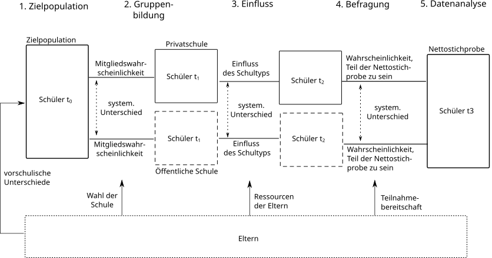
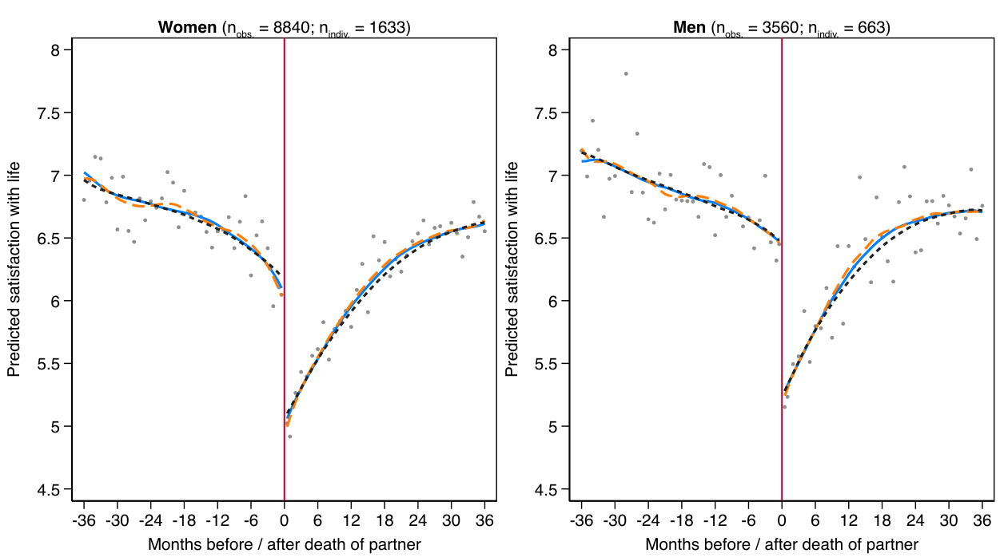

## Querschnittuntersuchungen

Bei einer Querschnitt-Untersuchung werden mittels einer Stichprobe zu einem Zeitpunkt mehrere Eigenschaften simultan gemessen. Das Ziel der Untersuchung ist es, systematische Unterschiede bezüglich eines Merkmals zwischen Gruppen oder systemtatische Zusammenhänge zwischen Merkmalen zu erfassen.

- Vorteile: 
  - Kostengünstig & weniger voraussetzungsreich als Experimente oder Längsschnittbefragungen
  - viele wichtige Einflüsse sind nicht experimentell studierbar aber im Querschnitt erfragbar

- Nachteile: Selektionseffekte (in die Stichprobe & in das "Treatment"), Verzerrung durch unbeobachtete Faktoren


## Querschnitt = alle Einflüsse auf einmal!

{width=80%}

## The never ending drama: Selektivitäten {.midi}
Selektion ins "Treatment"

::::: {.columns}
:::: {.column width="50%"}
```{mermaid}
flowchart TB

X["Privatschule"] --> Y["Bildungserfolg"] 
Z["Einkommen der Eltern"] --> X & Y

```
::::

:::: {.column width="50%"}
- Schüler:innen auf Privatschulen unterscheiden sich in Bezug auf das Einkommen der Eltern von Schüler:innen auf öffentlichen Schulen. 
- Der Einfluss von Privat/Öffentlichen Schulen muss daher vom Einfluss der "Selektion in Privatschulen" getrennt werden. 
::::
:::::


## The never ending drama: Selektivitäten {.midi}
Selektion in die Stichprobe

::::: {.columns}
:::: {.column width="50%"}
```{mermaid}
flowchart TB

G[Geschlecht] --> E[Einsamkeit]
B[Bildung] --> E
G --> B
T[Teilnahme]
G --> T 
B --> T
```
::::

:::: {.column width="50%"}
- Personen, die an der Umfrage teilnehmen, sind eher weiblich und höher gebildet. 
- Da diese beiden Eigenschaften auch auf die Einsamkeit wirken, verzerrt die Teilnahmeselektivität den Zusammenhang zwischen Geschlecht, Bildung und Einsamkeit in der analytischen Stichprobe.
::::
:::::


## No causal, no cry! {.midi}

- Selektion ins Treatment ist dann ein Problem, wenn wir die direkte Wirkung eines Treatments auf ein Outcome studieren wollen (Stufe 2 der "ladder of causality"). 
     - Was ist die Wirkung von Privatschulen auf Bildungserfolge von Schüler:innen -- **unabhängig** von allen anderen Eigenschaften, die mit Privatschulen zusammenhängen? 
     - Was ist der Einfluss von Scheidungen auf die Entwicklung von Kindern -- **unabhängig** von allen anderen Eigenschaften, die mit Scheidungen zusammenhängen? 
     
- Manchmal ist das aber nicht unser Ziel. Oft wollen wir "nur" einen Zusammenhang beschreiben oder Unterschiede erfassen (Stufe 1 der "ladder of causality").
     
## Renaisance der Mädchen-/Jungenschulen? 

[Clavel & Flannery (2022)](https://bera-journals.onlinelibrary.wiley.com/doi/full/10.1002/berj.3841) untersuchten für Irland Unterschiede zwischen geschlechtergetrennten und gemischten Schulen mit PISA-Daten. 

::::: {.columns}
:::: {.column width="50%"}

::::

:::: {.column width="50%"}

::::
:::::


## Der Zusammenhang von Intelligenz und Einkommen


[Quelle: Keuschnigg et al. (2023)](https://academic.oup.com/esr/article/39/5/820/7008955)


## Trenddesign

- Bei einem Trenddesign werden über die Zeit mehrere Stichproben gezogen, bei dem das gleiche Item genutzt wird.

- Wichtig: Veränderungen im Trend können sowohl auf veränderte Reaktionen/Messungen auf das Item als auch auf veränderte Zusammensetzungen der Stichproben über die Zeit zurückzuführen sein. 

- Ändern sich z.B. Selektionseffekte über die Zeit, führt dies zu unterschiedlichen Zusammensetzungen und somit auch zu unterschiedlichen Trends.

## Trends in den Krankenständen


## Eine neue Jugendkultur der Vorsicht? 

::::: {.columns}
:::: {.column width="80%"}
{width=70%}
::::

:::: {.column width="20%"}
[Quelle: Twenge & Park (2019)](https://academic.oup.com/chidev/article/90/2/638/8257274) für die USA
::::
:::::

## Trenddesign: Sonntagsfrage

Welche Partei würden Sie wählen, wenn heute Bundestagswahl wäre ([Quelle](https://www.dkriesel.com/sonntagsfrage))?

{width=90%}

## Paneldesign

- Bei einer Panel-Untersuchung wird mittels einer **konstanten** Stichprobe zu **unterschiedlichen** Zeitpunkten mindestens eine Eigenschaft (typischerweise aber viele) gemessen. 

- Mit einem Paneldesign können Sie den Zusammenhang einer zeitlichen *Veränderungen* eines Merkmals auf *Veränderungen* eines Outcomes studieren.

## Paneldesign & Teilnahmeselektion {.midi}

::::: {.columns}
:::: {.column width="30%"}

::::

:::: {.column width="70%"}
- Panel haben ein besonders Problem: Die Teilnahmewahrscheinlichkeit über Befragungszeitpunkte nimmt ab und ist meist selektiv ([Klausch (2015)](https://thomasklausch.wordpress.com/2015/10/13/attrition-in-the-liss-panel-most-severe-in-the-first-two-years/).

- Daher verändert sich die Zusammensetzung des Panels über die Zeit. Dies wird auch als *Panel-Attrition* bezeichnet. 

- Das ist dann ein Problem, wenn unbeobachtete Faktoren eine große Rolle dabei spielen, die mit Merkmalen innerhalb einer Analyse verknüpft sind.

- Es sind daher meist Auffrischungsstichproben nötig. Dies sind neue Stichproben, die regelmäßig in das Panel hinzugegeben werden.
::::
:::::

## Paneldesign: Kinder (sie geben einem viel zurück!)

::::: {.columns}
:::: {.column width="50%"}

::::

:::: {.column width="50%"}

::::
:::::

Quelle: [Ruppanner et al. (2018)](https://onlinelibrary.wiley.com/doi/full/10.1111/jomf.12531)

## Paneldesign: Auch der schlimmste Tag vergeht {.midi}

{width=90%}

Quelle: [Hudde & Jacob (2023)](https://sociologicalscience.com/articles-v10-29-830/)

