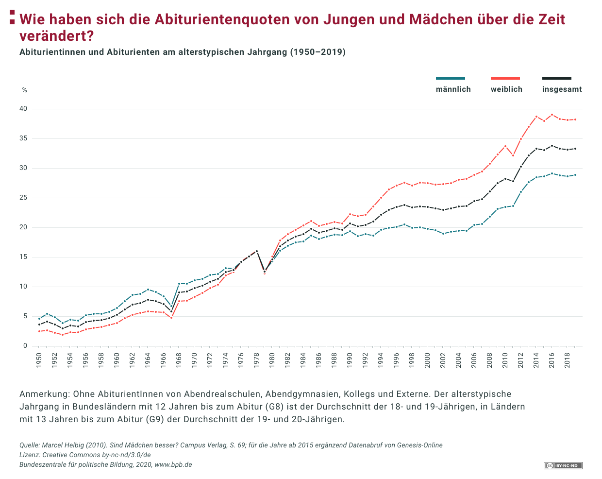
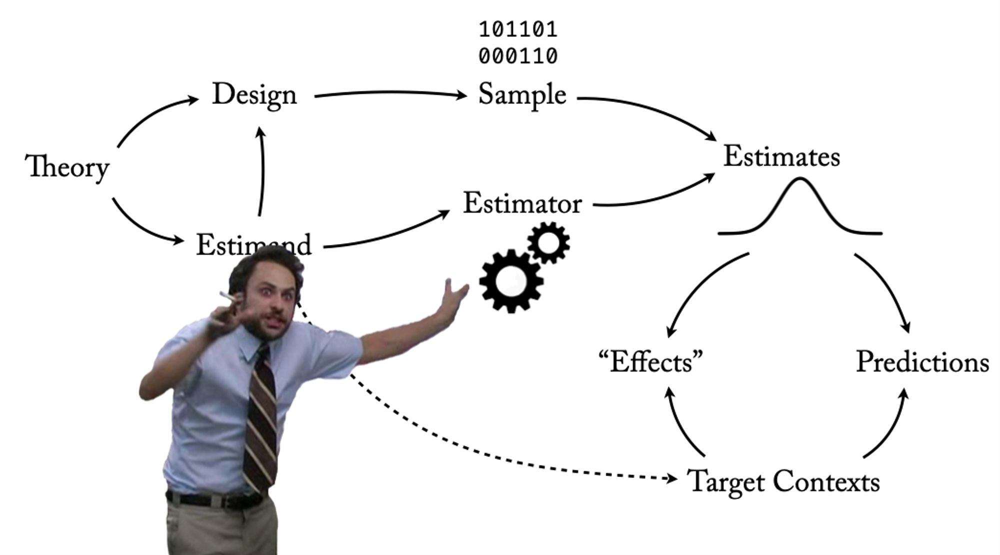

## Verstehen, was passiert.

{width="70%"}

## Mit Daten lernen, dann beraten.

{width="70%"}

## Nicht zum Lärm, sondern zur Aufklärung beitragen.

{width="70%"}

## Wie geht das?



## Geht das auch einfacher? (Spoiler: Jaein.)


## Erkentnisinteresse: Geschlechtsspezifische Bildungsungleichheiten {.midi}


## Erkentnisinteresse: Geschlechtsspezifische Bildungsungleichheiten {.midi}



## Hypothesen: Unterschiede in X führen zu Unterschieden in Y {.midi}

Die Theorien über Ungleichheiten im Bildungssytem haben wir in Form eines Systems dargestellt, dass Unterschiede in Ausprägungen von Eigenschaften miteinander verbindet. Solche Verbindungen bezeichnen wir als **Hypothesen**. 

- Hypothesen werden typischerweise als "Wenn-dann" oder als "Je-desto" Aussagen formuliert.
    - Wenn ein Unterschied in X besteht, besteht auch ein Unterschied in Y. 
    - Je größer/kleiner die Unterschiede in X sind, desto größer/kleiner sind die Unterschiede in Y. 

Hypothesen können auch mehrere Verbindungen umfassen und selbstverständlich sprachlich eleganter als die oben genannten Versionen formuliert sein. 

## Aktuelle Hypothesen:[^1] 

- Traditionelle völkische Folklore verstärkt eine feindliche/negative Sicht auf die soziale Umgebung und erhöht dadurch die Neigung zur Wahl rechtsextremer Parteien ([Amaya & Braun (2026)](https://journals.sagepub.com/doi/full/10.1177/00031224251409746)).
- Wenn Frauen in Berufe eintreten, die vorher nur von Männern ausgeübt wurden, ändert sich weder das Verhalten, Leistung oder die Beförderung von Männern - aber Männer glauben, dass sich ihre Situation verschlechtert ([Greenberg et al. (2026)](https://academic.oup.com/qje/advance-article/doi/10.1093/qje/qjag016/8551347)).  
- Je mehr ältere Brüder von der gleichen Mutter ein Mann hat, desto höher ist die Wahrscheinlichkeit, dass er sich als schwul identifiziert ([Blanchard (2017); Leseempfehlung: Kommentare zu diesem Artikel](https://link.springer.com/article/10.1007/s10508-017-1007-4)).

[^1]: Persönliche Selektion aus der Wissenschaftsinbox vom Haupt (2026).

## Von der Hypothese zur Datenanalyse {.midi}

Jedes Element von Hypothesen müssen wir in der Datenanalyse in nachvollziehbarer Weise auf beobachtbare Informationen und angemessene Verfahren zurückführen.
```{mermaid}
flowchart LR

subgraph H[Hypothese]
X[Unterschiede in X] -- führen zu -->
Y[Unterschieden in Y] 
end

subgraph D[Datenanalyse]
V1[Verteilung von X] -- korreliert mit -->
V2[Verteilung von Y] 
end

subgraph V[Vergleich / Modellierung]
  X1@{ img: "https://www.svgrepo.com/show/471053/bar-chart-09.svg", label: "Verteilung von Y bei X = 0", pos: "t", h: 60, constraint: "on" }
  X2@{ img: "https://www.svgrepo.com/show/471054/bar-chart-08.svg", label: "Verteilung von Y bei X = 1", pos: "t", h: 60, constraint: "on" }
  X1 <-- Differenz --> X2
end

H -- wird übersetzt zu --> D
D -- beruht auf --> V
```
Wir betreiben Datenanalyse, indem wir gruppenspezifische Verteilungen auf eine korrekte Art miteinander *vergleichen* und somit die theoretisch behauptete *systematische Unterschiedlichkeit* von Eigenschaften als *Differenzen* erfassen.

## Herausforderungen guter Vergleiche {.midi}

Niemand verbietet es uns, alles mit allem zu vergleichen. Daher gibt es keinen per se schlechten Vergleich. Wir verbinden allerdings in der Wissenschaft mit einem Vergleich ein Erkentnissinteresse. Dieses Interesse kann gut oder schlecht bedient werden.

1.  Wir möchten beschreiben, wie groß die Unterschiede zwischen Gruppen sind.

        -  Oft vergleichen wir Mittelwerte oder relative Anteile über Gruppen. Das kann aber aus vielen Gründen nicht unseren Interessen genügen. Daher müssen wir reflektieren, was ein sinnvoller Vergleichsmaßstab sein kann.

2.  Wir wollen oft wissen, ob etwas wirksam ist bzw. einen *eigenständigen* Effekt hat.

        - In diesem Fall möchten wir wissen, wie stark die Unterschiede in der Verteilung einer Eigenschaft ("Unterschiede in der Wahl extremer Parteien") durch eine andere Eigenschaft ("Verbreitung gruppenfeindliche Folklore") bedingt werden und wie stark sie durch andere Eigenschaften bedingt werden, die sich sonst noch zwischen den Gruppen unterscheiden ("Grad der Verstädterung"). Wir müssen daher den Einfluss des Gruppenmerkmals von den Einflüssen anderer Merkmale **isolieren**.

## Warum müssen wir vergleichen? {.midi}

- *Empirische* Vergleiche können wir nur mit beobachteten Daten durchführen. Wir können nicht eine Untersuchungseinheit *gleichzeitig* unter zwei unterschiedlichen Zuständen beobachten.[^3] Daher versuchen wir Untersuchungseinheiten zu vergleichen, die hinreichend (oder nahezu perfekt) vergleichbar sind, sich aber in der Eigenschaft unterscheiden, für deren Wirkung wir uns interessieren. Das geht nur auf Gruppenebene (also mindestens N = 2). 

- Wir können *kontrafaktische* Vergleiche als *Gedankenexperimente* durchführen. 
        - Wie würden sich Frauen in der Öffentlichkeit bewegen, wenn alle Männer abwesend wären - *im Vergleich* zur reelen Situation? 
        - Wie sähe die Lohnverteilung in Deutschland aus, wenn alle Personen wie im öffentlichen Dienst bezahlt würden - *im Vergleich* zur beobachteten Lohnverteilung? 

[^3]: Ich bezeichne dieses Problem als "Dr. Strange's Kopfschmerzpille im Multiverse".

## Warum müssen wir vergleichen? {.midi}

- Wir können beobachtete Verteilungen gegen *erwartete* Verteilungen vergleichen. 
  - Wir erwarten, dass sich die Verteilungen in einer repräsentative Stichprobe *nicht systematisch* von den Verteilungen unterscheiden, die wir in der Population erwarten.
  - Wir erwarten, dass sich die Verteilung von Eigenschaften über randomisierte Kontroll- und Versuchgruppen *vor* dem Treatment *nicht systematisch* unterscheiden. 
  - Wir müssen erwarten, dass sich Studienergebnisse zur gleichen Frage mit gleichem Studiendesign aber unterschiedlichen Stichproben unterscheiden - diese Unterschiede sollten aber im Rahmen einer Zufallsverteilung liegen. 
  - Wir können die eigenen Studienergebnisse mit vorherigen Studienergebnissen vergleichen. 


## In a nutshell: Was vergleichen wir womit? 

::: {.callout-important}
## *Empirische* Vergleiche 

- Sie können **nur** auf Grundlage von gruppenspezifischen, beobachteten Verteilungen durchgeführt werden.
- Alles mit N > 1 ist eine Gruppe. 
- Gruppen können (gleiche) Individuen (über die Zeit), Organistionen, Firmen, Länder oder Planeten sein. 
:::

::: {.callout-important}
## Vergleiche zwischen empirischen und *kontrafaktischen Zuständen*

- Das ist immer Theorie (aber deswegen nicht schlecht!). 
- Jede Kausalbehauptung benötigt ein plausibles, kontrafaktisches Szenario, mit dem wir vergleichen können. 
- Diese Vergleiche können wir mit Gedankenexperimenten oder Simulationen durchführen.
:::

## In a nutshell: Was vergleichen wir womit? 

::: {.callout-important}
## Vergleiche zwischen *empirischen und zufälligen Verteilungen*

- Manchmal lassen wir den Zufall für uns arbeiten (Randomisierung / zufälliges Sampling).
- **WENN** das so ist, erhalten wir *Zufallsverteilungen*. 
- Der Vergleich mit diesen Zufallsverteilungen *kann* uns helfen, die Unsicherheit über unsere Ergebnisse zu erfassen. 
:::

## Das datenanalytische Handwerkszeug für den Vergleich von Verteilungen


## Selber hämmern, nähen & schneiden

    1.  Maße der zentralen Tendenz: Modus, Median, arithmetisches Mittel

    2.  Maße der Streuung: Varianz, Standardabweichung, Diversität

    3.  Weitere Punkte der Verteilung: Quantile/Perzentile, Schiefe

## Verteilung der Löhne in Deutschland 2018

## Isolation von Einflüssen: Grundproblem

-   In einem randomisierten Experiment unterscheiden sich Kontroll- und Treatmentgruppe nur zufällig. Das heißt vor allem, dass sich die Verteilung von individuellen Merkmalen zwischen den Gruppen nur zufällig unterscheidet.

-   Wenn die Zuteilung in ein Treatment nicht randomisiert, sondern selektiv ist, unterscheiden sich Kontroll- und Treatmentgruppe *auch* nach der Verteilung der Merkmale, die zur Selektion führen.

-   Wenn wir Gruppenvergleiche mit dem Interesse machen möchten, den direkten Einfluss der Gruppenmitgliedschaft auf die Verteilung eines Merkmals zu erfassen, müssen wir den "Gruppeneinfluss" von der Selektion in die Gruppe unterscheiden.

-   Isolieren wir Einflüsse nicht voneinander, dann können wir u.a. fälschlicherweise dein Einfluss der Selektion als Gruppeneinfluss ansehen.

## Isolation von Einflüssen: Lösungen

Grundsätzlich haben wir zwei Möglichkeiten zur Isolation von Einflüssen:

-   Randomisierung in verschiedene Gruppen und kontrolliertes Treatment

-   Konstanthaltung, d.h. der Vergleich von Gruppen, die in anderen Eigenschaften $Z$ gleiche Werte haben.

## Vergleich mit dem Zufall

Manchmal vergleichen wir nicht empirische Verteilungen über Gruppen sondern empirische Ergebnisse gegen Ergebnisse, die wir unter Zufallsbedingungen erwarten würden. Zum Beispiel erwarten wir,

1.  dass sich die Verteilung von Merkmalen zwischen Kontroll- und Treatmentgruppe in einem randomisierten Experiment nur *zufällig unterscheiden*.

2.  dass sich die Verteilung von Merkmalen zwischen der Stichprobe und Population nur *zufällig unterscheiden*, wenn die Stichprobe zufällig gezogen wurde und keine Selektion stattfand.

3.  dass sich die Verteilung eines Merkmals *nur zufällig* verändert[^2], wenn ein Treatment oder eine Gruppenmitgliedschaft keine Wirkung hat.

[^2]: Wenn die Veränderung über eine längere Zeit beobachtet wird, müssen diese Veränderungen in Bezug auf einen "Baseline" Wert bezogen werden.

## Empirische Verteilungen und Zufallsverteilungen

-   Empirische Verteilungen und Zufallsverteilungen sind nicht das Gleiche!

-   Empirische Verteilungen enstehen durch datengenerierende Prozesse, wie die Lohnsetzung, Diskriminierung am Wohnungsmarkt oder Berufswahlentscheidungen. Alle diese Prozesse sind **nicht zufällig** und sollten daher auch nicht mit **Zufalls**verteilungen beschrieben werden.

-   Zufallsverteilungen sind das Resultat von Zufallsprozessen. Je nachdem, welchen Zufallsprozess wir beschreiben (z.B. Münzwurf, zufällige Schwankungen, zufällig auftretende sehr seltene Ereignisse), ist die Zufallsverteilung unterschiedlich.

## Erwartungswert (=Durchschnitt der Zufallsverteilung)

The expectation here is a lot of content; continue unchanged.

$$E[X] = \sum x_i \cdot P(x_i)$$

Einfacher Fall: Münzwurf (Werte: 0 = Zahl, 1 = Kopf). $E[\text{Kopf}] = 0 \cdot 0.5 + 1 \cdot 0.5 = 0.5$

## Warum brauchen wir das?

-   Sie machen eine Befragung und ziehen eine Zufallsstichprobe.

-   Woher wissen Sie, ob Ihre Stichprobe *tatsächlich* (annähernd) zufällig war?

-   Variable Geschlecht (Werte: 0 = Mann; 1 = Frau): E\[Frau\] = 0.5, da $0.5 \cdot 0 + 0.5 \cdot 1 = 0.5$

-   Keine Stichprobe wird allerdings exakt ein 50/50 Ratio haben, auch wenn die Stichprobe perfekt zufällig war.

-   Daher müssen wir lernen, erwartete Werte ($E[X]$) von realisierten Werten ($\bar{X}$ bzw. $P(X)$) zu unterscheiden, *um sie miteinander vergleichen zu können*.

## Bernoulli-Verteilung (Münzwurf)

## Gleichverteilung (Würfelwurf)

## Interaktive Verteilungen {.midi}

```{r}
library(shiny)
ui <- fluidPage(
  titlePanel("Bild' dir deine (stetige) Verteilung!"),
  sidebarLayout(
    sidebarPanel(
      tabsetPanel(
        tabPanel("Verteilung A",
                 h4("Verteilung A"),
                 sliderInput("mu1",  "Mittelwert μ",    min = -3, max = 3,  value = 0,  step = 0.5),
                 sliderInput("var1", "Varianz σ²",     min = 1, max = 7, value = 1,  step = 0.5),
                 sliderInput("skew1","Schiefe γ1",     min = -1,  max = 1,   value = 0,  step = 0.1),
                 sliderInput("kurt1","Kurtosis γ2",    min = 1, max = 10, value = 5,  step = 1)
        ),
        tabPanel("Verteilung B",
                 h4("Verteilung B"),
                 sliderInput("mu2",  "Mittelwert μ",    min = -3, max = 3,  value = 0,  step = 0.5),
                 sliderInput("var2", "Varianz σ²",     min = 1, max = 7, value = 1,  step = 0.5),
                 sliderInput("skew2","Schiefe γ1",     min = -1,  max = 1,   value = 0,  step = 0.1),
                 sliderInput("kurt2","Kurtosis γ2",    min = 1, max = 10, value = 5,  step = 1)
        )
      ),
      hr(),
      actionButton("draw", "Neu berechnen"),
      helpText("Mathematisch nicht mögliche Kombinationen führen zu einer Fehlermeldung.")
    ),
    mainPanel(
      plotOutput("overlayPlot", height = "600px")
    )
  )
)
```

```{r}
#| context: server
library(shiny)
library(PearsonDS)
library(ggplot2)

cols <- c(A = "#1b9e77", B = "#d95f02")

fit_safe <- function(mu, var, skew, kurt) {
  tryCatch(
    PearsonDS::pearsonFitM(mean = mu, variance = var, skewness = skew, kurtosis = kurt),
    error = function(e) structure(list(error = TRUE, message = conditionMessage(e)), class = "pearson_error")
  )
}

compute_plot_range <- function(f1, f2) {
  q1 <- tryCatch(PearsonDS::qpearson(c(0.001, 0.999), params = f1), error = function(e) NA_real_)
  q2 <- tryCatch(PearsonDS::qpearson(c(0.001, 0.999), params = f2), error = function(e) NA_real_)
  rng <- range(c(q1, q2), na.rm = TRUE)
  if (!is.finite(rng[1]) || !is.finite(rng[2]) || diff(rng) == 0) {
    s1 <- tryCatch(PearsonDS::rpearson(20000, params = f1), error = function(e) NA_real_)
    s2 <- tryCatch(PearsonDS::rpearson(20000, params = f2), error = function(e) NA_real_)
    rng <- range(c(s1, s2), na.rm = TRUE)
    if (!is.finite(rng[1]) || !is.finite(rng[2]) || diff(rng) == 0) rng <- c(-5, 5)
  }
  x <- seq(rng[1] - 0.1 * diff(rng), rng[2] + 0.1 * diff(rng), length.out = 1200)
  dens1 <- tryCatch(PearsonDS::dpearson(x, params = f1), error = function(e) rep(0, length(x)))
  dens2 <- tryCatch(PearsonDS::dpearson(x, params = f2), error = function(e) rep(0, length(x)))
  ymax <- max(c(dens1, dens2), na.rm = TRUE)
  if (!is.finite(ymax) || ymax == 0) ymax <- 0.5
  list(xlim = c(min(x), max(x)), ylim = c(0, ymax * 1.08))
}

# axis range reactive (initialized once)
axis_rng <- reactiveVal(NULL)
observe({
  req(input$mu1, input$var1, input$skew1, input$kurt1,
      input$mu2, input$var2, input$skew2, input$kurt2)
  if (is.null(axis_rng())) {
    f1 <- fit_safe(input$mu1, input$var1, input$skew1, input$kurt1)
    f2 <- fit_safe(input$mu2, input$var2, input$skew2, input$kurt2)
    axis_rng(compute_plot_range(f1, f2))
  }
})

# fits reactive (on button or initially)
vals <- eventReactive(input$draw, {
  list(
    f1 = fit_safe(input$mu1, input$var1, input$skew1, input$kurt1),
    f2 = fit_safe(input$mu2, input$var2, input$skew2, input$kurt2)
  )
}, ignoreNULL = FALSE)

overlayPlot <- renderPlot({
  axis <- axis_rng()
  req(axis)
  v <- vals()
  f1 <- v$f1; f2 <- v$f2

  if (inherits(f1, "pearson_error") || inherits(f2, "pearson_error")) {
    ggplot() +
      annotate("text", 0.5, 0.5, label = "Mindestens ein Fit fehlgeschlagen.\nBitte andere Werte wählen.", size = 5) +
      theme_void()
  } else {
    x <- seq(axis$xlim[1], axis$xlim[2], length.out = 1200)
    dens1 <- tryCatch(PearsonDS::dpearson(x, params = f1), error = function(e) rep(0, length(x)))
    dens2 <- tryCatch(PearsonDS::dpearson(x, params = f2), error = function(e) rep(0, length(x)))

    df <- data.frame(
      x = rep(x, 2),
      density = c(dens1, dens2),
      dist = factor(rep(c("A","B"), each = length(x)), levels = c("A","B"))
    )

    ggplot(df, aes(x = x, y = density, color = dist, fill = dist)) +
      geom_line(linewidth = 1) +
      geom_area(alpha = 0.18, position = "identity") +
      scale_color_manual(values = cols) +
      scale_fill_manual(values = cols) +
      labs(x = "x", y = "Dichte") +
      theme_minimal(base_size = 14) +
      theme(legend.title = element_blank()) +
      geom_vline(xintercept = input$mu1, linetype = "dashed", color = cols["A"], linewidth = 0.8) +
      geom_vline(xintercept = input$mu2, linetype = "dashed", color = cols["B"], linewidth = 0.8) +
      coord_cartesian(xlim = axis$xlim, ylim = axis$ylim, expand = FALSE)
  }
}, res = 96)
```

## Normalverteilung(en) (Unsystematische Differenzen in hoher Anzahl)

-   $N(x, \sigma)$ bezeichnet eine Normalverteilung mit dem Mittelwert $x$ und der Standardabweichung $\sigma$.

-   $N(0,1)$ wird als *Standardnormalverteilung* bezeichnet.

## Der Zufallsprozess bestimmt die Zufallsverteilung