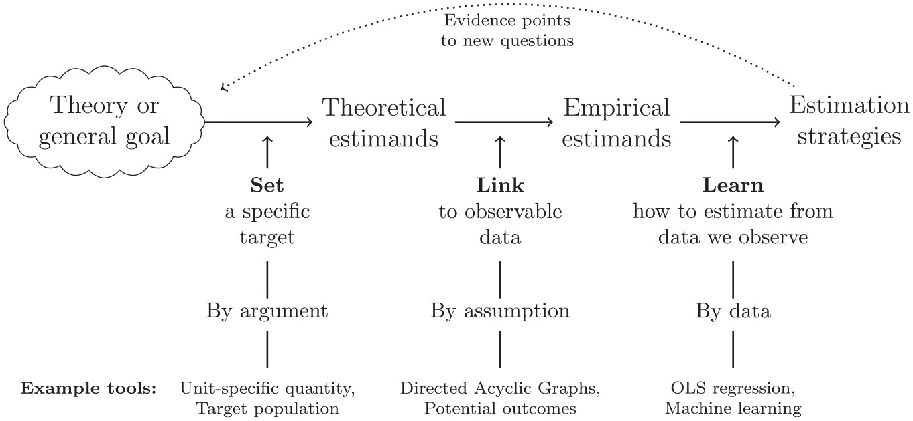

## Verstehen, was passiert.

{width="70%"}

## Mit Daten lernen, dann beraten.

{width="70%"}

## Nicht zum Lärm, sondern zur Aufklärung beitragen.

{width="70%"}

## Wie geht das?


## Geht das auch einfacher? (Spoiler: Jaein.)



## Erkentnisinteresse: Geschlechtsspezifische Bildungsungleichheiten {.midi}


## Erkentnisinteresse: Geschlechtsspezifische Bildungsungleichheiten {.midi}


## Hypothesen: Unterschiede in X führen zu Unterschieden in Y {.midi}

Die Theorien über Ungleichheiten im Bildungssytem haben wir in Form eines Systems dargestellt, dass Unterschiede in Ausprägungen von Eigenschaften miteinander verbindet. Solche Verbindungen bezeichnen wir als **Hypothesen**. 

- Hypothesen werden typischerweise als "Wenn-dann" oder als "Je-desto" Aussagen formuliert.
    - Wenn ein Unterschied in X besteht, besteht auch ein Unterschied in Y. 
    - Je größer/kleiner die Unterschiede in X sind, desto größer/kleiner sind die Unterschiede in Y. 

Hypothesen können auch mehrere Verbindungen umfassen und selbstverständlich sprachlich eleganter als die oben genannten Versionen formuliert sein. 

## Aktuelle Hypothesen:[^1] 

- Traditionelle völkische Folklore verstärkt eine feindliche/negative Sicht auf die soziale Umgebung und erhöht dadurch die Neigung zur Wahl rechtsextremer Parteien ([Amaya & Braun (2026)](https://journals.sagepub.com/doi/full/10.1177/00031224251409746)).
- Wenn Frauen in Berufe eintreten, die vorher nur von Männern ausgeübt wurden, ändert sich weder das Verhalten, Leistung oder die Beförderung von Männern - aber Männer glauben, dass sich ihre Situation verschlechtert ([Greenberg et al. (2026)](https://academic.oup.com/qje/advance-article/doi/10.1093/qje/qjag016/8551347)).  
- Je mehr ältere Brüder von der gleichen Mutter ein Mann hat, desto höher ist die Wahrscheinlichkeit, dass er sich als schwul identifiziert ([Blanchard (2017); Leseempfehlung: Kommentare zu diesem Artikel](https://link.springer.com/article/10.1007/s10508-017-1007-4)).

[^1]: Persönliche Selektion aus der Wissenschaftsinbox vom Haupt (2026).

## Von der Hypothese zur Datenanalyse {.midi}

Jedes Element von Hypothesen müssen wir in der Datenanalyse in nachvollziehbarer Weise auf beobachtbare Informationen und angemessene Verfahren zurückführen.
```{mermaid}
flowchart LR

subgraph H[Hypothese]
X[Unterschiede in X] -- führen zu -->
Y[Unterschieden in Y] 
end

subgraph D[Datenanalyse]
V1[Verteilung von X] -- korreliert mit -->
V2[Verteilung von Y] 
end

subgraph V[Vergleich / Modellierung]
  X1@{ img: "https://www.svgrepo.com/show/471053/bar-chart-09.svg", label: "Verteilung von Y bei X = 0", pos: "t", h: 60, constraint: "on" }
  X2@{ img: "https://www.svgrepo.com/show/471054/bar-chart-08.svg", label: "Verteilung von Y bei X = 1", pos: "t", h: 60, constraint: "on" }
  X1 <-- Differenz --> X2
end

H -- wird übersetzt zu --> D
D -- beruht auf --> V
```
Wir betreiben Datenanalyse, indem wir gruppenspezifische Verteilungen auf eine korrekte Art miteinander *vergleichen* und somit die theoretisch behauptete *systematische Unterschiedlichkeit* von Eigenschaften als *Differenzen* erfassen.


## Die Daten-Spielwiese (ALLBUS 2018)

<iframe width="100%" height="100%" src="https://019d8719-55fd-c4ab-9a3f-8a43cc60bba4.share.connect.posit.cloud" ></iframe>


## Herausforderungen guter Vergleiche {.midi}

Niemand verbietet es uns, alles mit allem zu vergleichen. Daher gibt es keinen per se schlechten Vergleich. Wir verbinden allerdings in der Wissenschaft mit einem Vergleich ein Erkentnissinteresse. Dieses Interesse kann gut oder schlecht bedient werden.

1.  Wir möchten beschreiben, wie groß die Unterschiede zwischen Gruppen sind.

        -  Oft vergleichen wir Mittelwerte oder relative Anteile über Gruppen. Das kann aber aus vielen Gründen nicht unseren Interessen genügen. Daher müssen wir reflektieren, was ein sinnvoller Vergleichsmaßstab sein kann.

2.  Wir wollen oft wissen, ob etwas wirksam ist bzw. einen *eigenständigen* Effekt hat.

        - In diesem Fall möchten wir wissen, wie stark die Unterschiede in der Verteilung einer Eigenschaft ("Unterschiede in der Wahl extremer Parteien") durch eine andere Eigenschaft ("Verbreitung gruppenfeindliche Folklore") bedingt werden und wie stark sie durch andere Eigenschaften bedingt werden, die sich sonst noch zwischen den Gruppen unterscheiden ("Grad der Verstädterung"). Wir müssen daher den Einfluss des Gruppenmerkmals von den Einflüssen anderer Merkmale **isolieren**.

## Warum müssen wir vergleichen? {.midi style="font-size: 85%"}

- *Empirische* Vergleiche können wir nur mit beobachteten Daten durchführen. Wir können nicht eine Untersuchungseinheit *gleichzeitig* unter zwei unterschiedlichen Zuständen beobachten.[^3] Daher versuchen wir Untersuchungseinheiten zu vergleichen, die hinreichend (oder nahezu perfekt) vergleichbar sind, sich aber in der Eigenschaft unterscheiden, für deren Wirkung wir uns interessieren. Das geht nur auf Gruppenebene (also mindestens N = 2). 

- Wir können *kontrafaktische* Vergleiche als *Gedankenexperimente* durchführen. 
    - Wie würden sich Frauen in der Öffentlichkeit bewegen, wenn alle Männer abwesend wären - *im Vergleich* zur reelen Situation? 
    - Wie sähe die Lohnverteilung in Deutschland aus, wenn alle Personen wie im öffentlichen Dienst bezahlt würden - *im Vergleich* zur beobachteten Lohnverteilung? 

[^3]: Ich bezeichne dieses Problem als "Dr. Strange's Kopfschmerzpille im Multiverse".

## Warum müssen wir vergleichen? {.midi style="font-size: 80%"}

- Wir können beobachtete Verteilungen gegen *erwartete* Verteilungen vergleichen. 
  - Wir erwarten, dass sich die Verteilungen in einer repräsentative Stichprobe *nicht systematisch* von den Verteilungen unterscheiden, die wir in der Population erwarten.
  - Wir erwarten, dass sich die Verteilung von Eigenschaften über randomisierte Kontroll- und Versuchgruppen *vor* dem Treatment *nicht systematisch* unterscheiden. 
  - Wir müssen erwarten, dass sich Studienergebnisse zur gleichen Frage mit gleichem Studiendesign aber unterschiedlichen Stichproben unterscheiden - diese Unterschiede sollten aber im Rahmen einer Zufallsverteilung liegen. 
  - Wir können die eigenen Studienergebnisse mit vorherigen Studienergebnissen vergleichen. 


## In a nutshell: Was vergleichen wir womit? 

::: {.callout-important}
## *Empirische* Vergleiche 

- Sie können **nur** auf Grundlage von gruppenspezifischen, beobachteten Verteilungen durchgeführt werden.
- Alles mit N > 1 ist eine Gruppe. 
- Gruppen können (gleiche) Individuen (über die Zeit), Organistionen, Firmen, Länder oder Planeten sein. 
:::

::: {.callout-important}
## Vergleiche zwischen empirischen und *kontrafaktischen Zuständen*

- Das ist immer Theorie (aber deswegen nicht schlecht!). 
- Jede Kausalbehauptung benötigt ein plausibles, kontrafaktisches Szenario, mit dem wir vergleichen können. 
- Diese Vergleiche können wir mit Gedankenexperimenten oder Simulationen durchführen.
:::

## In a nutshell: Was vergleichen wir womit? 

::: {.callout-important}
## Vergleiche zwischen *empirischen und zufälligen Verteilungen*

- Manchmal lassen wir den Zufall für uns arbeiten (Randomisierung / zufälliges Sampling).
- **WENN** das so ist, erhalten wir *Zufallsverteilungen*. 
- Der Vergleich mit diesen Zufallsverteilungen *kann* uns helfen, die Unsicherheit über unsere Ergebnisse zu erfassen. 
:::

## Reminder: Unterschiedliche Messung von Ausprägungen

Aus metrischen Ausprägungen lassen sich typischerweise *stetige* Verteilungen und aus nominalen und ordinalen Ausprägungen *diskrete* Verteilungen bilden. 

::: custom-small
+--------------+-----------+-----------+-------+----------+-------------------------+
|              |           |   Festgelegte Eigenschaft                              |
+==============+===========+===========+=======+==========+=========================+===============================+
| Skalenniveau | Subtyp    | Identität | Ränge | Abstände | Nullpunkt               | Beispiel                      |
+--------------+-----------+-----------+-------+----------+-------------------------+-------------------------------+
| Nominal      |           | ja        | nein  | nein     | nein                    | Familienstand, Länder         |
+--------------+-----------+-----------+-------+----------+-------------------------+-------------------------------+
| Ordinal      |           | ja        | ja    | nein     | nein                    | Schulnoten, Machtpositionen   |
+--------------+-----------+-----------+-------+----------+-------------------------+-------------------------------+
| Metrisch     | Intervall | ja        | ja    | ja       | nein                    | Prestige, IQ-Scores           |
+--------------+-----------+-----------+-------+----------+-------------------------+-------------------------------+
|              | Ratio     | ja        | ja    | ja       | ja                      | Alter, Arbeitslosigkeitsdauer |
+==============+===========+===========+=======+==========+=========================+===============================+
:::

## Zeit fürs Grobe 

::: {.columns}

::: {.column}

:::

::: {.column}
Die Abstände der ordinalen Ausprägungen sind nur äußerst selten gleich -- auch wenn das gerne aus pragmatischen Gründen angenommen wird.
:::
:::


##  Wie aus latenten stetigen Ausprägungen diskrete beobachtete Werte werden {.midi style="font-size: 60%"}

<iframe width="100%" height="100%" src="https://019dab17-9041-5311-ca36-f3f4c45d03e5.share.connect.posit.cloud/" ></iframe>


##  Sandbox: Stetige Verteilungen {.midi}

<iframe width="100%" height="100%" src="https://019d86ab-8f95-cd27-439b-478f5d4f4fe1.share.connect.posit.cloud" ></iframe>


## Sandbox: Diskrete Verteilungen {.midi}

<iframe width="100%" height="100%" src="https://019dab63-f84a-c2bf-67c8-dffe4d179050.share.connect.posit.cloud" ></iframe>

