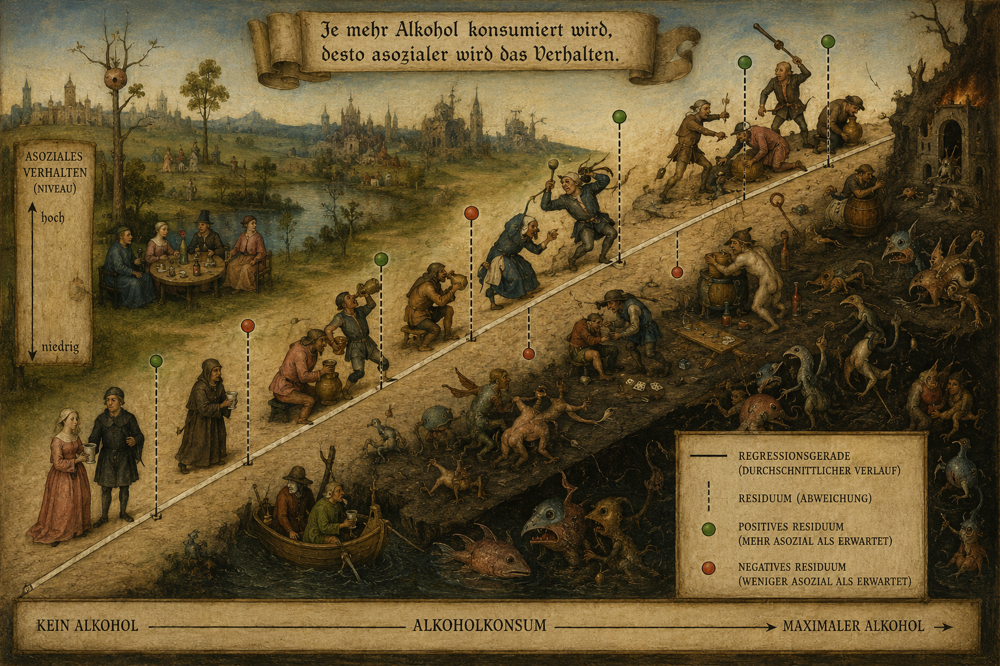

```{r}
library(haven)
library(dplyr)
library(ggplot2)
library(haven)
library(forcats)
library(tidyr)
library(knitr)

freda <- read_dta("C:/Daten/FReDA Campus Use File v.1.0.0/Data/freda_long.dta")
```


## Klemmbausteine für datenanalytische Modelle

<br>
<br>

:::{.extrapad}
1. **Korrelationen**:  Statistische Modelle korrelieren Ausprägungen von Variablen miteinader. 

2. **Residualvarianz**: Sie bilden ihre Parameter so, dass die Abstände zwischen *vorhergesagten Werten* und *beobachteten Werten* so gering wie möglich ist. 

3. **partielle Korrelationen**: Diese Modelle isolieren Einflüsse, indem sie die Korrelation zwischen dem Treatment und anderen Eigenschaften, die *sowohl* mit dem Treatment als *auch* mit dem Outcome verbunden sind, voneinander trennen. 
:::


## Born to be wild?  

Hypothese: Je früher das Alter des ersten Geschlechtsverkehrs war, desto höher ist die Anzahl bisheriger Partnerschaften zum Erhebungszeitpunkt. 

```{mermaid}
%%{init: {
  'theme': {'neutral'},
  'themeVariables': { 'fontSize': '24px' },
  'flowchart': { 'htmlLabels': true, 'useMaxWidth': false }
}}%%

flowchart TB

A[Alter]
S["Alter <br/> erster GV"]
P["Anzahl bisheriger <br/> Partnerschaften"]
G["Geschlecht"]
I@{shape: sm-circ}

A --> S
G --> S --- I --> P
G --?--> I
```

## Was sagen uns die FREDA Daten? 

```{r}
freda |>
  filter(!is.na(rtr51)) |>
  count(rtr51) |>
  mutate(relative_freq = n / sum(n) * 100) |>
  filter(rtr51 <= 20) |>
  ggplot(aes(x = factor(rtr51), y = relative_freq)) +
  geom_col(color = "white", fill = "steelblue") +
  labs(
    x = "Anzahl bisheriger Partnerschaften",
    y = "Relative Häufigkeit (%)"
  ) +
  theme_minimal() +
  theme(
    text = element_text(size = 20),
    axis.title = element_text(size = 24),
    axis.text = element_text(size = 18)
  )
```

## Was sagen uns die FREDA Daten? 

```{r}
freda |>
  filter(!is.na(rtr51), !is.na(sex_c)) |>
  mutate(sex_c = as_factor(sex_c)) |>
  count(sex_c, rtr51) |>
  mutate(relative_freq = n / sum(n) * 100, .by = sex_c) |>
  filter(rtr51 <= 20) |>
  ggplot(aes(x = factor(rtr51), y = relative_freq, fill = sex_c)) +
  geom_col(color = "white", alpha = 0.7, position = "identity") +
  labs(
    x = "Anzahl bisheriger Partnerschaften",
    y = "Relative Häufigkeit (%)",
    fill = "Geschlecht"
  ) +
  theme_minimal() +
  theme(
    text = element_text(size = 20),
    axis.title = element_text(size = 24),
    axis.text = element_text(size = 18)
  )
```

## Zusammenhänge 

```{r}
freda |>
  filter(!is.na(rtr51), !is.na(sex1i3), sex1i3 >= 13, sex1i3 <= 35) |>
  ggplot(aes(x = sex1i3, y = rtr51)) +
  geom_point(alpha = 0.3, size = 2) +
  geom_smooth(method = "lm", se = TRUE, color = "red") +
  labs(
    x = "Alter des ersten Geschlechtsverkehrs",
    y = "Anzahl bisheriger Partnerschaften",
  ) +
  theme_minimal() +
  theme(
    text = element_text(size = 20),
    axis.title = element_text(size = 24),
    axis.text = element_text(size = 18)
  )
```

## Flexiblere Modellierung (No-Golem-Policy!)

```{r}
library(mgcv)

freda |>
  filter(!is.na(rtr51), !is.na(sex1i3), !is.na(sex_c), sex1i3 >= 13, sex1i3 <= 35) |>
  mutate(sex_c = as_factor(sex_c)) |>
  ggplot(aes(x = sex1i3, y = rtr51, color = sex_c)) +
  geom_smooth(method = "gam", formula = y ~ s(x), method.args = list(family = poisson()), se = FALSE) +
  labs(
    x = "Alter des ersten Geschlechtsverkehrs",
    y = "Anzahl bisheriger Partnerschaften",
    color = "Geschlecht"
  ) +
  theme_minimal() +
  theme(
    text = element_text(size = 20),
    axis.title = element_text(size = 24),
    axis.text = element_text(size = 18)
  )
```

## Was macht ein (Regressions)-Modell? 

::: {.columns}

::: {.column width=30%}

```{mermaid}
flowchart TB

A[Alter]
S["Alter <br/> erster GV"]
P["Anzahl bisheriger  Partnerschaften"]
G["Geschlecht"]
I@{shape: sm-circ}

A --- S
G --> S --- I --> P
G --?--> I
```

:::

::: {.column width=70%}


- Regressionsmodelle sind Werkzeuge zur
      - Erfassung der Größenordnung von Einflüssen
      - und zur Isolation von Einflüssen. 

- Ein typisches Regressionsmodell bezieht sich immer auf **direkte** Einflüsse auf **ein** Outcome.[^1] 

    - Es werden daher diejenigen "Pfeile" untersucht, die direkt auf eine Box abzielen.  
    - Wir können aber so tun, als ob bestimte "Boxen" nicht vorkommen, um damit "direkte" Pfeile herzustellen.

::: 

::: 

[^1]: Modelle, die mehrere Outcomes gleichzeitig haben sind u.a.: Strukturgleichungsmodelle, Seemingly Unrelated Regression, Joint Models

## Regressionsmodelle drücken erwartete Differenzen aus

Jedes Regressionsmodell nimmt einen statistischen Kennwert und berechnet Differenzen dieses Kennwerts über verschiedene Gruppen. 

| Regressionsmodell                  	| Differenzen in       	|
|------------------------------------	|----------------------	|
| Lineare Regression                  | Mittelwerte          	|
| Lineares Wahrscheinlichkeitsmodell 	| Wahrscheinlichkeiten 	|
| Logistische Regression             	| Odds Ratios          	|
| Variance Function Regression       	| Varianzen            	|
| Quantil Regression       	| Quantilwerte           	|


## Was ist eine gute Schätzung - Kausaltheoretisch? 

- Die (soziale) Welt wirkt auf uns **systematisch** über verschiedene Prozesse.

- Im Rahmen dieser Bedingungen entwickeln wir dennoch ein hohes Maß an Individualität, d.h.: kleinere oder größere **Abweichungen** zu den "Typen", die das Resultat sozialer Prozesse sind. 

- Wenn wir alle systematischen Einflüsse auf ein Outcome erfasst haben, kann der Rest nur noch **unsystematisch*** und damit **zufällig** sein. 

- Eine lineare Regression soll die systematischen "Typen" hinsichtlich eines Outcomes als eine **Nievauverschiebung** erfassen. 

- *Falls* dies eine korrekte Erfassung der Wirkung der studierten sozialen Prozesse ist, sind die individuellen Abweichungen zum Niveau der eigenen Gruppe unsystematisch / zufällig. 

## Dieser Gedanke in "Kunstform"



## Niveauverschiebung in der Regression 

 <iframe width="1400" height="1050" data-external="1" src="https://019e841d-86fb-a0f3-d58b-43dbef9540a1.share.connect.posit.cloud"></iframe>

##  Die Niederungen der Einzelheiten {.midi}
$$\underbrace{y_i}_{\substack{\text{individ. Anzahl} \\ \text{bisheriger Partner}}} = \underbrace{\hat{\alpha}_{\color{white}{i}}}_{\substack{\text{durchschn. Anzahl} \\ \text{Basisgruppe}}} +  \underbrace{\hat{\beta}\cdot x_i}_{\substack{\text{systematische} \\ \text{Gruppenunterschiede}}}  + \underbrace{\epsilon_i}_{\substack{\text{individuelle} \\ \text{Abweichung = Residuum}}}$$

::: {.r-fit-text}
| Abkürzung        	| "sprich" 	| Bedeutung                                                                                                               	|
|------------------	|-----------------------	|------------------------------------------	|
| $y_i$            	|          	| Gemessener Wert der Anazhl bisheriger Beziehungen für Person $i$                                                                	|
| $\hat{\alpha}$  / $\hat{\beta}_0$   	| alpha / beta null   	| Durchschnittliche Anzahl bisheriger Beziehungen für die Referenzgruppe                                                              	|
| $\hat{\beta}x_i$ 	| beta     	| Differenz in der durchschnittlichen Anzahl bisheriger Beziehungen, wenn wir Personen vergleichen, die sich im Alter ihres ersten GVs um ein Jahr unterscheiden             	|
| $\epsilon_i$     	| epsilon  	| (zufällige) Differenz zwischen der beobachteten Anzahl bisheriger Beziehungen für Person $i$ zum Durchschnitt für Personen, die im gleichen Alter wie Person $i$ ihren ersten GV hatten  	|
::: 

## Von individuellen Werten zur Schätzung von Einflüssen

- Unser altes Problem: Wir können Einflüsse nicht auf Individualebene schätzen. 

- Wir müssen Einflüsse durch den Vergleich von Untersuchungseinheiten erfassen, die sich im Hinblick auf das Treatment um eine Einheit unterscheiden (und deren sonstige Unterschiede ignorierbar sind).  

- Die Modellparameter einer Regression beziehen sich daher auf Unterschiede zwischen Gruppen. 

$$\underbrace{\hat{y}_i}_{\substack{\text{erwartete Anzahl} \\ \text{bisheriger Partner}}} = \underbrace{\hat{\alpha}_{\color{white}{i}}}_{\substack{\text{durchschn. Anzahl} \\ \text{Basisgruppe}}} +  \underbrace{\hat{\beta}\cdot x_i}_{\substack{\text{systematische} \\ \text{Gruppenunterschiede im Durchschnitt}}}$$


## Was ist eine gute Schätzung eines Einflusses - Statistisch? 


::: {.columns}

::: {.column width=20%}


:::

::: {.column width=80%}
Behauptung des alten Gauß: Diejenige Schätzung eines Regressionsmodells ist am Besten, die die kleinst mögliche Summe der (quadrierten) Abstände zwischen den tatsächlichen und den geschätzten Werten (=Regressionsgerade) generiert.

-   Die Residuen werden quadriert, weil sich negative und positive
    Abweichungen von der Schätzung nicht wegsummieren sollen. Wir
    möchten das "Gesamtpaket " aller Residuen haben.

-   Schätzungen, die hohe einzelne Abweichungen verursachen, erhalten
    durch die Quadrierung ebenfalls eine schlechtere Bewertung, weil
    hohe quadrierte Abweichungen die Gesamtsumme aller quadrierten
    Residuen stark beeinflussen.

:::
:::

## Methode der kleinsten (Residual)quadrate

- Denken Sie daran, dass $\hat{y}_i$ eine **Schätzung** der Ausprägung eines Typen ist, die **lediglich** durch systematische Prozesse bedingt werden. 

- Eine lineare Regression setzt "soziale Prozesse" mit *Niveauverschiebungen* gleich. 

- Eine Niveauverschiebung wird als Differenz von geschätzten Ausprägungen nach Typen behandelt und die Residuen als "Zufallsstreuung" angesehen. 

- **Zentrale Behauptung**: Systematische Prozesse sind stets stärker als zufällige Prozesse.[^2] Daher ist die Methode am besten geeignet systematische von unsystematischen Einflüssen sauber zu trennen, die die kleinste Summe der "Zufallsstreuung" erfassen kann.

- Die Schätzmethode heißt deswegen **O**rdinary-**L**east-**S**quares - die Minimerung der Residualquadrate.  

[^2]: Etwas muss über den "Placebo-Effekt" hinaus gehen, um als wirkungsvoll angesehen zu werden. 

## Wie minimiert man die Summe der Residuen? 

$$\begin{aligned}
\mathrm{min} =& \sum\limits_{i=1}^n(y_i - \hat{y}_i)^2 \\ 
            =&\sum\limits_{i=1}^n(y_i - (\hat{\alpha} + \hat{\beta}x_i))^2 
\end{aligned}$$

Mathematisch lösbar durch: Ableitung nach $\hat{\alpha}$ und
$\hat{\beta}$ und diese beiden ersten Ableitungen auf 0 setzen und nach
$\hat{\alpha}$ oder $\hat{\beta}$ auflösen.


## Berechnung von OLS-Parametern

Daraus erhält man (für den Fall von **einer** genutzten Variablen):

$$\hat{\alpha}=\bar{y}-\hat{\beta} \bar{x}$$

Die Schätzung von $\hat{\alpha}$ verdeutlicht, dass dies ein Mittelwert von $y$ ist, aus dem alle anderen durch $x$ bedingten systematischen Unterschiede herausgerechnet wurden. Es ist der Durchschnittswert derjenigen Gruppe, aus der die Unterschiede zu allen anderen Gruppen - die zum Vergleichen genutzt werden - entfernt wurde. Diese Gruppe nennen wir "Basisgruppe". 

$$\hat{\beta} = \dfrac{\sum(x_i-\bar{x})(y_i - \bar{y})}{\sum(x_i-\bar{x})^2} = \dfrac{\sum x_iy_i - n\cdot\bar{x}\cdot\bar{y}}{\sum x_i^2 - n\cdot \bar{x}^2}$$

Der $\hat{\beta}$-Koeffizient drückt ein Verhältnis der Covarianz von
$x$ und $y$ in Relation zur Variation der $x$-Variable aus. Oder: Um wieviel erhöhen/verringern sich Y-Werte im Durchschnitt, wenn sich die X-Werte um eine Einheit ändern. 

## Übung macht die Meisterin

 <iframe width="1400" height="1050" data-external="1" src="https://www.shiny-appserver.org/ols/"></iframe>

## Papier ist geduldig... 

```{r}
library(haven)
library(dplyr)
library(forcats)
library(knitr)
library(kableExtra)

freda <- read_dta("C:/Daten/FReDA Campus Use File v.1.0.0/Data/freda_long.dta")

tab_data <- freda |>
  select(rtr51, sex1i3, sex_c) |>
  filter(!is.na(rtr51), !is.na(sex1i3), !is.na(sex_c)) |>
  mutate(sex_c_num = if_else(as_factor(sex_c) == "Male", 1L, 0L)) |>
  mutate(sex1i3 = sex1i3 - 17) |>
  select(rtr51, sex1i3, sex_c_num) |>
  slice_head(n = 10)

means_row <- tab_data |>
  summarise(across(everything(), mean)) |>
  mutate(across(everything(), \(x) round(x, 2)))

tab_data |>
  bind_rows(means_row) |>
  mutate(across(everything(), as.character)) |>
  mutate(
    rtr51     = if_else(row_number() == 11, paste0("Ø ", rtr51), rtr51),
    sex1i3    = if_else(row_number() == 11, paste0("Ø ", sex1i3), sex1i3),
    sex_c_num = if_else(row_number() == 11, paste0("Ø ", sex_c_num), sex_c_num)
  ) |>
  kable(
    col.names = c("Anz. Partnerschaften", "Alter erster GV - 17", "Geschlecht (0=F, 1=M)"),
    align = "c"
  ) |>
  kable_styling(full_width = FALSE) |>
  row_spec(10, extra_css = "border-bottom: 2px solid black;") |>
  row_spec(11, bold = TRUE, background = "#f5f5f5")
```

## Berechnung 

$$\hat{\beta} = \dfrac{\sum(x_i-\bar{x})(y_i - \bar{y})}{\sum(x_i-\bar{x})^2} = \dfrac{-27.2}{63.6} = -0.428 $$

- Die durchschnittliche Anzahl bisheriger Partnerschaften sinkt um 0.43 Partner*innen für jedes Jahr, in dem der erste GV später als 17 statt fand und 0.43 für jedes Jahr, in dem der erste GV früher als 17 statt fand. 

- Alternativ: Vergleicht man Personen, deren GV ein Jahr später als die Vergleichsgruppe stattfand, ist deren durchschnittliche Anzahl bisheriger Partner um 0.43 geringer. 

$$\hat{\alpha}=\bar{y}-\hat{\beta} \bar{x} = 1.9 - (-0.428)*1.8 = 2.67$$

 Die Basisgruppe sind in diesem Modell Personen, die mit 17 das erste Mal GV hatten.  Wir erwarten daher für diese Gruppe, eine durchschnittliche Anzahl von 2.67 bisherigen Partner:innen.  

## Was ist das für ein Voodoo?

| $\alpha$ +     	| $\beta$ $\cdot$      	| Alter erster GV - 17 	|  = $\hat{y}_i$     	|
|------	|--------	|:--------------------:	|-------	|
| 2.67 	| -0.428 	| -3                   	| 3.954 	|
| 2.67 	| -0.428 	| -2                   	| 3.526 	|
| 2.67 	| -0.428 	| -1                   	| 3.098 	|
| 2.67 	| -0.428 	| 0                    	| 2.67  	|
| 2.67 	| -0.428 	| 1                    	| 2.242 	|
| 2.67 	| -0.428 	| 2                    	| 1.814 	|
| 2.67 	| -0.428 	| 3                    	| 1.386 	|
| 2.67 	| -0.428 	| 4                    	| 0.958 	|
| 2.67 	| -0.428 	| 5                    	| 0.53  	|
| 2.67 	| -0.428 	| 6                    	| 0.102 	|

## Wie sieht das in unserem Beispiel aus? 

```{r}
library(dplyr)
library(ggplot2)
library(patchwork)

make_plot_with_ann <- function(data, xvar, yvar, xlab, ylab, jitter_x = FALSE, binary_x = FALSE) {
  df <- data |>
    select(x = all_of(xvar), y = all_of(yvar)) |>
    filter(!is.na(x), !is.na(y))

  fit <- lm(y ~ x, data = df)
  b0 <- coef(fit)[1]
  b1 <- coef(fit)[2]

  x0 <- 0
  xmax <- max(df$x, na.rm = TRUE)

  y0 <- b0 + b1 * x0
  ymax <- b0 + b1 * xmax

  xmid <- (x0 + xmax) / 2
  ymid <- b0 + b1 * xmid

  p <- ggplot(df, aes(x = x, y = y)) +
    {if (jitter_x) geom_jitter(width = 0.08, height = 0, alpha = 0.8) else geom_point(alpha = 0.8)} +
    geom_smooth(method = "lm", se = FALSE) +
    annotate("point", x = x0, y = y0, size = 2.5) +
    annotate("text", x = x0, y = y0, label = paste0(round(y0, 2)),
             hjust = -0.1, vjust = -0.8, size = 5) +
    annotate("point", x = xmax, y = ymax, size = 2.5) +
    annotate("text", x = xmax, y = ymax, label = paste0(round(ymax, 2)),
             hjust = 1.1, vjust = -0.8, size = 5) +
    annotate("text", x = xmid, y = ymid, label = paste0(round(b1, 2)),
             vjust = -1.0, size = 5.5, fontface = "bold") +
    labs(x = xlab, y = ylab) +
    theme_minimal() +
    theme(
      text = element_text(size = 20),
      axis.title = element_text(size = 16),
      axis.text = element_text(size = 14)
    )

  if (binary_x) {
    p <- p + scale_x_continuous(
      breaks = c(0, 1),
      labels = c("0", "1"),
      limits = c(-0.2, 1.2)
    )
  }

  p
}

p1 <- make_plot_with_ann(
  tab_data, "sex1i3", "rtr51",
  xlab = "Alter erster GV - 17",
  ylab = "Anzahl bisheriger Beziehungen",
  jitter_x = FALSE,
  binary_x = FALSE
)

p2 <- make_plot_with_ann(
  tab_data, "sex_c_num", "rtr51",
  xlab = "Geschlecht (0 = Frauen, 1 = Männer)",
  ylab = "Anzahl bisheriger Beziehungen",
  jitter_x = TRUE,
  binary_x = TRUE
)

p3 <- make_plot_with_ann(
  tab_data, "sex_c_num", "sex1i3",
  xlab = "Geschlecht (0 = Frauen, 1 = Männer)",
  ylab = "Alter erster GV - 17",
  jitter_x = TRUE,
  binary_x = TRUE
)

panel <- p1 + p2 + p3 + plot_layout(ncol = 3)
panel
```

## Was ist mit nicht-metrischen Variablen?

OLS behandelt alles als metrisch! Deswegen können Sie die gleichen Formeln über andere Daten bügeln (**Golem-Alarm**). 

Wenn wir eine Regression der Anzahl bisheriger Partnerschaften auf das Geschlecht (0 = Frauen, 1 = Männer) durchführen, ergibt sich: 

$$\hat{\beta} = \dfrac{\sum(x_i-\bar{x})(y_i - \bar{y})}{\sum(x_i-\bar{x})^2} = \dfrac{1.5}{2.5} = 0.6 $$

Wenn sich das Geschlecht um eine Einheit (Frau = 0 $\rightarrow$ Mann = 1) erhöht, dann erhöht sich die durchschnittliche Anzahl bisheriger Partner:innen um 0.6. 

$$\hat{\alpha}=\bar{y}-\hat{\beta} \bar{x} = 1.9 - (0.6)*0.5 = 1.6$$

Die Basisgruppe in diesem Modell sind die Frauen, da der Einfluss von "Mann-sein" in Relation zu "Frau-sein" erfasst wird. Daher erwarten wir für Frauen im Durchschnitt 1.6 bisherige Partner:innen.  


