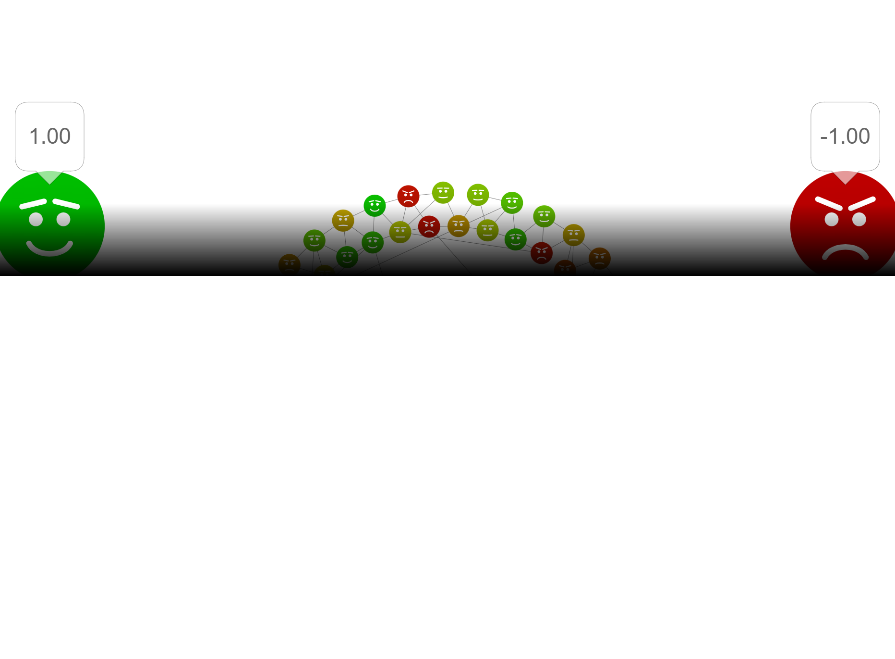

## Gesellschaftliche Entwicklungen verstehen

 ](images/age_dispair.png){width=50%}

## Unterschiede zwischen Gesellschaften verstehen

Warum ist die Anzahl der durchschnittlichen Geschlechtspartner:innen zwischen Ländern unterschiedlich hoch? 

<https://www.datapandas.org/ranking/average-number-of-sexual-partners-by-country>

## Menschliches Handeln verstehen

Hikikomori[^1]  - warum machen die das?

{width=50%}

[^1]: hiku: sich zurückziehen, komoru: sich verschließen

---

## Verstehen, wie Menschen Gesellschaft machen

Versuchen Sie sich mal als Designer eines neues Social Networks und sehen Sie, was passiert: <https://sociology.itz.kit.edu/twony/> 
 
---

## Soziologie Ergänzungsfach

<iframe width="1200" height="600" src="https://docs.google.com/spreadsheets/d/e/2PACX-1vRiCpi-YEhCI1Y15zMb9m2Uud0zoVupGBpA088mqEfIUE1dwthVUGo4Bx7eqWmQTCSmaSRD791PZ2r4/pubhtml?widget=true&amp;headers=false"></iframe>
